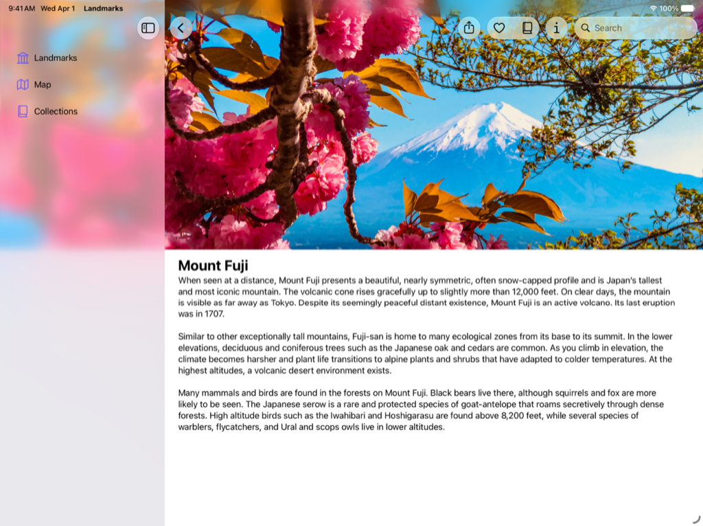
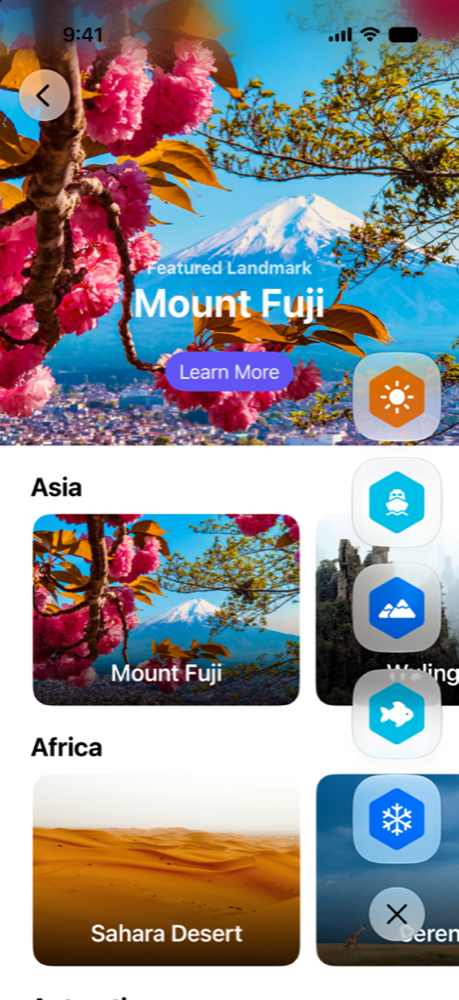

> Navigation: [Technologies](../technologies.md) · [SwiftUI](../swiftui.md)

# Landmarks: Building an app with Liquid Glass

Sample Code

Enhance your app experience with system-provided and custom Liquid Glass.

## Overview

Landmarks is a SwiftUI app that demonstrates how to use the new dynamic and expressive design feature, Liquid Glass. The Landmarks app lets people explore interesting sites around the world. Whether it’s a national park near their home or a far-flung location on a different continent, the app provides a way for people to organize and mark their adventures and receive custom activity badges along the way. Landmarks runs on iPad, iPhone, and Mac.

Landmarks uses a [NavigationSplitView](navigationsplitview.md) to organize and navigate to content in the app, and demonstrates several key concepts to optimize the use of Liquid Glass:

- Stretching content behind the sidebar and inspector with the background extension effect.
- Extending horizontal scroll views under a sidebar or inspector.
- Leveraging the system-provided glass effect in toolbars.
- Applying Liquid Glass effects to custom interface elements and animations.
- Building a new app icon with Icon Composer.

The sample also demonstrates several techniques to use when changing window sizes, and for adding global search.

## Apply a background extension effect

The sample applies a background extension effect to the featured landmark header in the top view, and the main image in the landmark detail view. This effect extends and blurs the image under the sidebar and inspector when they’re open, creating a full edge-to-edge experience.

To achieve this effect, the sample creates and configures an [Image](image.md) that extends to both the leading and trailing edges of the containing view, and applies the [backgroundExtensionEffect()](<view/backgroundextensioneffect().md>) modifier to the image. For the featured image, the sample adds an overlay with a headline and button after the modifier, so that only the image extends under the sidebar and inspector.

> [!note] Note
> The sample also extends the image beyond the top safe area, and adds logic to interactively extend the image when you scroll down beyond the view’s bounds. While this improves the experience of the image in the app, it isn’t required to implement the background extension effect.

For more information, see [Landmarks: Applying a background extension effect](landmarks-applying-a-background-extension-effect.md).

## Extend horizontal scrolling under the sidebar

Within each continent section in `LandmarksView`, an instance of `LandmarkHorizontalListView` shows a horizontally scrolling list of landmark views. When open, the landmark views can scroll underneath the sidebar or inspector.

To achieve this effect, the app aligns the scroll views next to the leading and trailing edges of the containing view.

For more information, see [Landmarks: Extending horizontal scrolling under a sidebar or inspector](landmarks-extending-horizontal-scrolling-under-a-sidebar-or-inspector.md).

## Refine the Liquid Glass in the toolbar

In `LandmarkDetailView`, the sample adds toolbar items for:

- sharing a landmark
- adding or removing a landmark from a list of Favorites
- adding or removing a landmark from Collections
- showing or hiding the inspector

The system applies Liquid Glass to toolbar items automatically:

An image of the landmark detail view for Mount Fuji on an iPad, with the toolbar and a portion of the sidebar visible. The toolbar items show the Liquid Glass effect. From the leading to trailing edge, there is a back button, share button, favorite button, collections button, info button, and a search bar.

The sample also organizes the toolbar into related groups, instead of having all the buttons in one group. For more information, see [Landmarks: Refining the system provided Liquid Glass effect in toolbars](landmarks-refining-the-system-provided-glass-effect-in-toolbars.md).

## Display badges with Liquid Glass

Badges provide people with a visual indicator of the activities they’ve recorded in the Landmarks app. When a person completes all four activities for a landmark, they earn that landmark’s badge. The sample uses custom Liquid Glass elements with badges, and shows how to coordinate animations with Liquid Glass.

To create a custom Liquid Glass badge, Landmarks uses a view with an `Image` to display a system symbol image for the badge. The badge has a background hexagon `Image` filled with a custom color. The badge view uses the [glassEffect(_:in:)](<view/glasseffect(__in_).md>) modifier to apply Liquid Glass to the badge.

To demonstrate the morphing effect that the system provides with Liquid Glass animations, the sample organizes the badges and the toggle button into a [GlassEffectContainer](glasseffectcontainer.md), and assigns each badge a unique [glassEffectID(_:in:)](<view/glasseffectid(__in_).md>).

For more information, see [Landmarks: Displaying custom activity badges](landmarks-displaying-custom-activity-badges.md). For information about building custom views with Liquid Glass, see [Applying Liquid Glass to custom views](applying-liquid-glass-to-custom-views.md).

## Create the app icon with Icon Composer

Landmarks includes a dynamic and expressive app icon composed in Icon Composer. You build app icons with four layers that the system uses to produce specular highlights when a person moves their device, so that the icon responds as if light was reflecting off the glass. The Settings app allows people to personalize the icon by selecting light, dark, clear, or tinted variants of your app icon as well.

For more information on creating a new app icon, see [Creating your app icon using Icon Composer](../xcode/creating-your-app-icon-using-icon-composer.md).

For design guidance, see Human Interface Guidelines \>  [App icons](../design/human-interface-guidelines/app-icons.md).

## Topics

### App features

- [Landmarks: Applying a background extension effect](landmarks-applying-a-background-extension-effect.md) — Configure an image to blur and extend under a sidebar or inspector panel.
- [Landmarks: Extending horizontal scrolling under a sidebar or inspector](landmarks-extending-horizontal-scrolling-under-a-sidebar-or-inspector.md) — Improve your horizontal scrollbar’s appearance by extending it under a sidebar or inspector.
- [Landmarks: Refining the system provided Liquid Glass effect in toolbars](landmarks-refining-the-system-provided-glass-effect-in-toolbars.md) — Organize toolbars into related groupings to improve their appearance and utility.
- [Landmarks: Displaying custom activity badges](landmarks-displaying-custom-activity-badges.md) — Provide people with a way to mark their adventures by displaying animated custom activity badges.

## See Also

### Essentials

- [Adopting Liquid Glass](../technologyoverviews/adopting-liquid-glass.md) — Find out how to bring the new material to your app.
- [Develop in Swift](../tutorials/develop-in-swift.md#explore-xcode) — Develop in Swift Tutorials introduce app development with Swift and Xcode to anyone learning to build apps for Apple platforms.
- [SwiftUI updates](../updates/swiftui.md) — Learn about important changes to SwiftUI.

## Download

- [LandmarksBuildingAnAppWithLiquidGlass.zip](https://docs-assets.developer.apple.com/published/a88428e6793e/LandmarksBuildingAnAppWithLiquidGlass.zip)
