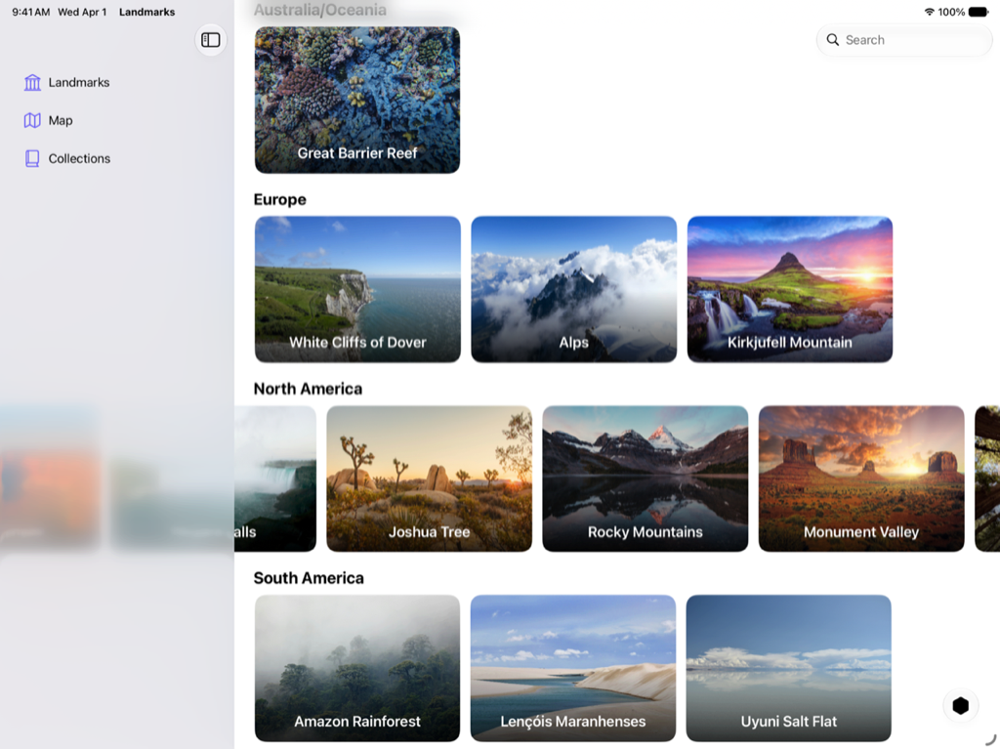

> Navigation: [Technologies](../technologies.md) · [SwiftUI](../swiftui.md) · [Landmarks: Building an app with Liquid Glass](landmarks-building-an-app-with-liquid-glass.md)

# Landmarks: Extending horizontal scrolling under a sidebar or inspector

<sub>Sample Code</sub>

Improve your horizontal scrollbar’s appearance by extending it under a sidebar or inspector.

## Overview

The Landmarks app lets people explore interesting sites around the world. Whether it’s a national park near their home or a far-flung location on a different continent, the app provides a way for people to organize and mark their adventures and receive custom activity badges along the way.

This sample demonstrates how to extend horizontal scrolling under a sidebar or inspector. Within each continent section in `LandmarksView`, an instance of `LandmarkHorizontalListView` shows a horizontally scrolling list of landmark views. When open, the landmark views can scroll underneath the sidebar or inspector.



## Configure the scroll view

To achieve this effect, the sample configures the `LandmarkHorizontalListView` so it touches the leading and trailing edges. When a scroll view touches the sidebar or inspector, the system automatically adjusts it to scroll under the sidebar or inspector and then off the edge of the screen.

The sample adds a [Spacer](spacer.md) at the beginning of the [ScrollView](scrollview.md) to inset the content so it aligns with the title padding:

```swift
ScrollView(.horizontal, showsIndicators: false) {
    LazyHStack(spacing: Constants.standardPadding) {
        Spacer()
            .frame(width: Constants.standardPadding)
        ForEach(landmarkList) { landmark in
            //...
        }
    }
}
```

## See Also

### App features

- [Landmarks: Applying a background extension effect](landmarks-applying-a-background-extension-effect.md) — Configure an image to blur and extend under a sidebar or inspector panel.
- [Landmarks: Refining the system provided Liquid Glass effect in toolbars](landmarks-refining-the-system-provided-glass-effect-in-toolbars.md) — Organize toolbars into related groupings to improve their appearance and utility.
- [Landmarks: Displaying custom activity badges](landmarks-displaying-custom-activity-badges.md) — Provide people with a way to mark their adventures by displaying animated custom activity badges.

## Download

- [LandmarksBuildingAnAppWithLiquidGlass.zip](https://docs-assets.developer.apple.com/published/a88428e6793e/LandmarksBuildingAnAppWithLiquidGlass.zip)
