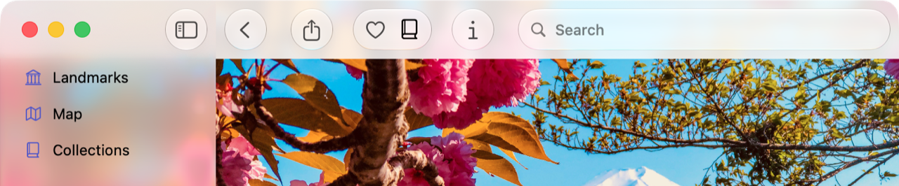

> Navigation: [Technologies](../technologies.md) · [SwiftUI](../swiftui.md) · [Landmarks: Building an app with Liquid Glass](landmarks-building-an-app-with-liquid-glass.md)

# Landmarks: Refining the system provided Liquid Glass effect in toolbars

<sub>Sample Code</sub>

Organize toolbars into related groupings to improve their appearance and utility.

## Overview

The Landmarks app lets people explore interesting sites around the world. Whether it’s a national park near their home or a far-flung location on a different continent, the app provides a way for people to organize and mark their adventures and receive custom activity badges along the way.

This sample demonstrates how to refine the system provided glass effect in toolbars. In `LandmarkDetailView`, the sample adds toolbar items for:

- sharing a landmark
- adding or removing a landmark from a list of Favorites
- adding or removing a landmark from Collections
- showing or hiding the inspector

The system applies Liquid Glass to the toolbar items automatically.



<sub>An image of the landmark detail view for Mount Fuji on an iPad, with the toolbar and a portion of the sidebar visible. The toolbar items show the Liquid Glass effect. From the leading to trailing edge, there is a back button, share button, favorite button, collections button, info button, and a search bar.</sub>

## Organize the toolbar items into logical groupings

To organize the toolbar items into logical groupings, the sample adds [ToolbarSpacer](toolbarspacer.md) items and passes [fixed](spacersizing/fixed.md) as the `sizing` parameter to divide the toolbar into sections:

```swift
.toolbar {
    ToolbarSpacer(.flexible)

    ToolbarItem {
        ShareLink(item: landmark, preview: landmark.sharePreview)
    }

    ToolbarSpacer(.fixed)
    
    ToolbarItemGroup {
        LandmarkFavoriteButton(landmark: landmark)
        LandmarkCollectionsMenu(landmark: landmark)
    }
    
    ToolbarSpacer(.fixed)

    ToolbarItem {
        Button("Info", systemImage: "info") {
            modelData.selectedLandmark = landmark
            modelData.isLandmarkInspectorPresented.toggle()
        }
    }
}
```

## See Also

### App features

- [Landmarks: Applying a background extension effect](landmarks-applying-a-background-extension-effect.md) — Configure an image to blur and extend under a sidebar or inspector panel.
- [Landmarks: Extending horizontal scrolling under a sidebar or inspector](landmarks-extending-horizontal-scrolling-under-a-sidebar-or-inspector.md) — Improve your horizontal scrollbar’s appearance by extending it under a sidebar or inspector.
- [Landmarks: Displaying custom activity badges](landmarks-displaying-custom-activity-badges.md) — Provide people with a way to mark their adventures by displaying animated custom activity badges.

## Download

- [LandmarksBuildingAnAppWithLiquidGlass.zip](https://docs-assets.developer.apple.com/published/a88428e6793e/LandmarksBuildingAnAppWithLiquidGlass.zip)
