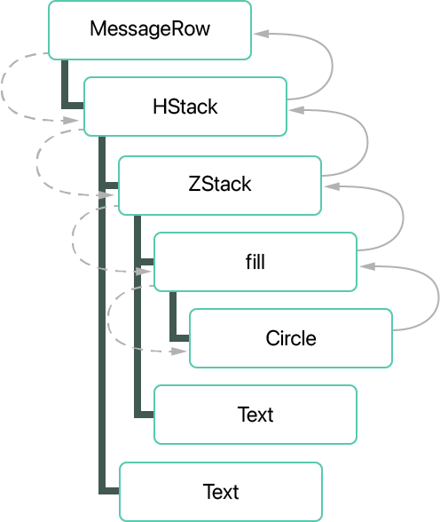
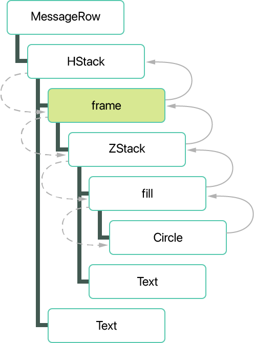
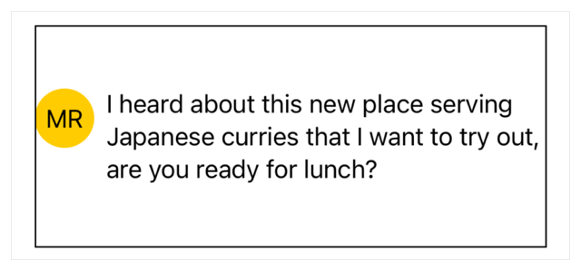

> Navigation: [Technologies](../technologies.md) · [SwiftUI](../swiftui.md) · [Layout adjustments](layout-adjustments.md)

# Laying out a simple view

<sub>Article</sub>

Create a view layout by adjusting the size of views.

## Overview

To create a layout for a view, start by composing a hierarchy of child views. Then, refine the size and spacing of the child views with configuration parameters, and by adding view modifiers, like those that affect a view’s frame and padding. To review how to compose layouts, see [Building layouts with stack views](building-layouts-with-stack-views.md).

### Establish a view hierarchy

The following example creates a view to display an incoming message from a messaging service. The view uses an [HStack](hstack.md) to collect a view that identifies the sender and another that provides the content of the message:

```swift
struct MessageRow: View {
    let message: Message

    var body: some View {
        HStack {
            ZStack {
                Circle()
                    .fill(Color.yellow)
                Text(message.initials)
            }

            Text(message.content)
        }
    }
}
```

The following screenshot of a `MessageRow` view includes a border that shows its bounds. Note the large size of the circle, which fills the space available to it:


<sub>A screenshot showing a black rectangle as the border of the view, inside of which is a large yellow circle on the left side of the view, with the letters “MR” in the center of the circle. On the right side of the view there are five lines of text. The text and circle are centered vertically in the view.</sub>

When SwiftUI renders a view hierarchy, it recursively evaluates each child view: The parent view proposes a size to the child views it contains, and the child views respond with a computed size.



<sub>A vertically stacked view hierarchy shown as boxes, which each list names of views. The top box is labeled MessageRow, connected with a straight line to an HStack box, just below it. The HStack connects by a straight line to three views beneath it, labeled ZStack, Spacer, and Text. The ZStack has two views connected by straight line under it, labeled Circle and Text. Circle has a single view connected beneath it, labeled fill. Dashed arrows on the left of the hierarchy indicate the flow of requests for size for the circle, starting with MessageRow. The flow proceeds down to HStack, ZStack, and Circle. Solid arrows on the right of the hierarchy represent answers being returned, starting at the Circle, then moving back toward the top of the image, to ZStack, HStack, and MessageRow.</sub>

The `MessageRow` view proposes a size to its only child, the [HStack](hstack.md), which is the full size proposed to it by its own parent. The stack proportionally divides this space between its child views, with system-default spacing between each child. This continues recursively:

- The [ZStack](zstack.md) proposes a size to its child views, the [Circle](circle.md) and [Text](text.md) views.
- The [Circle](circle.md) expands up to the size offered, while the [Text](text.md) takes just enough space for the string it contains.
- The [ZStack](zstack.md) returns the size of its largest child view, in this case the [Circle](circle.md).

When all child views have reported their size, the parent view renders them.

### Limit the view size

In the example above, SwiftUI has built-in views that manage size in different ways, including views that:

- Expand to fill the space offered by their parent, like [Color](color.md), [LinearGradient](lineargradient.md), and [Circle](circle.md).
- Have an ideal size that varies according to their contents, like [Text](text.md) and the container views.
- Have an ideal size that never varies, like [Toggle](toggle.md) or [DatePicker](datepicker.md).

You can constrain a view to a fixed size by adding a frame modifier. For example, use the [frame(width:height:alignment:)](<view/frame(width_height_alignment_).md>) modifier to limit the width the circle to `40` points:

```swift
struct MessageRow: View {
    let message: Message

    var body: some View {
        HStack {
            ZStack {
                Circle()
                    .fill(Color.yellow)
                Text(message.initials)
            }
            .frame(width: 40)

            Text(message.content)
        }
    }
}
```

When you add a frame modifier, SwiftUI wraps the affected view, effectively adding a new view to the view hierarchy.



<sub>A view hierarchy shown as boxes, in which are names of views. The top most box is labeled MessageRow, connected with a line to an HStack, just beneath it. The HStack connects to three view beneath it, boxes labeled frame, Spacer, and Text. Frame connects to a single view beneath it: ZStack. The ZStack has two views connected under it: box labeled Circle, and another labeled Text. The Circle has a single view connected beneath it, labeled fill. The view labeled frame is highlighted to indiciate that it was added compared to the previous view hierarchy example. Dashed arrows on the left of the hierarchy indicate the flow of requests for size for the circle, starting with HStack. The flow proceeds down to frame, ZStack, and then to Circle. Solid arrows on the right of the hierarchy represent answers being returned, starting at the Circle, then to ZStack, frame, and HStack.</sub>

When SwiftUI evaluates this new hierarchy, the frame modifier fixes the width of the [ZStack](zstack.md) that it wraps by passing along the value you specified as its parameter. The remainder of the size evaluation proceeds as before, where the [Circle](circle.md) now expands to fill a smaller space, constrained by the frame’s 40 point width. This enables the [HStack](hstack.md) to provide more space to its other child, which displays the message text.


<sub>A figure of a black rectangle as the border of a view, inside which is a small yellow circle on the left side, constrained to 40 points in diameter, with the letters “MR” at the center of the circle. On the right side are three lines of text. The text and circle are centered vertically.</sub>

### Position content with alignment

If you want the top of the circle aligned with the top of the message content text, you can refine the view by applying an alignment to the [HStack](hstack.md). To position the content vertically within the stack, specify the `alignment` parameter to [top](verticalalignment/top.md):

```swift
struct MessageRow: View {
    let message: Message

    var body: some View {
        HStack(alignment: .top) {
            ZStack {
                Circle()
                    .fill(Color.yellow)
                Text(message.initials)
            }
            .frame(width: 40)

            Text(message.content)
        }
    }
}
```

With the alignment applied, you get an unexpected result. The tops of the views don’t appear to align:


<sub>A figure of a black rectangle as the border of a view, inside which is a small yellow circle on the left side, constrained to 40 points in diameter, with the letters “MR” at the center of the circle. On the right side are three lines of text. The circle is centered vertically, while the text is aligned at the top of the view.</sub>

However, if you select the circle in Xcode, or temporarily add a border to the circle, you can see the tops of the views do in fact align. For more information on inspecting the size of a view, see [Inspecting view layout](inspecting-view-layout.md).


<sub>A figure of a black rectangle as the border of a view, inside which is a small yellow circle on the left side, constrained to 40 points in diameter, with the letters “MR” at the center of the circle. On the right side are three lines of text. The circle appears to be centered vertically, while the text is aligned at the top of the view. A figure of a blue box shows the border of the view enclosing the circle, which takes the full height of its parent view.</sub>

In the previous section, you applied a frame with only a width constraint. SwiftUI drew a circle limited by that width. But because the height was left unspecified, the circle’s frame separately expanded to fill the available height, even though that extra space had no visible impact on the rendered circle. You can resolve this problem by adding an explicit `height` parameter:

```swift
struct MessageRow: View {
    let message: Message

    var body: some View {
        HStack(alignment: .top) {
            ZStack {
                Circle()
                    .fill(Color.yellow)
                Text(message.initials)
            }
            .frame(width: 40, height: 40)

            Text(message.content)
        }
    }
}
```

The contents of the [HStack](hstack.md) are now top aligned, although the stack itself is centered in the `MessageRow` view as shown by the border displaying the row’s boundaries.



<sub>A black rectangle shows the border of the view, inside which is a small yellow circle on the left, constrained to 40 points in diameter, with the letters “MR” at the center of the circle. On the right are three lines of text. The top of the circle is aligned with the top of the lines of text. The view shows extra space above and below the circle and text, but none to the left or right. The circle and text press against the left and right edges of the border of the view.</sub>

### Add padding to the view

To avoid visually crowding the outer edges of a view, add padding. This introduces a fixed amount of space along the specified edges, reducing the space available for the contents of the view by a corresponding amount. For example, you can use [padding(_:_:)](<view/padding(____).md>) to add extra space along the [horizontal](edge/set/horizontal.md) edges of the [HStack](hstack.md):

```swift
struct MessageRow: View {
    let message: Message

    var body: some View {
        HStack(alignment: .top) {
            ZStack {
                Circle()
                    .fill(Color.yellow)
                Text(message.initials)
            }
            .frame(width: 40, height: 40)

            Text(message.content)
        }
        .padding([.horizontal])
    }
}
```

The padding modifier defaults to system-standard spacing, although you can alternatively choose different values for the padding modifier. 

<sub>A black rectangle shows the border of the view, inside which is a small yellow circle on the left, constrained to 40 points in diameter, with the letters “MR” at the center of the circle. On the right are three lines of text. The top of the circle is aligned with the top of the lines of text. The view shows extra space above and below the circle and text, and padding to the left and right of the circle and text, respectively.</sub>

## See Also

### Fine-tuning a layout

- [Inspecting view layout](inspecting-view-layout.md) — Determine the position and extent of a view using Xcode previews or by adding temporary borders.
