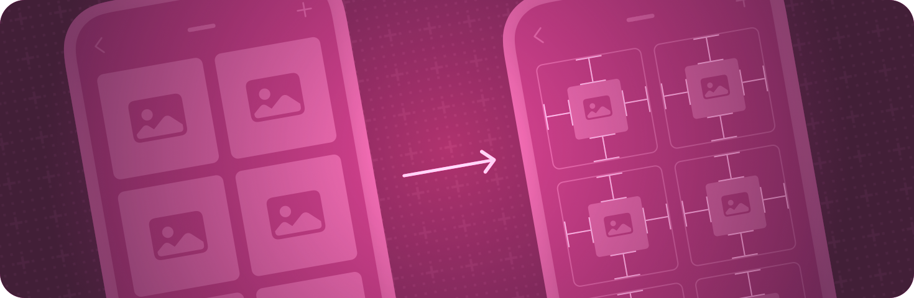

> Navigation: [Technologies](../technologies.md) · [SwiftUI](../swiftui.md)

# Layout adjustments

API Collection

Make fine adjustments to alignment, spacing, padding, and other layout parameters.

## Overview

Layout containers like stacks and grids provide a great starting point for arranging views in your app’s user interface. When you need to make fine adjustments, use layout view modifiers. You can adjust or constrain the size, position, and alignment of a view. You can also add padding around a view, and indicate how the view interacts with system-defined safe areas.

To get started with a basic layout, see [Layout fundamentals](layout-fundamentals.md). For design guidance, see [Layout](../design/human-interface-guidelines/layout.md) in the Human Interface Guidelines.

## Topics

### Fine-tuning a layout

- [Laying out a simple view](laying-out-a-simple-view.md) — Create a view layout by adjusting the size of views.
- [Inspecting view layout](inspecting-view-layout.md) — Determine the position and extent of a view using Xcode previews or by adding temporary borders.

### Adding padding around a view

- [padding(_:)](<view/padding(__).md>) — Adds a different padding amount to each edge of this view.
- [padding(_:_:)](<view/padding(____).md>) — Adds an equal padding amount to specific edges of this view.
- [padding3D(_:)](<view/padding3d(__).md>) — Pads this view using the edge insets you specify.
- [padding3D(_:_:)](<view/padding3d(____).md>) — Pads this view using the edge insets you specify.
- [scenePadding(_:)](<view/scenepadding(__).md>) — Adds padding to the specified edges of this view using an amount that’s appropriate for the current scene.
- [scenePadding(_:edges:)](<view/scenepadding(__edges_).md>) — Adds a specified kind of padding to the specified edges of this view using an amount that’s appropriate for the current scene.
- [ScenePadding](scenepadding.md) — The padding used to space a view from its containing scene.

### Influencing a view’s size

- [frame(width:height:alignment:)](<view/frame(width_height_alignment_).md>) — Positions this view within an invisible frame with the specified size.
- [frame(depth:alignment:)](<view/frame(depth_alignment_).md>) — Positions this view within an invisible frame with the specified depth.
- [frame(minWidth:idealWidth:maxWidth:minHeight:idealHeight:maxHeight:alignment:)](<view/frame(minwidth_idealwidth_maxwidth_minheight_idealheight_maxheight_alignment_).md>) — Positions this view within an invisible frame having the specified size constraints.
- [frame(minDepth:idealDepth:maxDepth:alignment:)](<view/frame(mindepth_idealdepth_maxdepth_alignment_).md>) — Positions this view within an invisible frame having the specified depth constraints.
- [containerRelativeFrame(_:alignment:)](<view/containerrelativeframe(__alignment_).md>) — Positions this view within an invisible frame with a size relative to the nearest container.
- [containerRelativeFrame(_:alignment:_:)](<view/containerrelativeframe(__alignment___).md>) — Positions this view within an invisible frame with a size relative to the nearest container.
- [containerRelativeFrame(_:count:span:spacing:alignment:)](<view/containerrelativeframe(__count_span_spacing_alignment_).md>) — Positions this view within an invisible frame with a size relative to the nearest container.
- [fixedSize()](<view/fixedsize().md>) — Fixes this view at its ideal size.
- [fixedSize(horizontal:vertical:)](<view/fixedsize(horizontal_vertical_).md>) — Fixes this view at its ideal size in the specified dimensions.
- [layoutPriority(_:)](<view/layoutpriority(__).md>) — Sets the priority by which a parent layout should apportion space to this child.

### Adjusting a view’s position

- [Making fine adjustments to a view’s position](making-fine-adjustments-to-a-view-s-position.md) — Shift the position of a view by applying the offset or position modifier.
- [position(_:)](<view/position(__).md>) — Positions the center of this view at the specified point in its parent’s coordinate space.
- [position(x:y:)](<view/position(x_y_).md>) — Positions the center of this view at the specified coordinates in its parent’s coordinate space.
- [offset(_:)](<view/offset(__).md>) — Offset this view by the horizontal and vertical amount specified in the offset parameter.
- [offset(x:y:)](<view/offset(x_y_).md>) — Offset this view by the specified horizontal and vertical distances.
- [offset(z:)](<view/offset(z_).md>) — Brings a view forward in Z by the provided distance in points.

### Aligning views

- [Aligning views within a stack](aligning-views-within-a-stack.md) — Position views inside a stack using alignment guides.
- [Aligning views across stacks](aligning-views-across-stacks.md) — Create a custom alignment and use it to align views across multiple stacks.
- [alignmentGuide(_:computeValue:)](<view/alignmentguide(__computevalue_).md>) — Sets the view’s horizontal alignment.
- [Alignment](alignment.md) — An alignment in both axes.
- [HorizontalAlignment](horizontalalignment.md) — An alignment position along the horizontal axis.
- [VerticalAlignment](verticalalignment.md) — An alignment position along the vertical axis.
- [DepthAlignment](depthalignment.md) — An alignment position along the depth axis.
- [AlignmentID](alignmentid.md) — A type that you use to create custom alignment guides.
- [ViewDimensions](viewdimensions.md) — A view’s size and alignment guides in its own coordinate space.
- [ViewDimensions3D](viewdimensions3d.md) — A view’s 3D size and alignment guides in its own coordinate space.
- [SpatialContainer](spatialcontainer.md) — A layout container that aligns overlapping content in 3D space.

### Setting margins

- [contentMargins(_:for:)](<view/contentmargins(__for_).md>) — Configures the content margin for a provided placement.
- [contentMargins(_:_:for:)](<view/contentmargins(____for_).md>) — Configures the content margin for a provided placement.
- [ContentMarginPlacement](contentmarginplacement.md) — The placement of margins.

### Staying in the safe areas

- [ignoresSafeArea(_:edges:)](<view/ignoressafearea(__edges_).md>) — Expands the safe area of a view.
- [ignoresSafeArea(_:edges:alignment:)](<view/ignoressafearea(__edges_alignment_).md>) — Expands the safe area of a view aligning content within the new bounds using the provided alignment. _(beta)_
- [safeAreaInset(edge:alignment:spacing:content:)](<view/safeareainset(edge_alignment_spacing_content_).md>) — Shows the specified content beside the modified view.
- [safeAreaPadding(_:)](<view/safeareapadding(__).md>) — Adds the provided insets into the safe area of this view.
- [safeAreaPadding(_:_:)](<view/safeareapadding(____).md>) — Adds the provided insets into the safe area of this view.
- [SafeAreaRegions](safearearegions.md) — A set of symbolic safe area regions.

### Setting a layout direction

- [layoutDirectionBehavior(_:)](<view/layoutdirectionbehavior(__).md>) — Sets the behavior of this view for different layout directions.
- [LayoutDirectionBehavior](layoutdirectionbehavior.md) — A description of what should happen when the layout direction changes.
- [layoutDirection](environmentvalues/layoutdirection.md) — The layout direction associated with the current environment.
- [LayoutDirection](layoutdirection.md) — A direction in which SwiftUI can lay out content.
- [LayoutRotationUnaryLayout](layoutrotationunarylayout.md)

### Reacting to interface characteristics

- [isLuminanceReduced](environmentvalues/isluminancereduced.md) — A Boolean value that indicates whether the display or environment currently requires reduced luminance.
- [displayScale](environmentvalues/displayscale.md) — The display scale of this environment.
- [pixelLength](environmentvalues/pixellength.md) — The size of a pixel on the screen.
- [horizontalSizeClass](environmentvalues/horizontalsizeclass.md) — The horizontal size class of this environment.
- [verticalSizeClass](environmentvalues/verticalsizeclass.md) — The vertical size class of this environment.
- [UserInterfaceSizeClass](userinterfacesizeclass.md) — A set of values that indicate the visual size available to the view.

### Accessing edges, regions, and layouts

- [Edge](edge.md) — An enumeration to indicate one edge of a rectangle.
- [Edge3D](edge3d.md) — An edge or face of a 3D volume.
- [HorizontalEdge](horizontaledge.md) — An edge on the horizontal axis.
- [VerticalEdge](verticaledge.md) — An edge on the vertical axis.
- [EdgeInsets](edgeinsets.md) — The inset distances for the sides of a rectangle.
- [EdgeInsets3D](edgeinsets3d.md) — The inset distances for the faces of a 3D volume.

## See Also

### View layout

- [Layout fundamentals](layout-fundamentals.md) — Arrange views inside built-in layout containers like stacks and grids.
- [Custom layout](custom-layout.md) — Place views in custom arrangements and create animated transitions between layout types.
- [Lists](lists.md) — Display a structured, scrollable column of information.
- [Tables](tables.md) — Display selectable, sortable data arranged in rows and columns.
- [View groupings](view-groupings.md) — Present views in different kinds of purpose-driven containers, like forms or control groups.
- [Scroll views](scroll-views.md) — Enable people to scroll to content that doesn’t fit in the current display.
