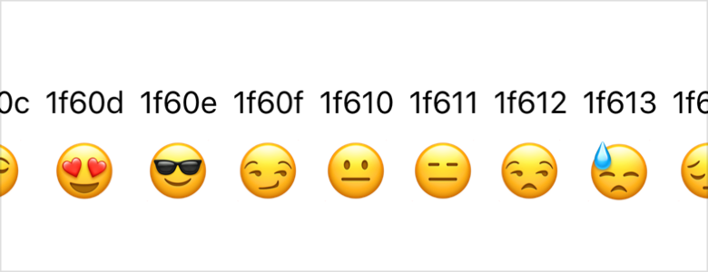

> Navigation: [Technologies](../technologies.md) · [SwiftUI](../swiftui.md)

# LazyHGrid

<sub>Structure</sub>

A container view that arranges its child views in a grid that grows horizontally, creating items only as needed.

<sub>iOS, iPadOS, Mac Catalyst, macOS, tvOS, visionOS, watchOS</sub>

```swift
nonisolated struct LazyHGrid<Content> where Content : View
```

## Overview

Use a lazy horizontal grid when you want to display a large, horizontally scrollable collection of views arranged in a two dimensional layout. The first view that you provide to the grid’s `content` closure appears in the top row of the column that’s on the grid’s leading edge. Additional views occupy successive cells in the grid, filling the first column from top to bottom, then the second column, and so on. The number of columns can grow unbounded, but you specify the number of rows by providing a corresponding number of [GridItem](griditem.md) instances to the grid’s initializer.

The grid in the following example defines two rows and uses a [ForEach](foreach.md) structure to repeatedly generate a pair of [Text](text.md) views for the rows in each column:

```swift
struct HorizontalSmileys: View {
    let rows = [GridItem(.fixed(30)), GridItem(.fixed(30))]

    var body: some View {
        ScrollView(.horizontal) {
            LazyHGrid(rows: rows) {
                ForEach(0x1f600...0x1f679, id: \.self) { value in
                    Text(String(format: "%x", value))
                    Text(emoji(value))
                        .font(.largeTitle)
                }
            }
        }
    }

    private func emoji(_ value: Int) -> String {
        guard let scalar = UnicodeScalar(value) else { return "?" }
        return String(Character(scalar))
    }
}
```

For each column in the grid, the top row shows a Unicode code point from the “Smileys” group, and the bottom shows its corresponding emoji:



You can achieve a similar layout using a [Grid](grid.md) container. Unlike a lazy grid, which creates child views only when SwiftUI needs to display them, a regular grid creates all of its child views right away. This enables the grid to provide better support for cell spacing and alignment. Only use a lazy grid if profiling your app shows that a [Grid](grid.md) view performs poorly because it tries to load too many views at once.

## Relationships

- **Conforms To**: [View](view.md)

## Topics

### Creating a horizontal grid

- [init(rows:alignment:spacing:pinnedViews:content:)](<lazyhgrid/init(rows_alignment_spacing_pinnedviews_content_).md>) — Creates a grid that grows horizontally.

## See Also

### Dynamically arranging views in two dimensions

- [LazyVGrid](lazyvgrid.md) — A container view that arranges its child views in a grid that grows vertically, creating items only as needed.
- [GridItem](griditem.md) — A description of a row or a column in a lazy grid.
