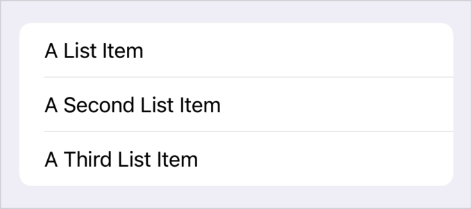
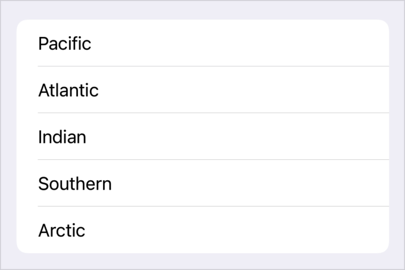
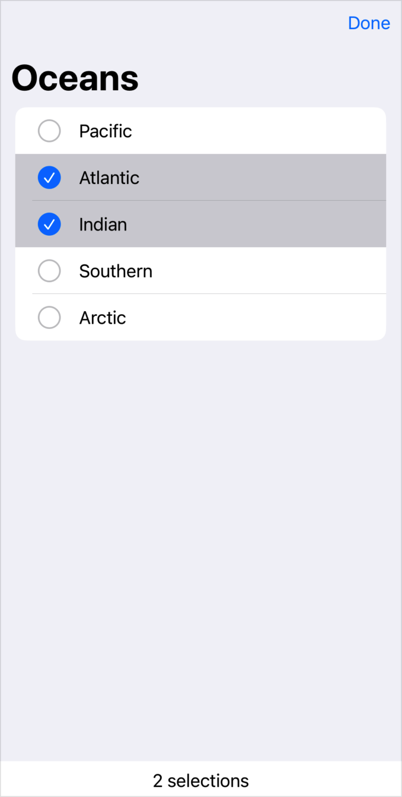
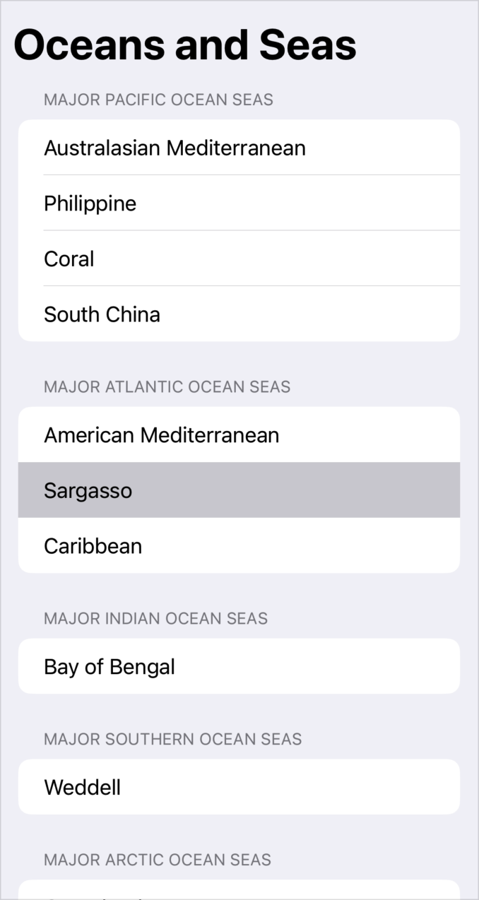
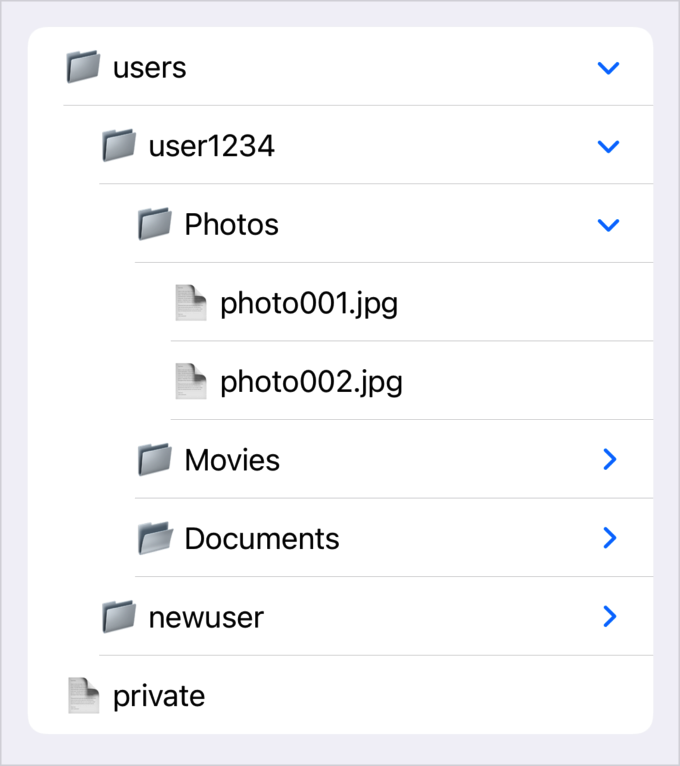
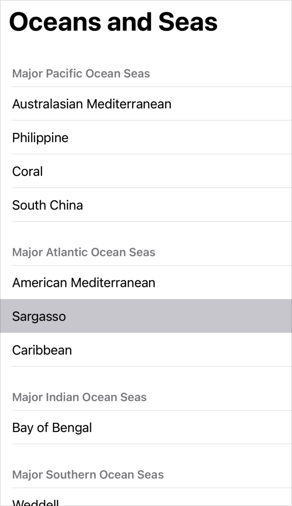

> Navigation: [Technologies](../technologies.md) · [SwiftUI](../swiftui.md)

# List

<sub>Structure</sub>

A container that presents rows of data arranged in a single column, optionally providing the ability to select one or more members.

<sub>iOS, iPadOS, Mac Catalyst, macOS, tvOS, visionOS, watchOS</sub>

```swift
nonisolated struct List<SelectionValue, Content> where SelectionValue : Hashable, Content : View
```

## Overview

In its simplest form, a `List` creates its contents statically, as shown in the following example:

```swift
var body: some View {
    List {
        Text("A List Item")
        Text("A Second List Item")
        Text("A Third List Item")
    }
}
```



More commonly, you create lists dynamically from an underlying collection of data. The following example shows how to create a simple list from an array of an `Ocean` type which conforms to [Identifiable](../swift/identifiable.md):

```swift
struct Ocean: Identifiable {
    let name: String
    let id = UUID()
}

private var oceans = [
    Ocean(name: "Pacific"),
    Ocean(name: "Atlantic"),
    Ocean(name: "Indian"),
    Ocean(name: "Southern"),
    Ocean(name: "Arctic")
]

var body: some View {
    List(oceans) {
        Text($0.name)
    }
}
```



### Supporting selection in lists

To make members of a list selectable, provide a binding to a selection variable. Binding to a single instance of the list data’s `Identifiable.ID` type creates a single-selection list. Binding to a [Set](../swift/set.md) with a type that matches the list data’s `Identifiable.ID` type creates a list that supports multiple selections. The following example shows how to add multiselect to the previous example:

```swift
struct Ocean: Identifiable, Hashable {
    let name: String
    let id = UUID()
}

private var oceans = [
    Ocean(name: "Pacific"),
    Ocean(name: "Atlantic"),
    Ocean(name: "Indian"),
    Ocean(name: "Southern"),
    Ocean(name: "Arctic")
]

@State private var multiSelection = Set<UUID>()

var body: some View {
    NavigationView {
        List(oceans, selection: $multiSelection) {
            Text($0.name)
        }
        .navigationTitle("Oceans")
        .toolbar { EditButton() }
    }
    Text("\(multiSelection.count) selections")
}
```

When people make a single selection by tapping or clicking, the selected cell changes its appearance to indicate the selection. To enable multiple selections with tap gestures, put the list into edit mode by either modifying the [editMode](environmentvalues/editmode.md) value, or adding an [EditButton](editbutton.md) to your app’s interface. When you put the list into edit mode, the list shows a circle next to each list item. The circle contains a checkmark when the user selects the associated item. The example above uses an Edit button, which changes its title to Done while in edit mode:



People can make multiple selections without needing to enter edit mode on devices that have a keyboard and mouse or trackpad, like Mac and iPad.

### Refreshing the list content

To make the content of the list refreshable using the standard refresh control, use the [refreshable(action:)](<view/refreshable(action_).md>) modifier.

The following example shows how to add a standard refresh control to a list. When the user drags the top of the list downward, SwiftUI reveals the refresh control and executes the specified action. Use an `await` expression inside the `action` closure to refresh your data. The refresh indicator remains visible for the duration of the awaited operation.

```swift
struct Ocean: Identifiable, Hashable {
     let name: String
     let id = UUID()
     let stats: [String: String]
 }

 class OceanStore: ObservableObject {
     @Published var oceans = [Ocean]()
     func loadStats() async {}
 }

 @EnvironmentObject var store: OceanStore

 var body: some View {
     NavigationView {
         List(store.oceans) { ocean in
             HStack {
                 Text(ocean.name)
                 StatsSummary(stats: ocean.stats) // A custom view for showing statistics.
             }
         }
         .refreshable {
             await store.loadStats()
         }
         .navigationTitle("Oceans")
     }
 }
```

### Supporting multidimensional lists

To create two-dimensional lists, group items inside [Section](section.md) instances. The following example creates sections named after the world’s oceans, each of which has [Text](text.md) views named for major seas attached to those oceans. The example also allows for selection of a single list item, identified by the `id` of the example’s `Sea` type.

```swift
struct ContentView: View {
    struct Sea: Hashable, Identifiable {
        let name: String
        let id = UUID()
    }

    struct OceanRegion: Identifiable {
        let name: String
        let seas: [Sea]
        let id = UUID()
    }

    private let oceanRegions: [OceanRegion] = [
        OceanRegion(name: "Pacific",
                    seas: [Sea(name: "Australasian Mediterranean"),
                           Sea(name: "Philippine"),
                           Sea(name: "Coral"),
                           Sea(name: "South China")]),
        OceanRegion(name: "Atlantic",
                    seas: [Sea(name: "American Mediterranean"),
                           Sea(name: "Sargasso"),
                           Sea(name: "Caribbean")]),
        OceanRegion(name: "Indian",
                    seas: [Sea(name: "Bay of Bengal")]),
        OceanRegion(name: "Southern",
                    seas: [Sea(name: "Weddell")]),
        OceanRegion(name: "Arctic",
                    seas: [Sea(name: "Greenland")])
    ]

    @State private var singleSelection: UUID?

    var body: some View {
        NavigationView {
            List(selection: $singleSelection) {
                ForEach(oceanRegions) { region in
                    Section(header: Text("Major \(region.name) Ocean Seas")) {
                        ForEach(region.seas) { sea in
                            Text(sea.name)
                        }
                    }
                }
            }
            .navigationTitle("Oceans and Seas")
        }
    }
}
```

Because this example uses single selection, people can make selections outside of edit mode on all platforms.



> [!note] Note
> In iOS 15, iPadOS 15, and tvOS 15 and earlier, lists support selection only in edit mode, even for single selections.

### Creating hierarchical lists

You can also create a hierarchical list of arbitrary depth by providing tree-structured data and a `children` parameter that provides a key path to get the child nodes at any level. The following example uses a deeply-nested collection of a custom `FileItem` type to simulate the contents of a file system. The list created from this data uses collapsing cells to allow the user to navigate the tree structure.

```swift
struct ContentView: View {
    struct FileItem: Hashable, Identifiable, CustomStringConvertible {
        var id: Self { self }
        var name: String
        var children: [FileItem]? = nil
        var description: String {
            switch children {
            case nil:
                return "📄 \(name)"
            case .some(let children):
                return children.isEmpty ? "📂 \(name)" : "📁 \(name)"
            }
        }
    }
    let fileHierarchyData: [FileItem] = [
      FileItem(name: "users", children:
        [FileItem(name: "user1234", children:
          [FileItem(name: "Photos", children:
            [FileItem(name: "photo001.jpg"),
             FileItem(name: "photo002.jpg")]),
           FileItem(name: "Movies", children:
             [FileItem(name: "movie001.mp4")]),
              FileItem(name: "Documents", children: [])
          ]),
         FileItem(name: "newuser", children:
           [FileItem(name: "Documents", children: [])
           ])
        ]),
        FileItem(name: "private", children: nil)
    ]
    var body: some View {
        List(fileHierarchyData, children: \.children) { item in
            Text(item.description)
        }
    }
}
```



### Styling lists

SwiftUI chooses a display style for a list based on the platform and the view type in which it appears. Use the [listStyle(_:)](<view/liststyle(__).md>) modifier to apply a different [ListStyle](liststyle.md) to all lists within a view. For example, adding `.listStyle(.plain)` to the example shown in the “Creating Multidimensional Lists” topic applies the [plain](liststyle/plain.md) style, the following screenshot shows:



## Relationships

- **Conforms To**: [View](view.md)

## Topics

### Creating a list from a set of views

- [init(content:)](<list/init(content_).md>) — Creates a list with the given content.
- [init(selection:content:)](<list/init(selection_content_).md>) — Creates a list with the given content that supports selecting a single row that cannot be deselected.

### Creating a list from enumerated data

- [init(_:rowContent:)](<list/init(__rowcontent_).md>) — Creates a list that computes its rows on demand from an underlying collection of identifiable data.
- [init(_:selection:rowContent:)](<list/init(__selection_rowcontent_).md>) — Creates a list that computes its rows on demand from an underlying collection of identifiable data, optionally allowing users to select a single row.
- [init(_:id:rowContent:)](<list/init(__id_rowcontent_).md>) — Creates a list that identifies its rows based on a key path to the identifier of the underlying data.
- [init(_:id:selection:rowContent:)](<list/init(__id_selection_rowcontent_).md>) — Creates a list that identifies its rows based on a key path to the identifier of the underlying data, optionally allowing users to select a single row.

### Creating a list from hierarchical data

- [init(_:children:rowContent:)](<list/init(__children_rowcontent_).md>) — Creates a hierarchical list that computes its rows on demand from a binding to an underlying collection of identifiable data.
- [init(_:children:selection:rowContent:)](<list/init(__children_selection_rowcontent_).md>) — Creates a hierarchical list that computes its rows on demand from a binding to an underlying collection of identifiable data and allowing users to have exactly one row always selected.
- [init(_:id:children:rowContent:)](<list/init(__id_children_rowcontent_).md>) — Creates a hierarchical list that identifies its rows based on a key path to the identifier of the underlying data.
- [init(_:id:children:selection:rowContent:)](<list/init(__id_children_selection_rowcontent_).md>) — Creates a hierarchical list that identifies its rows based on a key path to the identifier of the underlying data and allowing users to have exactly one row always selected.

### Creating a list from editable data

- [init(_:editActions:rowContent:)](<list/init(__editactions_rowcontent_).md>) — Creates a list that computes its rows on demand from an underlying collection of identifiable data and enables editing the collection.
- [init(_:editActions:selection:rowContent:)](<list/init(__editactions_selection_rowcontent_).md>) — Creates a list that computes its rows on demand from an underlying collection of identifiable data, enables editing the collection, and requires a selection of a single row.
- [init(_:id:editActions:rowContent:)](<list/init(__id_editactions_rowcontent_).md>) — Creates a list that computes its rows on demand from an underlying collection of identifiable data and enables editing the collection.
- [init(_:id:editActions:selection:rowContent:)](<list/init(__id_editactions_selection_rowcontent_).md>) — Creates a list that computes its rows on demand from an underlying collection of identifiable data, enables editing the collection, and requires a selection of a single row.

### Supporting types

- [body](list/body.md) — The content of the list.

## See Also

### Creating a list

- [Displaying data in lists](displaying-data-in-lists.md) — Visualize collections of data with platform-appropriate appearance.
- [listStyle(_:)](<view/liststyle(__).md>) — Sets the style for lists within this view.
