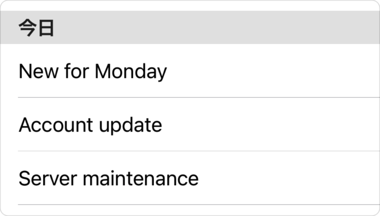

> Navigation: [Technologies](../technologies.md) · [SwiftUI](../swiftui.md)

# LocalizedStringKey

<sub>Structure</sub>

The key used to look up an entry in a strings file or strings dictionary file.

<sub>iOS, iPadOS, Mac Catalyst, macOS, tvOS, visionOS, watchOS</sub>

```swift
@frozen struct LocalizedStringKey
```

## Overview

Initializers for several SwiftUI types – such as [Text](text.md), [Toggle](toggle.md), [Picker](picker.md) and others –  implicitly look up a localized string when you provide a string literal. When you use the initializer `Text("Hello")`, SwiftUI creates a `LocalizedStringKey` for you and uses that to look up a localization of the `Hello` string. This works because `LocalizedStringKey` conforms to [ExpressibleByStringLiteral](../swift/expressiblebystringliteral.md).

Types whose initializers take a `LocalizedStringKey` usually have a corresponding initializer that accepts a parameter that conforms to [StringProtocol](../swift/stringprotocol.md). Passing a `String` variable to these initializers avoids localization, which is usually appropriate when the variable contains a user-provided value.

As a general rule, use a string literal argument when you want localization, and a string variable argument when you don’t. In the case where you want to localize the value of a string variable, use the string to create a new `LocalizedStringKey` instance.

The following example shows how to create [Text](text.md) instances both with and without localization. The title parameter provided to the [Section](section.md) is a literal string, so SwiftUI creates a `LocalizedStringKey` for it. However, the string entries in the `messageStore.today` array are `String` variables, so the [Text](text.md) views in the list use the string values verbatim.

```swift
List {
    Section(header: Text("Today")) {
        ForEach(messageStore.today) { message in
            Text(message.title)
        }
    }
}
```

If the app is localized into Japanese with the following translation of its `Localizable.strings` file:

```swift
 "Today" = "今日";
```

When run in Japanese, the example produces a list like the following, localizing “Today” for the section header, but not the list items.



## Relationships

- **Conforms To**: [Equatable](../swift/equatable.md), [ExpressibleByExtendedGraphemeClusterLiteral](../swift/expressiblebyextendedgraphemeclusterliteral.md), [ExpressibleByStringInterpolation](../swift/expressiblebystringinterpolation.md), [ExpressibleByStringLiteral](../swift/expressiblebystringliteral.md), [ExpressibleByUnicodeScalarLiteral](../swift/expressiblebyunicodescalarliteral.md)

## Topics

### Creating a key from a literal value

- [init(_:)](<localizedstringkey/init(__).md>) — Creates a localized string key from the given string value.
- [init(stringLiteral:)](<localizedstringkey/init(stringliteral_).md>) — Creates a localized string key from the given string literal.

### Creating a key from an interpolation

- [init(stringInterpolation:)](<localizedstringkey/init(stringinterpolation_).md>) — Creates a localized string key from the given string interpolation.
- [StringInterpolation](localizedstringkey/stringinterpolation.md) — Represents the contents of a string literal with interpolations while it’s being built, for use in creating a localized string key.

## See Also

### Localizing text

- [Preparing views for localization](preparing-views-for-localization.md) — Specify hints and add strings to localize your SwiftUI views.
- [locale](environmentvalues/locale.md) — The current locale that views should use.
- [typesettingLanguage(_:isEnabled:)](<view/typesettinglanguage(__isenabled_).md>) — Specifies the language for typesetting.
- [TypesettingLanguage](typesettinglanguage.md) — Defines how typesetting language is determined for text.
