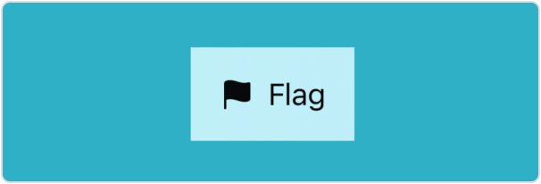
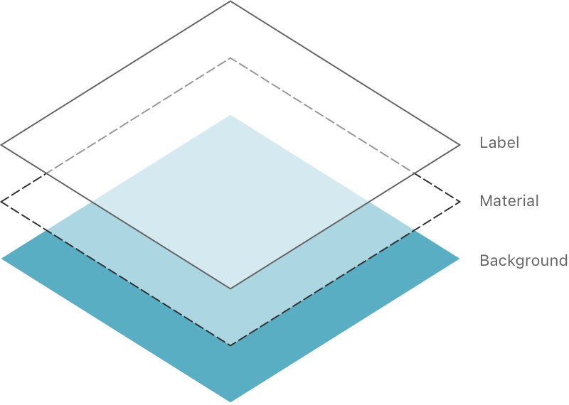
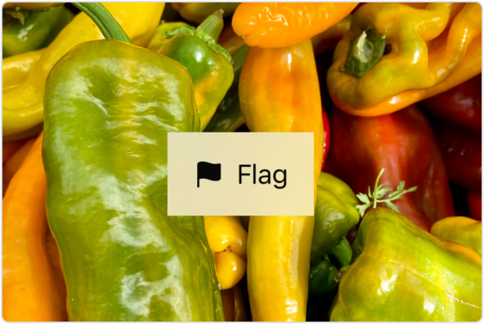
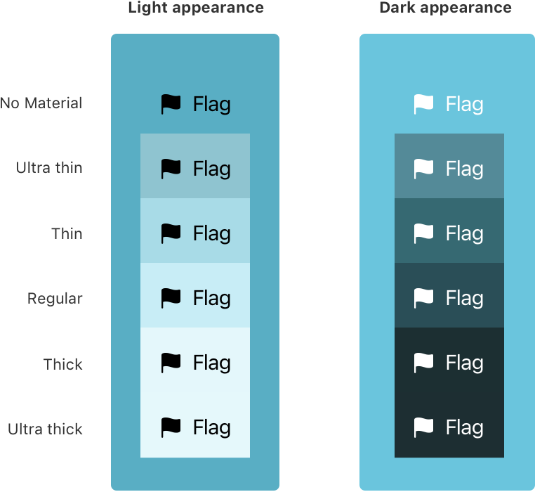
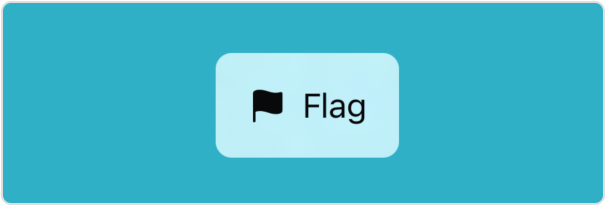

> Navigation: [Technologies](../technologies.md) · [SwiftUI](../swiftui.md)

# Material

<sub>Structure</sub>

A background material type.

<sub>iOS, iPadOS, Mac Catalyst, macOS, tvOS, visionOS, watchOS</sub>

```swift
struct Material
```

## Overview

You can apply a blur effect to a view that appears behind another view by adding a material with the [background(_:ignoresSafeAreaEdges:)](<view/background(__ignoressafeareaedges_).md>) modifier:

```swift
ZStack {
    Color.teal
    Label("Flag", systemImage: "flag.fill")
        .padding()
        .background(.regularMaterial)
}
```

In the example above, the [ZStack](zstack.md) layers a [Label](label.md) on top of the color [teal](shapestyle/teal.md). The background modifier inserts the regular material below the label, blurring the part of the background that the label — including its padding — covers:



A material isn’t a view, but adding a material is like inserting a translucent layer between the modified view and its background:



The blurring effect provided by the material isn’t simple opacity. Instead, it uses a platform-specific blending that produces an effect that resembles heavily frosted glass. You can see this more easily with a complex background, like an image:

```swift
ZStack {
    Image("chili_peppers")
        .resizable()
        .aspectRatio(contentMode: .fit)
    Label("Flag", systemImage: "flag.fill")
        .padding()
        .background(.regularMaterial)
}
```



For physical materials, the degree to which the background colors pass through depends on the thickness. The effect also varies with light and dark appearance:



If you need a material to have a particular shape, you can use the [background(_:in:fillStyle:)](<view/background(__in_fillstyle_).md>) modifier. For example, you can create a material with rounded corners:

```swift
ZStack {
    Color.teal
    Label("Flag", systemImage: "flag.fill")
        .padding()
        .background(.regularMaterial, in: RoundedRectangle(cornerRadius: 8))
}
```



When you add a material, foreground elements exhibit vibrancy, a context-specific blend of the foreground and background colors that improves contrast. However using [foregroundStyle(_:)](<view/foregroundstyle(__).md>) to set a custom foreground style — excluding the hierarchical styles, like [secondary](shapestyle/secondary-swift.type.property.md) — disables vibrancy.

> [!note] Note
> A material blurs a background that’s part of your app, but not what appears behind your app on the screen. For example, the content on the Home Screen doesn’t affect the appearance of a widget.

## Relationships

- **Conforms To**: [Copyable](../swift/copyable.md), [Escapable](../swift/escapable.md), [Sendable](../swift/sendable.md), [SendableMetatype](../swift/sendablemetatype.md), [ShapeStyle](shapestyle.md)

## Topics

### Getting material types

- [ultraThin](material/ultrathin.md) — A mostly translucent material.
- [thin](material/thin.md) — A material that’s more translucent than opaque.
- [regular](material/regular.md) — A material that’s somewhat translucent.
- [thick](material/thick.md) — A material that’s more opaque than translucent.
- [ultraThick](material/ultrathick.md) — A mostly opaque material.
- [bar](material/bar.md) — A material matching the style of system toolbars.

### Instance Methods

- [materialActiveAppearance(_:)](<material/materialactiveappearance(__).md>) — Sets an explicit active appearance for this material.

## See Also

### Supporting types

- [AngularGradient](angulargradient.md) — An angular gradient.
- [EllipticalGradient](ellipticalgradient.md) — A radial gradient that draws an ellipse.
- [LinearGradient](lineargradient.md) — A linear gradient.
- [RadialGradient](radialgradient.md) — A radial gradient.
- [ImagePaint](imagepaint.md) — A shape style that fills a shape by repeating a region of an image.
- [HierarchicalShapeStyle](hierarchicalshapestyle.md) — A shape style that maps to one of the numbered content styles.
- [HierarchicalShapeStyleModifier](hierarchicalshapestylemodifier.md) — Styles that you can apply to hierarchical shapes.
- [ForegroundStyle](foregroundstyle.md) — The foreground style in the current context.
- [BackgroundStyle](backgroundstyle.md) — The background style in the current context.
- [SelectionShapeStyle](selectionshapestyle.md) — A style used to visually indicate selection following platform conventional colors and behaviors.
- [SeparatorShapeStyle](separatorshapestyle.md) — A style appropriate for foreground separator or border lines.
- [TintShapeStyle](tintshapestyle.md) — A style that reflects the current tint color.
- [FillShapeStyle](fillshapestyle.md) — A shape style that displays one of the overlay fills.
- [LinkShapeStyle](linkshapestyle.md) — A style appropriate for links.
- [PlaceholderTextShapeStyle](placeholdertextshapestyle.md) — A style appropriate for placeholder text.
