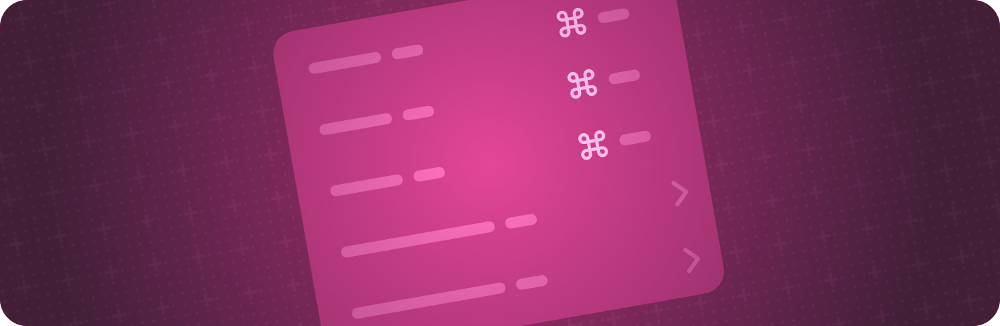

> Navigation: [Technologies](../technologies.md) · [SwiftUI](../swiftui.md)

# Menus and commands

API Collection

Provide space-efficient, context-dependent access to commands and controls.

## Overview

Use a menu to provide people with easy access to common commands. You can add items to a macOS or iPadOS app’s menu bar using the [commands(content:)](<scene/commands(content_).md>) scene modifier, or create context menus that people reveal near their current task using the [contextMenu(menuItems:)](<view/contextmenu(menuitems_).md>) view modifier.

Create submenus by nesting [Menu](menu.md) instances inside others. Use a [Divider](divider.md) view to create a separator between menu elements.

For design guidance, see [Menus](../design/human-interface-guidelines/menus.md) in the Human Interface Guidelines.

## Topics

### Building a menu bar

- [Building and customizing the menu bar with SwiftUI](building-and-customizing-the-menu-bar-with-swiftui.md) — Provide a seamless, cross-platform user experience by building a native menu bar for iPadOS and macOS.

### Creating a menu

- [Populating SwiftUI menus with adaptive controls](populating-swiftui-menus-with-adaptive-controls.md) — Improve your app by populating menus with controls and organizing your content intuitively.
- [Menu](menu.md) — A control for presenting a menu of actions.
- [menuStyle(_:)](<view/menustyle(__).md>) — Sets the style for menus within this view.

### Creating context menus

- [contextMenu(menuItems:)](<view/contextmenu(menuitems_).md>) — Adds a context menu to a view.
- [contextMenu(menuItems:preview:)](<view/contextmenu(menuitems_preview_).md>) — Adds a context menu with a custom preview to a view.
- [contextMenu(forSelectionType:menu:primaryAction:)](<view/contextmenu(forselectiontype_menu_primaryaction_).md>) — Adds an item-based context menu to a view.

### Defining commands

- [commands(content:)](<scene/commands(content_).md>) — Adds commands to the scene.
- [commandsRemoved()](<scene/commandsremoved().md>) — Removes all commands defined by the modified scene.
- [commandsReplaced(content:)](<scene/commandsreplaced(content_).md>) — Replaces all commands defined by the modified scene with the commands from the builder.
- [Commands](commands.md) — Conforming types represent a group of related commands that can be exposed to the user via the main menu on macOS and key commands on iOS.
- [CommandMenu](commandmenu.md) — Command menus are stand-alone, top-level containers for controls that perform related, app-specific commands.
- [CommandGroup](commandgroup.md) — Groups of controls that you can add to existing command menus.
- [CommandsBuilder](commandsbuilder.md) — Constructs command sets from multi-expression closures. Like `ContentBuilder`, it supports up to ten expressions in the closure body.
- [CommandGroupPlacement](commandgroupplacement.md) — The standard locations that you can place new command groups relative to.

### Getting built-in command groups

- [SidebarCommands](sidebarcommands.md) — A built-in set of commands for manipulating window sidebars.
- [TextEditingCommands](texteditingcommands.md) — A built-in group of commands for searching, editing, and transforming selections of text.
- [TextFormattingCommands](textformattingcommands.md) — A built-in set of commands for transforming the styles applied to selections of text.
- [ToolbarCommands](toolbarcommands.md) — A built-in set of commands for manipulating window toolbars.
- [ImportFromDevicesCommands](importfromdevicescommands.md) — A built-in set of commands that enables importing content from nearby devices.
- [InspectorCommands](inspectorcommands.md) — A built-in set of commands for manipulating inspectors.
- [EmptyCommands](emptycommands.md) — An empty group of commands.

### Showing a menu indicator

- [menuIndicator(_:)](<view/menuindicator(__).md>) — Sets the menu indicator visibility for controls within this view.
- [menuIndicatorVisibility](environmentvalues/menuindicatorvisibility.md) — The menu indicator visibility to apply to controls within a view.

### Configuring menu dismissal

- [menuActionDismissBehavior(_:)](<view/menuactiondismissbehavior(__).md>) — Tells a menu whether to dismiss after performing an action.
- [MenuActionDismissBehavior](menuactiondismissbehavior.md) — The set of menu dismissal behavior options.

### Setting a preferred order

- [menuOrder(_:)](<view/menuorder(__).md>) — Sets the preferred order of items for menus presented from this view.
- [menuOrder](environmentvalues/menuorder.md) — The preferred order of items for menus presented from this view.
- [MenuOrder](menuorder.md) — The order in which a menu presents its content.

### Deprecated types

- [MenuButton](menubutton.md) — A button that displays a menu containing a list of choices when pressed. _(deprecated)_
- [PullDownButton](pulldownbutton.md) _(deprecated)_
- [ContextMenu](contextmenu.md) — A container for views that you present as menu items in a context menu. _(deprecated)_

## See Also

### Views

- [View fundamentals](view-fundamentals.md) — Define the visual elements of your app using a hierarchy of views.
- [View configuration](view-configuration.md) — Adjust the characteristics of views in a hierarchy.
- [View styles](view-styles.md) — Apply built-in and custom appearances and behaviors to different types of views.
- [Animations](animations.md) — Create smooth visual updates in response to state changes.
- [Text input and output](text-input-and-output.md) — Display formatted text and get text input from the user.
- [Images](images.md) — Add images and symbols to your app’s user interface.
- [Controls and indicators](controls-and-indicators.md) — Display values and get user selections.
- [Shapes](shapes.md) — Trace and fill built-in and custom shapes with a color, gradient, or other pattern.
- [Drawing and graphics](drawing-and-graphics.md) — Enhance your views with graphical effects and customized drawings.
