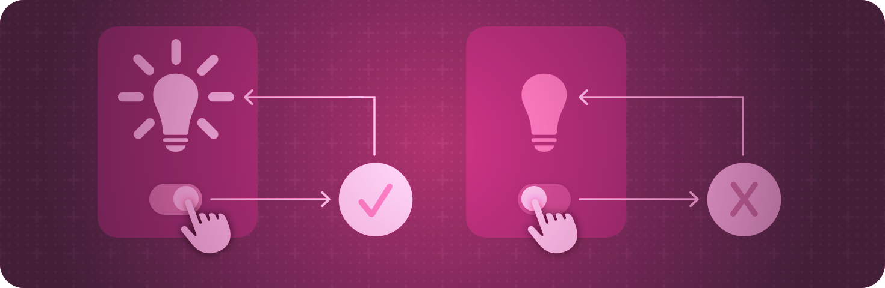

> Navigation: [Technologies](../technologies.md) · [SwiftUI](../swiftui.md)

# Model data

API Collection

Manage the data that your app uses to drive its interface.

## Overview

SwiftUI offers a declarative approach to user interface design. As you compose a hierarchy of views, you also indicate data dependencies for the views. When the data changes, either due to an external event or because of an action that the user performs, SwiftUI automatically updates the affected parts of the interface. As a result, the framework automatically performs most of the work that view controllers traditionally do.

The framework provides tools, like state variables and bindings, for connecting your app’s data to the user interface. These tools help you maintain a single source of truth for every piece of data in your app, in part by reducing the amount of glue logic you write. Select the tool that best suits the task you need to perform:

- Manage transient UI state locally within a view by wrapping value types as [State()](<state().md>) properties.
- Share a reference to a source of truth, like local state, using the [Binding](binding.md) property wrapper.
- Connect to and observe reference model data in views by applying the [Observable()](<../observation/observable().md>) macro to the model data type. Instantiate an observable model data type directly in a view with a [State()](<state().md>) property. Share the observable model data with other views in the hierarchy without passing a reference using the [Environment](environment.md) property wrapper.

## Topics

### Creating and sharing view state

- [Managing user interface state](managing-user-interface-state.md) — Encapsulate view-specific data within your app’s view hierarchy to make your views reusable.
- [State()](<state().md>) — Creates a property that can read and write a value managed by SwiftUI.
- [State(initialValue:)](<state(initialvalue_).md>) — Creates a property with an initial value that can read and write a value managed by SwiftUI.
- [State(wrappedValue:)](<state(wrappedvalue_).md>) — Creates a property with a wrapped value that can read and write a value managed by SwiftUI.
- [State](state.md) — A property wrapper type that can read and write a value managed by SwiftUI.
- [Bindable](bindable.md) — A property wrapper type that supports creating bindings to the mutable properties of observable objects.
- [Binding](binding.md) — A property wrapper type that can read and write a value owned by a source of truth.

### Creating model data

- [Managing model data in your app](managing-model-data-in-your-app.md) — Create connections between your app’s data model and views.
- [Migrating from the Observable Object protocol to the Observable macro](migrating-from-the-observable-object-protocol-to-the-observable-macro.md) — Update your existing app to leverage the benefits of Observation in Swift.
- [Observable()](<../observation/observable().md>) — Defines and implements conformance of the Observable protocol.
- [Monitoring data changes in your app](monitoring-model-data-changes-in-your-app.md) — Show changes to data in your app’s user interface by using observable objects.
- [StateObject](stateobject.md) — A property wrapper type that instantiates an observable object.
- [ObservedObject](observedobject.md) — A property wrapper type that subscribes to an observable object and invalidates a view whenever the observable object changes.
- [ObservableObject](../combine/observableobject.md) — A type of object with a publisher that emits before the object has changed.

### Responding to data changes

- [onChange(of:initial:_:)](<view/onchange(of_initial___).md>) — Adds a modifier for this view that fires an action when a specific value changes.
- [onReceive(_:perform:)](<view/onreceive(__perform_).md>) — Adds an action to perform when this view detects data emitted by the given publisher.

### Distributing model data throughout your app

- [environmentObject(_:)](<view/environmentobject(__).md>) — Supplies an observable object to a view’s hierarchy.
- [environmentObject(_:)](<scene/environmentobject(__).md>) — Supplies an `ObservableObject` to a view subhierarchy.
- [EnvironmentObject](environmentobject.md) — A property wrapper type for an observable object that a parent or ancestor view supplies.

### Managing dynamic data

- [DynamicProperty](dynamicproperty.md) — An interface for a stored variable that updates an external property of a view.

## See Also

### Data and storage

- [Environment values](environment-values.md) — Share data throughout a view hierarchy using the environment.
- [Preferences](preferences.md) — Indicate configuration preferences from views to their container views.
- [Persistent storage](persistent-storage.md) — Store data for use across sessions of your app.
