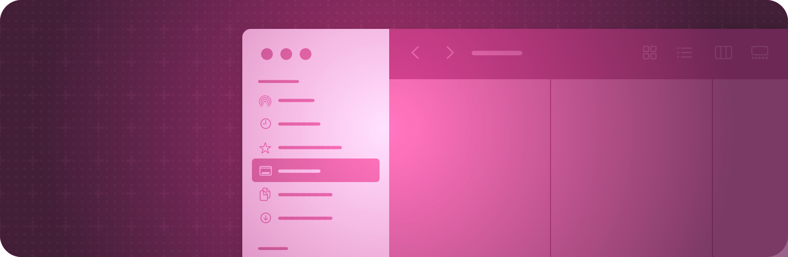

> Navigation: [Technologies](../technologies.md) · [SwiftUI](../swiftui.md)

# Navigation

API Collection

Enable people to move between different parts of your app’s view hierarchy within a scene.

## Overview

Use navigation containers to provide structure to your app’s user interface, enabling people to easily move among the parts of your app.

For example, people can move forward and backward through a stack of views using a [NavigationStack](navigationstack.md), or choose which view to display from a tab bar using a [TabView](tabview.md).

Configure navigation containers by adding view modifiers like [navigationSplitViewStyle(_:)](<view/navigationsplitviewstyle(__).md>) to the container. Use other modifiers on the views inside the container to affect the container’s behavior when showing that view. For example, you can use [navigationTitle(_:)](<view/navigationtitle(__).md>) on a view to provide a toolbar title to display when showing that view.

## Topics

### Essentials

- [Understanding the navigation stack](understanding-the-navigation-stack.md) — Learn about the navigation stack, links, and how to manage navigation types in your app’s structure.

### Presenting views in columns

- [Bringing robust navigation structure to your SwiftUI app](bringing-robust-navigation-structure-to-your-swiftui-app.md) — Use navigation links, stacks, destinations, and paths to provide a streamlined experience for all platforms, as well as behaviors such as deep linking and state restoration.
- [Migrating to new navigation types](migrating-to-new-navigation-types.md) — Improve navigation behavior in your app by replacing navigation views with navigation stacks and navigation split views.
- [NavigationSplitView](navigationsplitview.md) — A view that presents views in two or three columns, where selections in leading columns control presentations in subsequent columns.
- [navigationSplitViewStyle(_:)](<view/navigationsplitviewstyle(__).md>) — Sets the style for navigation split views within this view.
- [navigationSplitViewColumnWidth(_:)](<view/navigationsplitviewcolumnwidth(__).md>) — Sets a fixed, preferred width for the column containing this view.
- [navigationSplitViewColumnWidth(min:ideal:max:)](<view/navigationsplitviewcolumnwidth(min_ideal_max_).md>) — Sets a flexible, preferred width for the column containing this view.
- [NavigationSplitViewVisibility](navigationsplitviewvisibility.md) — The visibility of the leading columns in a navigation split view.
- [NavigationLink](navigationlink.md) — A view that controls a navigation presentation.

### Stacking views in one column

- [NavigationStack](navigationstack.md) — A view that displays a root view and enables you to present additional views over the root view.
- [NavigationPath](navigationpath.md) — A type-erased list of data representing the content of a navigation stack.
- [navigationDestination(for:destination:)](<view/navigationdestination(for_destination_).md>) — Associates a destination view with a presented data type for use within a navigation stack.
- [navigationDestination(isPresented:destination:)](<view/navigationdestination(ispresented_destination_).md>) — Associates a destination view with a binding that can be used to push the view onto a [NavigationStack](navigationstack.md).
- [navigationDestination(item:destination:)](<view/navigationdestination(item_destination_).md>) — Associates a destination view with a bound value for use within a navigation stack or navigation split view

### Managing column collapse

- [NavigationSplitViewColumn](navigationsplitviewcolumn.md) — A view that represents a column in a navigation split view.

### Setting titles for navigation content

- [navigationTitle(_:)](<view/navigationtitle(__).md>) — Configures the view’s title for purposes of navigation, using a localized string resource.
- [navigationSubtitle(_:)](<view/navigationsubtitle(__).md>) — Configures the view’s subtitle for purposes of navigation, using a localized string resource.
- [navigationDocument(_:)](<view/navigationdocument(__).md>) — Configures the view’s document for purposes of navigation.
- [navigationDocument(_:preview:)](<view/navigationdocument(__preview_).md>) — Configures the view’s document for purposes of navigation.

### Configuring the navigation bar

- [navigationBarBackButtonHidden(_:)](<view/navigationbarbackbuttonhidden(__).md>) — Hides the navigation bar back button for the view.
- [navigationBarTitleDisplayMode(_:)](<view/navigationbartitledisplaymode(__).md>) — Configures the title display mode for this view.
- [NavigationBarItem](navigationbaritem.md) — A configuration for a navigation bar that represents a view at the top of a navigation stack.

### Configuring the sidebar

- [sidebarRowSize](environmentvalues/sidebarrowsize.md) — The current size of sidebar rows.
- [SidebarRowSize](sidebarrowsize.md) — The standard sizes of sidebar rows.

### Presenting views in tabs

- [Enhancing your app’s content with tab navigation](enhancing-your-app-content-with-tab-navigation.md) — Keep your app content front and center while providing quick access to navigation using the tab bar.
- [TabView](tabview.md) — A view that switches between multiple child views using interactive user interface elements.
- [Tab](tab.md) — The content for a tab and the tab’s associated tab item in a tab view.
- [TabRole](tabrole.md) — A value that defines the purpose of the tab.
- [TabSection](tabsection.md) — A container that you can use to add hierarchy within a tab view.
- [tabViewStyle(_:)](<view/tabviewstyle(__).md>) — Sets the style for the tab view within the current environment.

### Configuring a tab bar

- [defaultAdaptableTabBarPlacement(_:)](<view/defaultadaptabletabbarplacement(__).md>) — Specifies the default placement for the tabs in a tab view using the adaptable sidebar style.
- [defaultTabBarPlacement(_:)](<view/defaulttabbarplacement(__).md>) — Specifies the preferred placement for the tabs of a [TabView](tabview.md) in the [sidebarAdaptable](tabviewstyle/sidebaradaptable.md) style on platforms where the tab bar cannot adapt between different representations, and only one representation can be shown. _(beta)_
- [tabViewSidebarHeader(content:)](<view/tabviewsidebarheader(content_).md>) — Adds a custom header to the sidebar of a tab view.
- [tabViewSidebarFooter(content:)](<view/tabviewsidebarfooter(content_).md>) — Adds a custom footer to the sidebar of a tab view.
- [tabViewSidebarBottomBar(content:)](<view/tabviewsidebarbottombar(content_).md>) — Adds a custom bottom bar to the sidebar of a tab view.
- [AdaptableTabBarPlacement](adaptabletabbarplacement.md) — A placement for tabs in a tab view using the adaptable sidebar style.
- [tabBarPlacement](environmentvalues/tabbarplacement.md) — The current placement of the tab bar.
- [TabBarPlacement](tabbarplacement.md) — A placement for tabs in a tab view.
- [isTabBarShowingSections](environmentvalues/istabbarshowingsections.md) — A Boolean value that determines whether a tab view shows the expanded contents of a tab section.
- [tabBarMinimizeBehavior(_:)](<view/tabbarminimizebehavior(__).md>) — Sets the behavior for tab bar minimization.
- [TabBarMinimizeBehavior](tabbarminimizebehavior.md)
- [TabViewBottomAccessoryPlacement](tabviewbottomaccessoryplacement.md) — A placement of the bottom accessory in a tab view. You can use this to adjust the content of the accessory view based on the placement.

### Configuring a tab

- [sectionActions(content:)](<view/sectionactions(content_).md>) — Adds custom actions to a section.
- [TabPlacement](tabplacement.md) — A place that a tab can appear.
- [TabContentBuilder](tabcontentbuilder.md) — A result builder that constructs tabs for a tab view that supports programmatic selection. This builder requires that all tabs in the tab view have the same selection type.
- [TabContent](tabcontent.md) — A type that provides content for programmatically selectable tabs in a tab view.
- [AnyTabContent](anytabcontent.md) — Type erased tab content.

### Enabling tab customization

- [tabViewCustomization(_:)](<view/tabviewcustomization(__).md>) — Specifies the customizations to apply to the sidebar representation of the tab view.
- [TabViewCustomization](tabviewcustomization.md) — The customizations a person makes to an adaptable sidebar tab view.
- [TabCustomizationBehavior](tabcustomizationbehavior.md) — The customization behavior of customizable tab view content.

### Displaying views in multiple panes

- [HSplitView](hsplitview.md) — A layout container that arranges its children in a horizontal line and allows the user to resize them using dividers placed between them.
- [VSplitView](vsplitview.md) — A layout container that arranges its children in a vertical line and allows the user to resize them using dividers placed between them.

### Deprecated Types

- [NavigationView](navigationview.md) — A view for presenting a stack of views that represents a visible path in a navigation hierarchy. _(deprecated)_
- [tabItem(_:)](<view/tabitem(__).md>) — Sets the tab bar item associated with this view. _(deprecated)_

## See Also

### App structure

- [App organization](app-organization.md) — Define the entry point and top-level structure of your app.
- [Scenes](scenes.md) — Declare the user interface groupings that make up the parts of your app.
- [Windows](windows.md) — Display user interface content in a window or a collection of windows.
- [Immersive spaces](immersive-spaces.md) — Display unbounded content in a person’s surroundings.
- [Documents](documents.md) — Enable people to open and manage documents.
- [Modal presentations](modal-presentations.md) — Present content in a separate view that offers focused interaction.
- [Toolbars](toolbars.md) — Provide immediate access to frequently used commands and controls.
- [Search](search.md) — Enable people to search for text or other content within your app.
- [App extensions](app-extensions.md) — Extend your app’s basic functionality to other parts of the system, like by adding a Widget.
