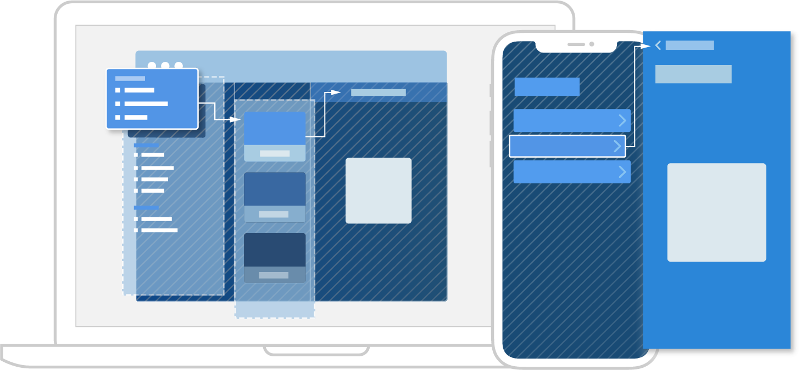

> Navigation: [Technologies](../technologies.md) · [SwiftUI](../swiftui.md)

# NavigationView

<sub>Structure</sub>

A view for presenting a stack of views that represents a visible path in a navigation hierarchy.

> [!warning] Deprecated
> Use [NavigationStack](navigationstack.md) and [NavigationSplitView](navigationsplitview.md) instead. For more information, see [Migrating to new navigation types](migrating-to-new-navigation-types.md).

<sub>iOS, iPadOS, Mac Catalyst, macOS, tvOS, visionOS, watchOS</sub>

```swift
nonisolated struct NavigationView<Content> where Content : View
```

## Overview

Use a `NavigationView` to create a navigation-based app in which the user can traverse a collection of views. Users navigate to a destination view by selecting a [NavigationLink](navigationlink.md) that you provide. On iPadOS and macOS, the destination content appears in the next column. Other platforms push a new view onto the stack, and enable removing items from the stack with platform-specific controls, like a Back button or a swipe gesture.



Use the [init(content:)](<navigationview/init(content_).md>) initializer to create a navigation view that directly associates navigation links and their destination views:

```swift
NavigationView {
    List(model.notes) { note in
        NavigationLink(note.title, destination: NoteEditor(id: note.id))
    }
    Text("Select a Note")
}
```

Style a navigation view by modifying it with the [navigationViewStyle(_:)](<view/navigationviewstyle(__).md>) view modifier. Use other modifiers, like [navigationTitle(_:)](<view/navigationtitle(__)-avgj.md>), on views presented by the navigation view to customize the navigation interface for the presented view.

## Relationships

- **Conforms To**: [View](view.md)

## Topics

### Creating a navigation view

- [init(content:)](<navigationview/init(content_).md>) — Creates a destination-based navigation view. _(deprecated)_

### Styling navigation views

- [navigationViewStyle(_:)](<view/navigationviewstyle(__).md>) — Sets the style for navigation views within this view. _(deprecated)_
- [NavigationViewStyle](navigationviewstyle.md) — A specification for the appearance and interaction of a navigation view. _(deprecated)_

## See Also

### Deprecated Types

- [tabItem(_:)](<view/tabitem(__).md>) — Sets the tab bar item associated with this view. _(deprecated)_
