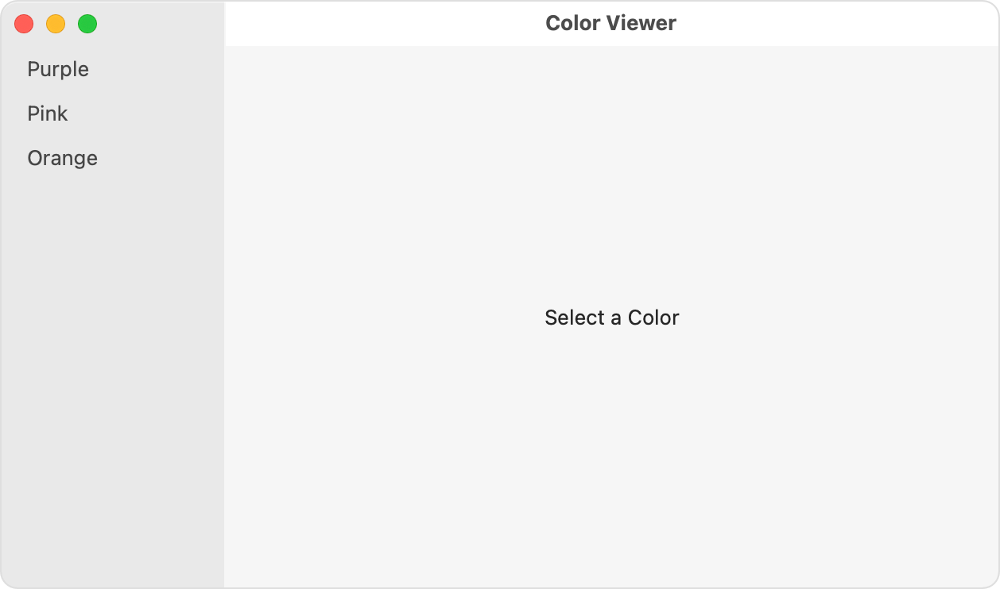
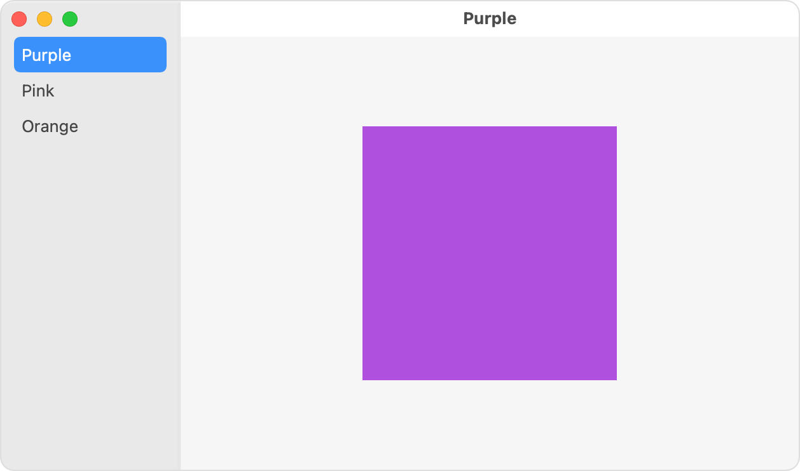
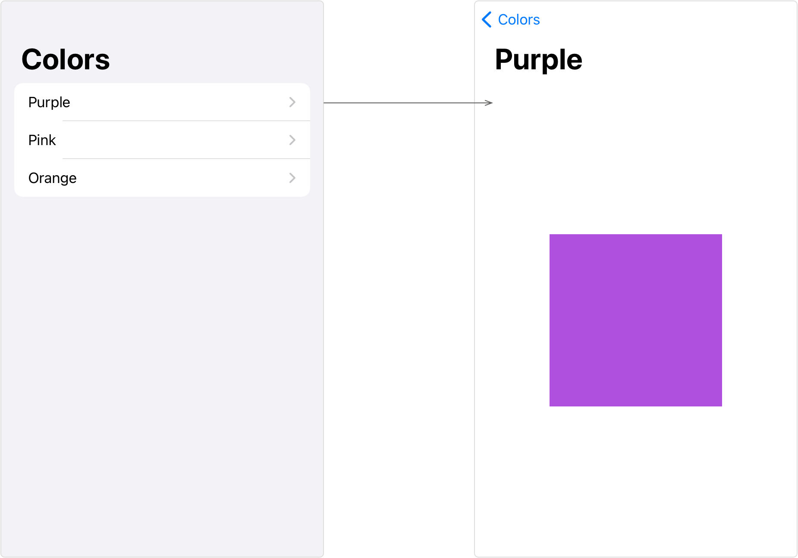

> Navigation: [Technologies](../../technologies.md) · [SwiftUI](../../swiftui.md) · [NavigationView](../navigationview.md)

# init(content:)

<sub>Initializer</sub>

Creates a destination-based navigation view.

> [!warning] Deprecated
> Use [NavigationStack](../navigationstack.md) and [NavigationSplitView](../navigationsplitview.md) instead. For more information, see [Migrating to new navigation types](../migrating-to-new-navigation-types.md).

<sub>iOS, iPadOS, Mac Catalyst, macOS, tvOS, visionOS, watchOS</sub>

```swift
nonisolated init(@ContentBuilder content: () -> Content)
```

## Parameters

- `content` — A [ViewBuilder](../viewbuilder.md) that produces the content that the navigation view wraps. Any views after the first act as placeholders for corresponding columns in a multicolumn display.

## Discussion

Perform navigation by initializing a link with a destination view. For example, consider a `ColorDetail` view that displays a color sample:

```swift
struct ColorDetail: View {
    var color: Color

    var body: some View {
        color
            .frame(width: 200, height: 200)
            .navigationTitle(color.description.capitalized)
    }
}
```

The following [NavigationView](../navigationview.md) presents three links to color detail views:

```swift
NavigationView {
    List {
        NavigationLink("Purple", destination: ColorDetail(color: .purple))
        NavigationLink("Pink", destination: ColorDetail(color: .pink))
        NavigationLink("Orange", destination: ColorDetail(color: .orange))
    }
    .navigationTitle("Colors")

    Text("Select a Color") // A placeholder to show before selection.
}
```

When the horizontal size class is [UserInterfaceSizeClass.regular](../userinterfacesizeclass/regular.md), like on an iPad in landscape mode, or on a Mac, the navigation view presents itself as a multicolumn view, using its second and later content views — a single [Text](../text.md) view in the example above — as a placeholder for the corresponding column:



<sub>A screenshot of a Mac window showing a multicolumn navigation view. The left column lists the colors Purple, Pink, and Orange, with none selected. The right column presents a placeholder view that says Select a Color.</sub>

When the user selects one of the navigation links from the list, the linked destination view replaces the placeholder text in the detail column:



<sub>A screenshot of a Mac window showing a multicolumn navigation view. The left column lists the colors Purple, Pink, and Orange, with Purple selected. The right column presents a detail view that shows a purple square.</sub>

When the size class is [UserInterfaceSizeClass.compact](../userinterfacesizeclass/compact.md), like on an iPhone in portrait orientation, the navigation view presents itself as a single column that the user navigates as a stack. Tapping one of the links replaces the list with the detail view, which provides a back button to return to the list:



<sub>Two screenshots of an iPhone in portrait orientation connected by an arrow. The first screenshot shows a single column consisting of a list of colors with the names Purple, Pink, and Orange. The second screenshot has the title Purple, and contains a purple square. The arrow connects the Purple item in the list on the left to the screenshot on the right.</sub>
