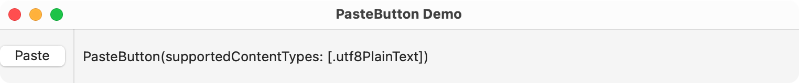

> Navigation: [Technologies](../technologies.md) · [SwiftUI](../swiftui.md)

# PasteButton

<sub>Structure</sub>

A system button that reads items from the pasteboard and delivers it to a closure.

<sub>iOS, iPadOS, Mac Catalyst, macOS, visionOS</sub>

```swift
nonisolated struct PasteButton
```

## Overview

Use a paste button when you want to provide a button for pasting items from the system pasteboard into your app. The system provides a button appearance and label appropriate to the current environment. However, you can use view modifiers like [buttonBorderShape(_:)](<view/buttonbordershape(__).md>), [labelStyle(_:)](<view/labelstyle(__).md>), and [tint(_:)](<view/tint(__).md>) to customize the button in some contexts.

You declare what type of items your app will accept; use a type that conforms to the [Transferable](../coretransferable/transferable.md) protocol. When the user taps or clicks the button, your closure receives the pasteboard items in the specified type.

In the following example, a paste button declares that it accepts a string. When the user taps or clicks the button, the sample’s closure receives an array of strings and sets the first as the value of `pastedText`, which updates a nearby [Text](text.md) view.

```swift
@State private var pastedText: String = ""

var body: some View {
    HStack {
        PasteButton(payloadType: String.self) { strings in
            pastedText = strings[0]
        }
        Divider()
        Text(pastedText)
        Spacer()
    }
}
```



A paste button automatically validates and invalidates based on changes to the pasteboard on iOS, but not on macOS.

## Relationships

- **Conforms To**: [View](view.md)

## Topics

### Creating a paste button

- [init(supportedContentTypes:payloadAction:)](<pastebutton/init(supportedcontenttypes_payloadaction_).md>) — Creates a Paste button that accepts specific types of data from the pasteboard.
- [init(payloadType:onPaste:)](<pastebutton/init(payloadtype_onpaste_).md>) — Creates an instance that accepts values of the specified type.

### Deprecated initializers

- [init(supportedTypes:payloadAction:)](<pastebutton/init(supportedtypes_payloadaction_).md>) — Creates a Paste button that accepts specific types of data from the pasteboard. _(deprecated)_
- [init(supportedTypes:validator:payloadAction:)](<pastebutton/init(supportedtypes_validator_payloadaction_).md>) — Creates a Paste button that accepts specific types of data from the pasteboard, performing a custom validation of the data before sending it to your app. _(deprecated)_
- [init(supportedContentTypes:validator:payloadAction:)](<pastebutton/init(supportedcontenttypes_validator_payloadaction_).md>) — Creates a Paste button that accepts specific types of data from the pasteboard, performing a custom validation of the data before sending it to your app. _(deprecated)_

## See Also

### Creating special-purpose buttons

- [EditButton](editbutton.md) — A button that toggles the edit mode environment value.
- [RenameButton](renamebutton.md) — A button that triggers a standard rename action.
