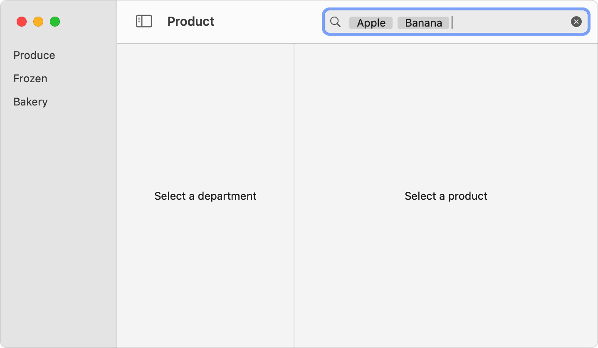

> Navigation: [Technologies](../technologies.md) · [SwiftUI](../swiftui.md) · [Search](search.md)

# Performing a search operation

<sub>Article</sub>

Update search results based on search text and optional tokens that you store.

## Overview

To conduct a search in your app’s data model, create storage for the query text and present it with a searchable view modifier. Because you manage the storage, you can detect when it changes and update the search operation in response. By updating search results as people type, you ensure that your app’s search interface is responsive.

You can also optionally provide storage for tokens, which are discrete search terms that your app recognizes. Tokens provide a way to combine multiple search terms, and make it easier for you to indicate that a search term is common or expected in your app.


<sub>A wide rectangle with rounded corners that contains a magnifying glass on the left, followed by the three words, Apple, Banana, and Pear, each inside its own dark gray rectangle. An X in a dark gray circle appears on the far right of the bounding rectangle.</sub>

For information on how to control the placement of the search field in your app’s interface, see [Adding a search interface to your app](adding-a-search-interface-to-your-app.md).

### Provide storage for a string

The searchable modifiers take a [Binding](binding.md) to a string value for the `text` input. The string serves as the storage for the search query field that SwiftUI displays. You can create this storage inside a view using a [State](state.md) property, and initialize it to an empty string:

```swift
@State private var searchText: String = ""
```

To make it easier to share the search query among different views, you can create a published value inside an observable object that’s part of your app’s model:

```swift
class Model: ObservableObject {
    @Published var searchText: String = ""
}
```

In either case, pass a [Binding](binding.md) to this string into the searchable view modifier by adding the dollar sign (`$`) prefix to the value:

```swift
struct ContentView: View {
    @EnvironmentObject private var model: Model
    @State private var departmentId: Department.ID?
    @State private var productId: Product.ID?

    var body: some View {
        NavigationSplitView {
            DepartmentList(departmentId: $departmentId)
        } content: {
            ProductList(departmentId: departmentId, productId: $productId)
                .searchable(text: $model.searchText)
        } detail: {
            ProductDetails(productId: productId)
        }
    }
}
```

### Provide storage for tokens

In addition to a search string, the search field can also display tokens when you use one of the searchable modifiers that has a `tokens` parameter, like [searchable(text:tokens:placement:prompt:token:)](<view/searchable(text_tokens_placement_prompt_token_).md>).

You create tokens by defining a group of values that conform to the [Identifiable](../swift/identifiable.md) protocol, then instantiate the collection of values. For example you can create an enumeration of fruit tokens:

```swift
enum FruitToken: String, Identifiable, Hashable, CaseIterable {
    case apple
    case pear
    case banana
    var id: Self { self }
}
```

Then add a new published property to your model to store a collection of tokens:

```swift
@Published var tokens: [FruitToken] = []
```

To display tokens, provide a [Binding](binding.md) to the `tokens` array as the searchable modifier’s `tokens` input parameter, and describe how to draw each token using the `token` closure. From the closure, return the [View](view.md) that represents the token given as an input. For example, you can use a [Text](text.md) view to represent each token:

```swift
ProductList(departmentId: departmentId, productId: $productId)
    .searchable(text: $model.searchText, tokens: $model.tokens) { token in
        switch token {
        case .apple: Text("Apple")
        case .pear: Text("Pear")
        case .banana: Text("Banana")
        }
    }
```

You can represent the token with a [Text](text.md) view, as the above example demonstrates. In iOS and iPadOS, you can use a [Label](label.md) instead. Ensure the view clearly represents the corresponding search query, and if you use a label, that the tokens fit the search query field’s height. Tokens appear at the beginning of the search field before any plain text. The following shows how the search field looks when the `tokens` array contains the `apple` and `banana` tokens:



<sub>A macOS window with three navigation panes. The pane on the left lists the items, Produce, Frozen, and Bakery. The middle pane has the placeholder text, Select a Department. The pane on the right has the placeholder text, Select a Product. The toolbar has a search field in the upper-right of the window that has the words, Apple and Banana, each inside a gray rectangle.</sub>

### Support tokens that have a mutable component

You can enable people to mutate part of the data that represents a token by using a [Picker](picker.md) in the `token` closure. For example, suppose you have fruit token data that contains both a kind and a hydration property:

```swift
struct FruitToken: String, Identifiable, Hashable, CaseIterable {
    enum Kind {
        case apple
        case pear
        case banana
        var id: Self { self }
    }

    enum Hydration: String, Identifiable, Hashable, CaseIterable {
        case hydrated
        case dehydrated
    }

    var kind: Kind
    var hydration: Hydration = .hydrated
}
```

With your new model, specify a [Binding](binding.md) to the token in the `token` closure by adding a dollar sign (`$`). Use the binding to create a picker for the `hydration` property and a label that uses the `kind` property:

```swift
ProductList(departmentId: departmentId, productId: $productId)
    .searchable(text: $model.searchText, tokens: $model.tokens) { $token in
        Picker(selection: $token.hydration) {
            ForEach(FruitToken.Hydration.allCases) { hydration in
                switch hydration {
                case .hydrated: Text("Hydrated")
                case .dehydrated: Text("Dehydrated")
                }
            }
        } label: {
            switch token.kind {
            case .apple: Text("Apple")
            case .pear: Text("Pear")
            case .banana: Text("Banana")
            }
        }
    }
```

### Add tokens to the search

Provide a way for people to add tokens to the search field. You can do this in different ways. For example, you can:

- Suggest tokens to add to the array by using one of the searchable view modifiers that have a `suggestedTokens` input parameter, like [searchable(text:tokens:suggestedTokens:placement:prompt:token:)](<view/searchable(text_tokens_suggestedtokens_placement_prompt_token_).md>). People select suggestions from a list that appears below the search field. For more information about offering suggestions for tokens, as well as for search text, see [Suggesting search terms](suggesting-search-terms.md).
- Monitor the search string as people edit it. When you detect a substring that matches one of the tokens, convert the text into a token by removing the relevant characters from the string and add the corresponding token to the `tokens` array.
- Wait until you see a dividing character in the search string, like a comma or a space, and then attempt to tokenize the preceding characters.
- Wait until someone submits the search, and then attempt to tokenize the entire search string. For more information about submitting a search, see [Managing search interface activation](managing-search-interface-activation.md).

### Conduct the search

When you detect changes in the search query, your app can begin a search. How you perform the search operation depends on how your app stores and presents data. One approach is to filter the elements that appear in a [List](list.md) based on whether a field in the list’s items matches the search query. For example, you can create a method that returns only the items in an array of products with names that match the search text or one of the tokens currently in the search field:

```swift
func filteredProducts(
    products: [Product],
    searchText: String,
    tokens: [FruitToken]
) -> [Product] {
    guard !searchText.isEmpty || !tokens.isEmpty else { return products }
    return products.filter { product in
        product.name.lowercased().contains(searchText.lowercased()) ||
        tokens.map({ $0.rawValue }).contains(product.name.lowercased())
    }
}
```

Consider the complexity of the search and the cost of changing the search terms. If the cost is high, like when updates require network access, or for complex filter logic, consider prefetching and caching data or reducing the frequency of updates. Alternatively, you can wait until someone submits the query before conducting the search. For information about detecting query submission, see [Managing search interface activation](managing-search-interface-activation.md).

If the search space can be broken into broad categories, you can help people narrow the search more quickly by providing a scope. See [Scoping a search operation](scoping-a-search-operation.md).

## See Also

### Searching your app’s data model

- [Adding a search interface to your app](adding-a-search-interface-to-your-app.md) — Present an interface that people can use to search for content in your app.
- [searchable(text:placement:prompt:)](<view/searchable(text_placement_prompt_).md>) — Marks this view as searchable, which configures the display of a search field.
- [searchable(text:tokens:placement:prompt:token:)](<view/searchable(text_tokens_placement_prompt_token_).md>) — Marks this view as searchable with text and tokens.
- [searchable(text:editableTokens:placement:prompt:token:)](<view/searchable(text_editabletokens_placement_prompt_token_).md>) — Marks this view as searchable, which configures the display of a search field.
- [SearchFieldPlacement](searchfieldplacement.md) — The placement of a search field in a view hierarchy.
