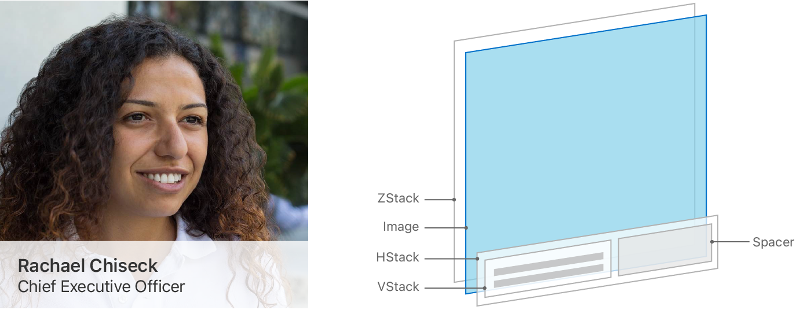
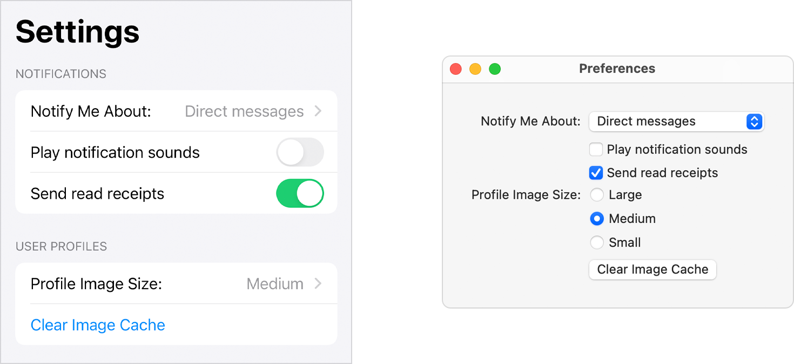

> Navigation: [Technologies](../technologies.md) · [SwiftUI](../swiftui.md) · [Layout fundamentals](layout-fundamentals.md)

# Picking container views for your content

Article

Build flexible user interfaces by using stacks, grids, lists, and forms.

## Overview

SwiftUI provides a range of container views that group and repeat views. Use some containers purely for structure and layout, like stack views, lazy stack views, and grid views. Use others, like lists and forms, to also adopt system-standard visuals and interactivity.

Choosing the most appropriate container views for each part of your app’s user interface is an important skill to learn; it helps you with everything from positioning two views next to each other, to creating complex layouts with hundreds of elements.

### Group collections of views

Stack views are the most primitive layout container available in SwiftUI. Use stacks to group collections of views into horizontal or vertical lines, or to stack them on top of one another.

Use [HStack](hstack.md) to lay out views in a horizontal line, [VStack](vstack.md) to position views in a vertical line, and [ZStack](zstack.md) to layer views on top of one another. Then, combine stack views to compose more complex layouts. These three kinds of stacks, along with their alignment and spacing properties, view modifiers, and [Spacer](spacer.md) views combine to allow extensive layout flexibility.

A diagram showing how a generic user profile layout might utilize stack views. The diagram shows the rendered layout next to an exploded, 3D illustration of the view hierarchy showing four layers of views stacked on top of each other. The lowest level of the hierarchy is a ZStack; above that is an Image view, then an HStack, and finally a VStack and Spacer view at the highest level.

You often use stack views as building blocks inside other container views. For example, a [List](list.md) typically contains stack views, with which you lay out views inside each row.

For more information on using stack views to lay out views, see [Building layouts with stack views](building-layouts-with-stack-views.md).

### Repeat views or groups of views

You can also use [HStack](hstack.md), [VStack](vstack.md), [LazyHStack](lazyhstack.md), and [LazyVStack](lazyvstack.md) to repeat views or groups of views. Place a stack view inside a [ScrollView](scrollview.md) so your content can expand beyond the bounds of its container. Users can simultaneously scroll horizontally, vertically, or in both directions.

Stack views and lazy stacks have similar functionality, and they may feel interchangeable, but they each have strengths in different situations. Stack views load their child views all at once, making layout fast and reliable, because the system knows the size and shape of every subview as it loads them. Lazy stacks trade some degree of layout correctness for performance, because the system only calculates the geometry for subviews as they become visible.

When choosing the type of stack view to use, always start with a standard stack view and only switch to a lazy stack if profiling your code shows a worthwhile performance improvement. For more information on lazy stack views and how to measure your app’s view loading performance, see [Creating performant scrollable stacks](creating-performant-scrollable-stacks.md).

### Position views in a two-dimensional layout

To lay out views horizontally and vertically at the same time, use a [LazyVGrid](lazyvgrid.md) or [LazyHGrid](lazyhgrid.md). Grids are a good container choice to lay out content that naturally displays in square containers, like an image gallery. Grids are also a good choice to scale user interface layouts up for display on larger devices. For example, a directory of contact information might suit a list or vertical stack on an iPhone, but might fit more naturally in a grid layout when scaled up to a larger device like the iPad or Mac.

A diagram showing how a user interface might scale up from a device with a smaller screen, such as an iPhone onto a device with a larger screen, like a Mac.

Like stack views, SwiftUI grid views don’t inherently include a scrolling viewport; place them inside a [ScrollView](scrollview.md) if the content might be larger than the available space.

### Display and interact with collections of data

[List](list.md) views in SwiftUI are conceptually similar to the combination of a [LazyVStack](lazyvstack.md) and [ScrollView](scrollview.md), but by default will include platform-appropriate visual styling around and between their contained items. For example, when running on iOS, the default configuration of a [List](list.md) adds separator lines between rows, and draws disclosure indicators for items which have navigation, and where the list is contained in a [NavigationView](navigationview.md).

[List](list.md) views also support platform-appropriate interactivity for common tasks such as inserting, reordering, and removing items. For example, adding the [onDelete(perform:)](<dynamicviewcontent/ondelete(perform_).md>) modifier to a [ForEach](foreach.md) inside a [List](list.md) will enable system-standard swipe-to-delete interactivity.

Like [LazyHStack](lazyhstack.md) and [LazyVStack](lazyvstack.md), rows inside a SwiftUI [List](list.md) also load lazily, and there is no non-lazy equivalent. Lists inherently scroll when necessary, and you don’t need to wrap them in a [ScrollView](scrollview.md).

### Group views and controls for data entry

Use [Form](form.md) to build data-entry interfaces, settings, or preference screens that use system-standard controls.

A diagram showing a macOS preferences window, and an iOS settings screen next to each other. The screens both contain the same settings, but they use different, platform-appropriate controls.

Like all SwiftUI views, forms display their content in a platform-appropriate way. Be aware that the layout of controls inside a [Form](form.md) may differ significantly based on the platform. For example, a [Picker](picker.md) control in a [Form](form.md) on iOS adds navigation, showing the picker’s choices on a separate screen, while the same [Picker](picker.md) on macOS displays a pop-up button or set of radio buttons.
