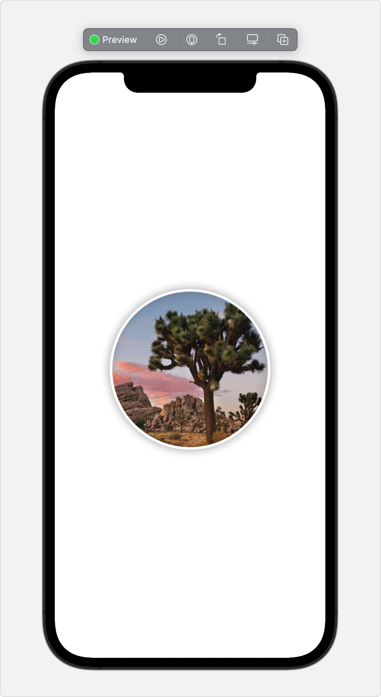
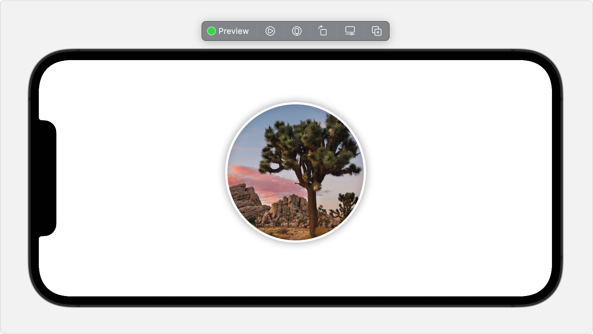
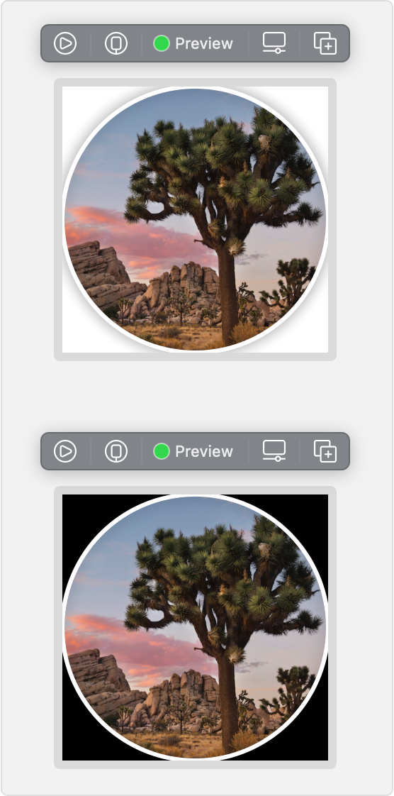

> Navigation: [Technologies](../technologies.md) · [SwiftUI](../swiftui.md)

# PreviewProvider

<sub>Protocol</sub>

A type that produces view previews in Xcode.

> [!warning] Deprecated
> Use [Preview(_:body:)](<preview(__body_).md>) instead.

<sub>iOS, iPadOS, Mac Catalyst, macOS, tvOS, visionOS, watchOS</sub>

```swift
@MainActor @preconcurrency protocol PreviewProvider : _PreviewProvider
```

## Overview

> [!important] Important
> You can use this protocol to define a preview manually, but you typically use a preview macro like [Preview(_:body:)](<preview(__body_).md>) instead.

You can create an Xcode preview by declaring a structure that conforms to the `PreviewProvider` protocol. Implement the required [previews](previewprovider/previews-swift.type.property.md) computed property, and return the view to display:

```swift
struct CircleImage_Previews: PreviewProvider {
    static var previews: some View {
        CircleImage()
    }
}
```

Xcode statically discovers preview providers in your project and generates previews for any providers currently open in the source editor. Xcode generates the preview using the current run destination as a hint for which device to display. For example, Xcode shows the following preview if you’ve selected an iOS target to run on the iPhone 12 Pro Max simulator:



When you create a new file (File \> New \> File) and choose the SwiftUI view template, Xcode automatically inserts a preview structure at the bottom of the file that you can configure. You can also create new preview structures in an existing SwiftUI view file by choosing Editor \> Create Preview.

Customize the preview’s appearance by adding view modifiers, just like you do when building a custom [View](view.md). This includes preview-specific modifiers that let you control aspects of the preview, like the device orientation:

```swift
struct CircleImage_Previews: PreviewProvider {
    static var previews: some View {
        CircleImage()
            .previewInterfaceOrientation(.landscapeLeft)
    }
}
```



For the complete list of preview customizations, see [Previews in Xcode](previews-in-xcode.md).

Xcode creates different previews for each view in your preview, so you can see variations side by side. For example, you might want to see a view’s light and dark appearances simultaneously:

```swift
struct CircleImage_Previews: PreviewProvider {
    static var previews: some View {
        CircleImage()
        CircleImage()
            .preferredColorScheme(.dark)
    }
}
```

Use a [Group](group.md) when you want to maintain different previews, but apply a single modifier to all of them:

```swift
struct CircleImage_Previews: PreviewProvider {
    static var previews: some View {
        Group {
            CircleImage()
            CircleImage()
                .preferredColorScheme(.dark)
        }
        .previewLayout(.sizeThatFits)
    }
}
```



## Topics

### Creating a preview

- [previews](previewprovider/previews-swift.type.property.md) — A collection of views to preview. _(deprecated)_
- [Previews](previewprovider/previews-swift.associatedtype.md) — The type to preview. _(deprecated)_

### Specifying the platform

- [platform](previewprovider/platform.md) — The platform on which to run the provider. _(deprecated)_

## See Also

### Defining a preview

- [PreviewPlatform](previewplatform.md) — Platforms that can run the preview. _(deprecated)_
- [previewDisplayName(_:)](<view/previewdisplayname(__).md>) — Sets a user visible name to show in the canvas for a preview. _(deprecated)_
