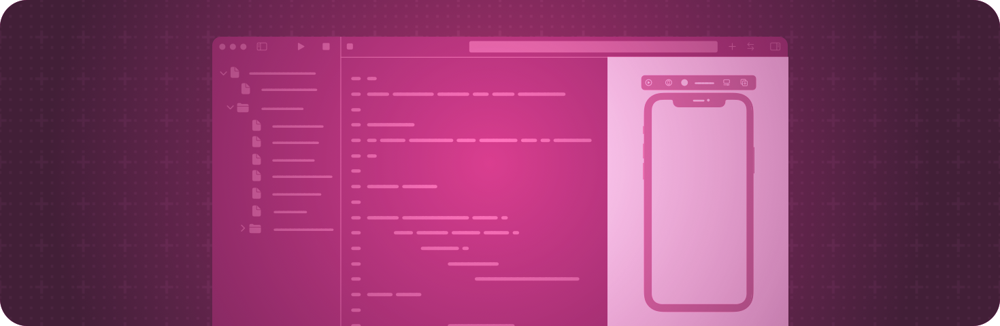

> Navigation: [Technologies](../technologies.md) · [SwiftUI](../swiftui.md)

# Previews in Xcode

API Collection

Generate dynamic, interactive previews of your custom views.

## Overview

When you create a custom [View](view.md) with SwiftUI, Xcode can display a preview of the view’s content that stays up-to-date as you make changes to the view’s code. You use one of the preview macros — like [Preview(_:body:)](<preview(__body_).md>) — to tell Xcode what to display. Xcode shows the preview in a canvas beside your code.

Different preview macros enable different kinds of configuration. For example, you can add traits that affect the preview’s appearance using the [Preview(_:traits:_:body:)](<preview(__traits___body_).md>) macro or add custom viewpoints for the preview using the [Preview(_:traits:body:cameras:)](<preview(__traits_body_cameras_).md>) macro. You can also check how your view behaves inside a specific scene type. For example, in visionOS you can use the [Preview(_:immersionStyle:traits:body:)](<preview(__immersionstyle_traits_body_).md>) macro to preview your view inside an [ImmersiveSpace](immersivespace.md).

## Topics

### Essentials

- [Previewing your app’s interface in Xcode](../xcode/previewing-your-apps-interface-in-xcode.md) — Iterate designs quickly and preview your apps’ displays across different Apple devices.

### Creating a preview

- [Preview(_:body:)](<preview(__body_).md>) — Creates a preview of a SwiftUI view.
- [Preview(_:traits:_:body:)](<preview(__traits___body_).md>) — Creates a preview of a SwiftUI view using the specified traits.
- [Preview(_:traits:body:cameras:)](<preview(__traits_body_cameras_).md>) — Creates a preview of a SwiftUI view using the specified traits and custom viewpoints.
- [Preview(_:traits:arguments:body:)](<preview(__traits_arguments_body_).md>) — Creates a group of previews of a parameterized SwiftUI view, varying its inputs over the provided arguments.

### Customizing a preview

- [Previewable()](<previewable().md>) — Tag allowing a dynamic property to appear inline in a preview.
- [PreviewModifier](previewmodifier.md) — A type that defines an environment in which previews can appear.
- [PreviewModifierContent](previewmodifiercontent.md) — The type-erased content of a preview.

### Creating a preview in the context of a scene

- [Preview(_:immersionStyle:traits:body:)](<preview(__immersionstyle_traits_body_).md>) — Creates a preview of a SwiftUI view in an immersive space.
- [Preview(_:immersionStyle:traits:body:cameras:)](<preview(__immersionstyle_traits_body_cameras_).md>) — Creates a preview of a SwiftUI view in an immersive space with custom viewpoints.
- [Preview(_:windowStyle:traits:body:)](<preview(__windowstyle_traits_body_).md>) — Creates a preview of a SwiftUI view in a window.
- [Preview(_:windowStyle:traits:body:cameras:)](<preview(__windowstyle_traits_body_cameras_).md>) — Creates a preview of a SwiftUI view in a window with custom viewpoints.

### Building in debug mode

- [DebugReplaceableView](debugreplaceableview.md) — Erases view opaque result types in debug builds.

### Deprecated

- [Deprecated](previews-deprecated.md) — Review deprecated preview symbols and their replacements.

## See Also

### Tool support

- [Xcode library customization](xcode-library-customization.md) — Expose custom views and modifiers in the Xcode library.
- [Performance analysis](performance-analysis.md) — Measure and improve your app’s responsiveness.
