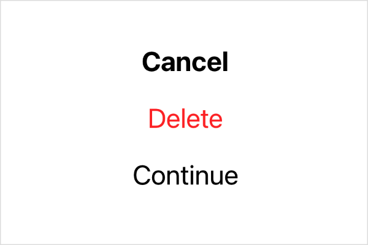

> Navigation: [Technologies](../../technologies.md) · [SwiftUI](../../swiftui.md) · [PrimitiveButtonStyleConfiguration](../primitivebuttonstyleconfiguration.md)

# role

<sub>Instance Property</sub>

An optional semantic role describing the button’s purpose.

<sub>iOS, iPadOS, Mac Catalyst, macOS, tvOS, visionOS, watchOS</sub>

```swift
let role: ButtonRole?
```

## Discussion

A value of `nil` means that the Button has no assigned role. If the button does have a role, use it to make adjustments to the button’s appearance. The following example shows a custom style that uses bold text when the role is [cancel](../buttonrole/cancel.md), [red](../shapestyle/red.md) text when the role is [destructive](../buttonrole/destructive.md), and adds no special styling otherwise:

```swift
struct MyButtonStyle: PrimitiveButtonStyle {
    func makeBody(configuration: Configuration) -> some View {
        configuration.label
            .onTapGesture {
                configuration.trigger()
            }
            .font(
                configuration.role == .cancel ? .title2.bold() : .title2)
            .foregroundColor(
                configuration.role == .destructive ? Color.red : nil)
    }
}
```

You can create one of each button using this style to see the effect:

```swift
VStack(spacing: 20) {
    Button("Cancel", role: .cancel) {}
    Button("Delete", role: .destructive) {}
    Button("Continue") {}
}
.buttonStyle(MyButtonStyle())
```


