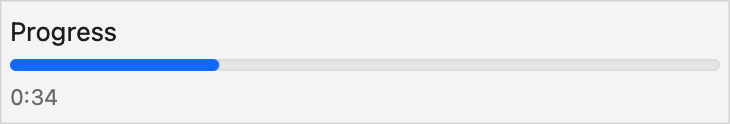

> Navigation: [Technologies](../../technologies.md) · [SwiftUI](../../swiftui.md) · [ProgressView](../progressview.md)

# init(timerInterval:countsDown:label:)

<sub>Initializer</sub>

Creates a progress view for showing continuous progress as time passes, with a descriptive label.

<sub>iOS, iPadOS, Mac Catalyst, macOS, tvOS, visionOS, watchOS</sub>

```swift
nonisolated init(timerInterval: ClosedRange<Date>, countsDown: Bool = true, @ContentBuilder label: () -> Label)
```

## Parameters

- `timerInterval` — The date range over which the view progresses.

- `countsDown` — A Boolean value that determines whether the view empties or fills as time passes. If `true` (the default), the view empties.

- `label` — An optional view that describes the purpose of the progress view.

## Discussion

Use this initializer to create a view that shows continuous progress within a date range. The following example initializes a progress view with a range of `start...end`, where `start` is 30 seconds in the past and `end` is 90 seconds in the future. As a result, the progress view begins at 25 percent complete. This example also provides a custom descriptive label.

```swift
struct ContentView: View {
    let start = Date().addingTimeInterval(-30)
    let end = Date().addingTimeInterval(90)

    var body: some View {
        ProgressView(timerInterval: start...end,
                     countsDown: false) {
            Text("Progress")
         }
    }
}
```



By default, the progress view empties as time passes from the start of the date range to the end, but you can use the `countsDown` parameter to create a progress view that fills as time passes, as the above example demonstrates.

The progress view provided by this initializer uses a text label that automatically updates to describe the current time remaining. To provide a custom label to show the current value, use [init(value:total:label:currentValueLabel:)](<init(value_total_label_currentvaluelabel_).md>) instead.

> [!note] Note
> Date-relative progress views, such as those created with this initializer, don’t support custom styles.

## See Also

### Create a progress view spanning a date range

- [init(timerInterval:countsDown:)](<init(timerinterval_countsdown_).md>) — Creates a progress view for showing continuous progress as time passes.
- [init(timerInterval:countsDown:label:currentValueLabel:)](<init(timerinterval_countsdown_label_currentvaluelabel_).md>) — Creates a progress view for showing continuous progress as time passes, with descriptive and current progress labels.
