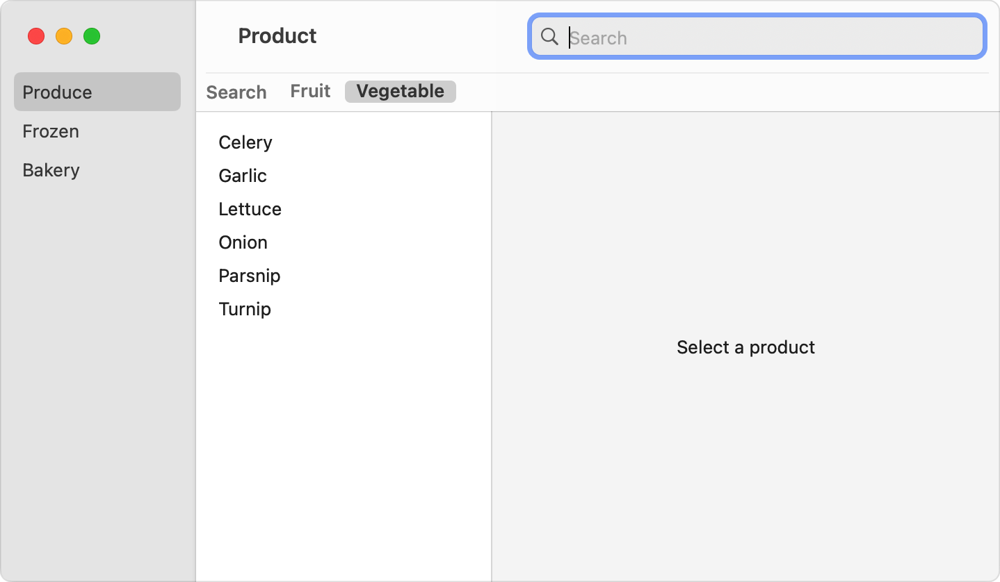

> Navigation: [Technologies](../technologies.md) · [SwiftUI](../swiftui.md) · [Search](search.md)

# Scoping a search operation

<sub>Article</sub>

Divide the search space into a few broad categories.

## Overview

If the data you want to search falls into a few categories, you can define different scopes to help people narrow their search. When you define a scope, SwiftUI presents a picker that people can use to choose one of them. You then use the current scope selection as one of the inputs to the search operation.

### Define the possible scopes

Start by creating a type that conforms to the [Hashable](../swift/hashable.md) protocol to represent the possible scopes. For example, you can use an enumeration to scope a product search to just fruits or just vegetables:

```swift
enum ProductScope {
    case fruit
    case vegetable
}
```

Then create a property to store the current scope, either as a state variable in a view, or a published property in your model:

```swift
@Published var scope: ProductScope = .fruit
```

### Apply the scope

To use the scope information, bind the current scope to the [searchScopes(_:scopes:)](<view/searchscopes(__scopes_).md>) modifier. You also indicate a set of views that correspond to the different scopes. Like the [searchSuggestions(_:)](<view/searchsuggestions(__).md>) modifier, the scopes modifier operates on the searchable modifier that’s closer to the modified view, so it needs to follow the searchable modifier:

```swift
ProductList(departmentId: departmentId, productId: $productId)
    .searchable(text: $model.searchText, tokens: $model.tokens) { token in
        switch token {
        case .apple: Text("Apple")
        case .pear: Text("Pear")
        case .banana: Text("Banana")
        }
    }
    .searchScopes($model.scope) {
        Text("Fruit").tag(ProductScope.fruit)
        Text("Vegetable").tag(ProductScope.vegetable)
    }
```

SwiftUI uses the binding and views to add a [Picker](picker.md) to the search field. By default, the picker appears below the search field in macOS when search is active, or in iOS when someone starts entering text into the search field:

**macOS**



<sub>A macOS window with three navigation panes. The pane on the left lists the items, Produce, Frozen, and Bakery. The middle pane has a picker at the top with the choices, Fruit and Vegetable, and Vegetable is selected. The middle pane lists products, all of which are vegetables. The pane on the right has the placeholder text Select a Product. The toolbar has a search field in the upper right of the window that has the placeholder text, Search.</sub>

**iOS**


<sub>A part of an iOS screen that shows a search field with the placeholder text, Search. A picker appears below the search field with two choices, Fruit and Vegetable, and Vegetable is selected. A list of vegetables appears below the picker.</sub>

You can change when the picker appears by using the [searchScopes(_:activation:_:)](<view/searchscopes(__activation___).md>) modifier instead, and supplying one of the [SearchScopeActivation](searchscopeactivation.md) values, like [onTextEntry](searchscopeactivation/ontextentry.md) or [onSearchPresentation](searchscopeactivation/onsearchpresentation.md).

To ensure that the picker operates correctly, match the type of the scope binding with the type of each view’s tag. In the above example, both the `scope` input and the tags for each view have the type `ProductScope`.

### Use the scope in your search

Modify your search to account for the current value of the `scope` property, if you offer it, along with the text and tokens in the query. For example, you might include the scope as one element of a predicate that you define for a Core Data fetch request. For more information about conducting a search, see [Performing a search operation](performing-a-search-operation.md).

## See Also

### Limiting search scope

- [searchScopes(_:scopes:)](<view/searchscopes(__scopes_).md>) — Configures the search scopes for this view.
- [searchScopes(_:activation:_:)](<view/searchscopes(__activation___).md>) — Configures the search scopes for this view with the specified activation strategy.
- [SearchScopeActivation](searchscopeactivation.md) — The ways that searchable modifiers can show or hide search scopes.
