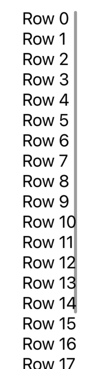

> Navigation: [Technologies](../technologies.md) · [SwiftUI](../swiftui.md)

# ScrollView

<sub>Structure</sub>

A scrollable view.

<sub>iOS, iPadOS, Mac Catalyst, macOS, tvOS, visionOS, watchOS</sub>

```swift
nonisolated struct ScrollView<Content> where Content : View
```

## Overview

The scroll view displays its content within the scrollable content region. As the user performs platform-appropriate scroll gestures, the scroll view adjusts what portion of the underlying content is visible. `ScrollView` can scroll horizontally, vertically, or both, but does not provide zooming functionality.

In the following example, a `ScrollView` allows the user to scroll through a [VStack](vstack.md) containing 100 [Text](text.md) views. The image after the listing shows the scroll view’s temporarily visible scrollbar at the right; you can disable it with the `showsIndicators` parameter of the `ScrollView` initializer.

```swift
var body: some View {
    ScrollView {
        VStack(alignment: .leading) {
            ForEach(0..<100) {
                Text("Row \($0)")
            }
        }
    }
}
```



### Controlling Scroll Position

You can influence where a scroll view is initially scrolled by using the [defaultScrollAnchor(_:)](<view/defaultscrollanchor(__).md>) view modifier.

Provide a value of [center](unitpoint/center.md) to have the scroll view start in the center of its content when a scroll view is scrollable in both axes.

```swift
ScrollView([.horizontal, .vertical]) {
    // initially centered content
}
.defaultScrollAnchor(.center)
```

Or provide an alignment of [bottom](unitpoint/bottom.md) to have the scroll view start at the bottom of its content when a scroll view is scrollable in its vertical axes.

```swift
ScrollView {
    // initially bottom aligned content
}
.defaultScrollAnchor(.bottom)
```

After the scroll view initially renders, the user may scroll the content of the scroll view.

To perform programmatic scrolling, wrap one or more scroll views with a [ScrollViewReader](scrollviewreader.md).

## Relationships

- **Conforms To**: [View](view.md)

## Topics

### Creating a scroll view

- [init(_:showsIndicators:content:)](<scrollview/init(__showsindicators_content_).md>) — Creates a new instance that’s scrollable in the direction of the given axis and can show indicators while scrolling. _(deprecated)_
- [init(_:content:)](<scrollview/init(__content_).md>) — Creates a new instance that’s scrollable in the direction of the given axis and can show indicators while scrolling.

### Configuring a scroll view

- [content](scrollview/content.md) — The scroll view’s content.
- [axes](scrollview/axes.md) — The scrollable axes of the scroll view.
- [showsIndicators](scrollview/showsindicators.md) — A value that indicates whether the scroll view displays the scrollable component of the content offset, in a way that’s suitable for the platform.

### Supporting types

- [body](scrollview/body.md) — The content and behavior of the scroll view.

## See Also

### Creating a scroll view

- [ScrollViewReader](scrollviewreader.md) — A view that provides programmatic scrolling, by working with a proxy to scroll to known child views.
- [ScrollViewProxy](scrollviewproxy.md) — A proxy value that supports programmatic scrolling of the scrollable views within a view hierarchy.
