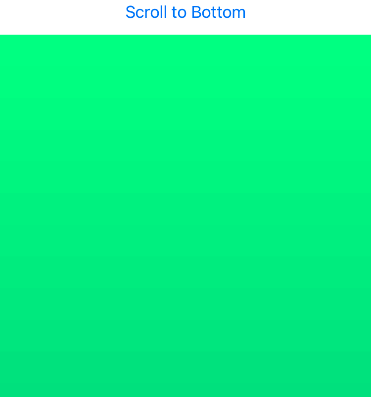

> Navigation: [Technologies](../technologies.md) · [SwiftUI](../swiftui.md)

# ScrollViewReader

<sub>Structure</sub>

A view that provides programmatic scrolling, by working with a proxy to scroll to known child views.

<sub>iOS, iPadOS, Mac Catalyst, macOS, tvOS, visionOS, watchOS</sub>

```swift
@frozen nonisolated struct ScrollViewReader<Content> where Content : View
```

## Overview

The scroll view reader’s content content builder receives a [ScrollViewProxy](scrollviewproxy.md) instance; you use the proxy’s [scrollTo(_:anchor:)](<scrollviewproxy/scrollto(__anchor_).md>) to perform scrolling.

The following example creates a [ScrollView](scrollview.md) containing 100 views that together display a color gradient. It also contains two buttons, one each at the top and bottom. The top button tells the [ScrollViewProxy](scrollviewproxy.md) to scroll to the bottom button, and vice versa.

```swift
@Namespace var topID
@Namespace var bottomID

var body: some View {
    ScrollViewReader { proxy in
        ScrollView {
            Button("Scroll to Bottom") {
                withAnimation {
                    proxy.scrollTo(bottomID)
                }
            }
            .id(topID)

            VStack(spacing: 0) {
                ForEach(0..<100) { i in
                    color(fraction: Double(i) / 100)
                        .frame(height: 32)
                }
            }

            Button("Top") {
                withAnimation {
                    proxy.scrollTo(topID)
                }
            }
            .id(bottomID)
        }
    }
}

func color(fraction: Double) -> Color {
    Color(red: fraction, green: 1 - fraction, blue: 0.5)
}
```



> [!important] Important
> You may not use the [ScrollViewProxy](scrollviewproxy.md) during execution of the `content` content builder; doing so results in a runtime error. Instead, only actions created within `content` can call the proxy, such as gesture handlers or a view’s `onChange(of:perform:)` method.

## Relationships

- **Conforms To**: [View](view.md)

## Topics

### Creating a scroll view reader

- [init(content:)](<scrollviewreader/init(content_).md>) — Creates an instance that can perform programmatic scrolling of its child scroll views.

### Configuring a scroll view reader

- [content](scrollviewreader/content.md) — The content builder that creates the reader’s content.

## See Also

### Creating a scroll view

- [ScrollView](scrollview.md) — A scrollable view.
- [ScrollViewProxy](scrollviewproxy.md) — A proxy value that supports programmatic scrolling of the scrollable views within a view hierarchy.
