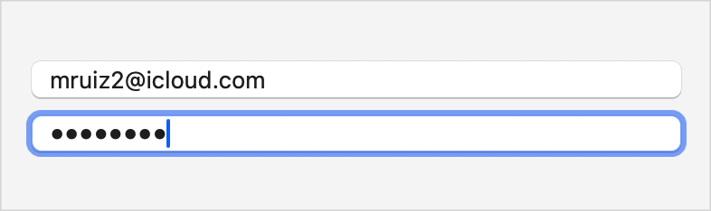
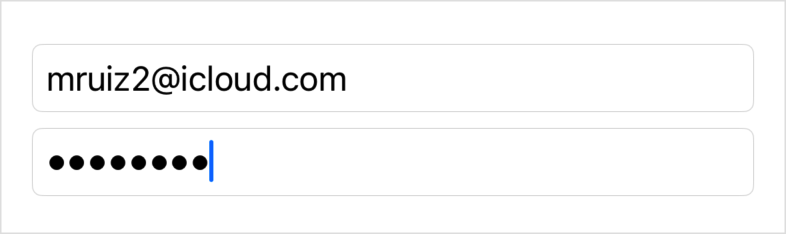
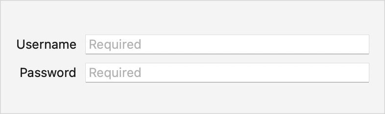
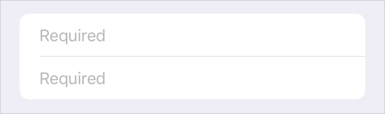
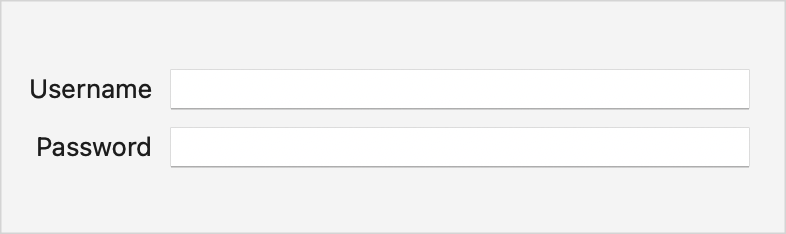
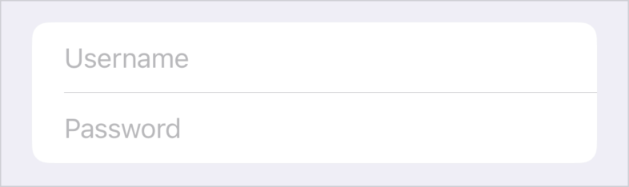

> Navigation: [Technologies](../technologies.md) · [SwiftUI](../swiftui.md)

# SecureField

<sub>Structure</sub>

A control into which people securely enter private text.

<sub>iOS, iPadOS, Mac Catalyst, macOS, tvOS, visionOS, watchOS</sub>

```swift
nonisolated struct SecureField<Label> where Label : View
```

## Overview

Use a secure field when you want the behavior of a [TextField](textfield.md), but you want to hide the field’s text. Typically, you use this for entering passwords and other sensitive information, as the second field in the following screenshot demonstrates:

**macOS**



<sub>Two vertically arranged wide rectangles filled with text. The first displays the email address mruiz2@icloud.com, and the second displays eight heavey dots in place of characters.</sub>

**iOS**



<sub>Two vertically arranged wide rectangles filled with text. The first displays the email address mruiz2@icloud.com, and the second displays eight heavey dots in place of characters.</sub>

The field:

- Displays one dot for each character someone types.
- Hides the dots when someone takes a screenshot in iOS.
- Prevents anyone from cutting or copying the field’s contents.
- Displays an indicator when Caps Lock is enabled.

### Bind to a string

A secure field binds to a string value and updates the string on every keystroke or other edit, so you can read its value at any time from elsewhere in your code. The following code shows how to create the above interface, with the secure field bound to a `password` string:

```swift
@State private var username: String = ""
@State private var password: String = ""

var body: some View {
    VStack {
        TextField("Username", text: $username)
            .autocorrectionDisabled(true)
            #if !os(macOS)
            .textInputAutocapitalization(.never)
            #endif

        SecureField("Password", text: $password)
            .onSubmit {
                handleLogin(username: username, password: password)
            }
    }
    .textFieldStyle(.roundedBorder)
}
```

The field in the above example has an [onSubmit(of:_:)](<view/onsubmit(of___).md>) modifier that sends the `username` and `password` strings to a custom `handleLogin(username:password:)` method if someone presses the Return key while the secure field has focus. You can alternatively provide another mechanism — like a button — to do the same thing.

### Guide people with a prompt

In addition to the string or view that you provide as a label, you can also provide a [Text](text.md) view prompt to help guide someone who uses the field, as the following [Form](form.md) does:

```swift
Form {
    TextField(text: $username, prompt: Text("Required")) {
        Text("Username")
    }
    .autocorrectionDisabled(true)
    #if !os(macOS)
    .textInputAutocapitalization(.never)
    #endif

    SecureField(text: $password, prompt: Text("Required")) {
        Text("Password")
    }
}
```

The system uses the label and prompt in different ways depending on the context. For example, a form in macOS places the label against the leading edge of the field and uses the prompt as placeholder text inside the field. The same form in iOS also uses the prompt as placeholder text, but doesn’t display the label:

**macOS**



<sub>Two vertically wide rectangles filled with the string Required. The string appears in a secondary color. The word Username appear to the left of the top rectangle, and the word Password appears to the left of the bottom rectangle. The two words are right aligned with each other.</sub>

**iOS**



<sub>A wide rectangle that's divided in half vertically by a horizontal dividing line. The two halves of the rectangle, both top and bottom, have the word Required in them. The words are aligned with each other, and appear near the left side of the rectangle. The words and the dividing line appear in a light gray color.</sub>

If you remove the prompt from the previous example, the field keeps the label on the leading edge and omits the placeholder text in macOS, but displays the label as a placeholder in iOS:

**macOS**



<sub>Two vertically wide, empty rectangles. The word Username appear to the left of the top rectangle, and the word Password appears to the left of the bottom rectangle. The two words are right aligned with each other.</sub>

**iOS**



<sub>A wide rectangle that's divided in half vertically by a horizontal dividing line. The two halves of the rectangle, both top and bottom, have a word in them. The top half has the word Username, and the bottom half has the word Password. The words are aligned with each other, and appear near the left side of the rectangle. The words and the dividing line appear in a light gray color.</sub>

## Relationships

- **Conforms To**: [View](view.md)

## Topics

### Creating a secure text field

- [init(_:text:)](<securefield/init(__text_).md>) — Creates a secure field with a prompt generated from a `Text`.
- [init(_:text:prompt:)](<securefield/init(__text_prompt_).md>) — Creates a secure field with a prompt generated from a `Text`.
- [init(text:prompt:label:)](<securefield/init(text_prompt_label_).md>) — Creates a secure field with a prompt generated from a `Text`.

### Deprecated initializers

- [init(_:text:onCommit:)](<securefield/init(__text_oncommit_).md>) — Creates an instance. _(deprecated)_

## See Also

### Getting text input

- [Building rich SwiftUI text experiences](building-rich-swiftui-text-experiences.md) — Build an editor for formatted text using SwiftUI text editor views and attributed strings.
- [TextField](textfield.md) — A control that displays an editable text interface.
- [textFieldStyle(_:)](<view/textfieldstyle(__).md>) — Sets the style for text fields within this view.
- [TextEditor](texteditor.md) — A view that can display and edit long-form text.
