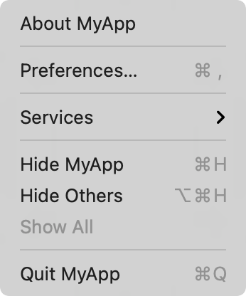
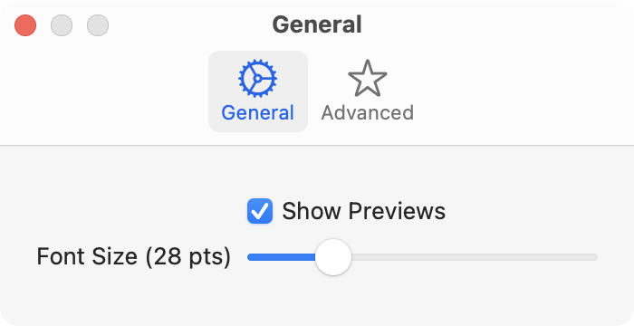

> Navigation: [Technologies](../technologies.md) · [SwiftUI](../swiftui.md)

# Settings

<sub>Structure</sub>

A scene that presents an interface for viewing and modifying an app’s settings.

<sub>macOS</sub>

```swift
nonisolated struct Settings<Content> where Content : View
```

## Overview

Use a settings scene to have SwiftUI manage views with controls for your app’s settings when you declare your app using the [App](app.md) protocol. When you use an [App](app.md) declaration for multiple platforms, compile the settings scene only in macOS:

```swift
@main
struct MyApp: App {
    var body: some Scene {
        WindowGroup {
            ContentView()
        }
        #if os(macOS)
        Settings {
            SettingsView()
        }
        #endif
    }
}
```

Passing a view as the argument to a settings scene in the [App](app.md) declaration causes SwiftUI to enable the app’s Settings menu item. SwiftUI manages displaying and removing the settings view when the user selects the Settings item from the application menu or the equivalent keyboard shortcut:



The contents of your settings view are controls that modify bindings to [UserDefaults](../foundation/userdefaults.md) values that SwiftUI manages using the [AppStorage](appstorage.md) property wrapper:

```swift
struct GeneralSettingsView: View {
    @AppStorage("showPreview") private var showPreview = true
    @AppStorage("fontSize") private var fontSize = 12.0

    var body: some View {
        Form {
            Toggle("Show Previews", isOn: $showPreview)
            Slider(value: $fontSize, in: 9...96) {
                Text("Font Size (\(fontSize, specifier: "%.0f") pts)")
            }
        }
    }
}
```

You can define your settings in a single view, or you can use a [TabView](tabview.md) to group settings into different collections:

```swift
struct SettingsView: View {
    var body: some View {
        TabView {
            Tab("General", systemImage: "gear") {
                GeneralSettingsView()
            }
            Tab("Advanced", systemImage: "star") {
                AdvancedSettingsView()
            }
        }
        .scenePadding()
        .frame(maxWidth: 350, minHeight: 100)
    }
}
```



## Relationships

- **Conforms To**: [Scene](scene.md)

## Topics

### Creating a settings scene

- [init(content:)](<settings/init(content_).md>) — Creates a scene that presents an interface for viewing and modifying an app’s preferences.

## See Also

### Managing a settings window

- [SettingsLink](settingslink.md) — A view that opens the Settings scene defined by an app.
- [OpenSettingsAction](opensettingsaction.md) — An action that presents the settings scene for an app.
- [openSettings](environmentvalues/opensettings.md) — A Settings presentation action stored in a view’s environment.
