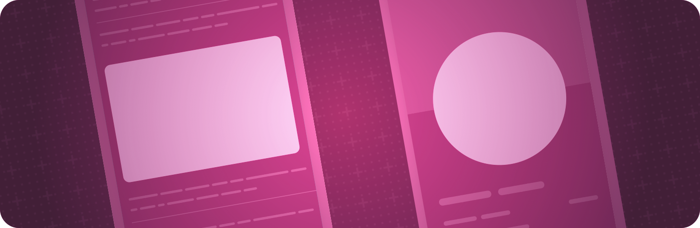

> Navigation: [Technologies](../technologies.md) · [SwiftUI](../swiftui.md)

# Shapes

API Collection

Trace and fill built-in and custom shapes with a color, gradient, or other pattern.

## Overview

Draw shapes like circles and rectangles, as well as custom paths that define shapes of your own design. Apply styles that include environment-aware colors, rich gradients, and material effects to the foreground, background, and outline of your shapes.

If you need the efficiency or flexibility of immediate mode drawing — for example, to create particle effects — use a [Canvas](canvas.md) view instead.

## Topics

### Creating rectangular shapes

- [Rectangle](rectangle.md) — A rectangular shape aligned inside the frame of the view containing it.
- [RoundedRectangle](roundedrectangle.md) — A rectangular shape with rounded corners, aligned inside the frame of the view containing it.
- [RoundedCornerStyle](roundedcornerstyle.md) — Defines the shape of a rounded rectangle’s corners.
- [RoundedRectangularShape](roundedrectangularshape.md) — A protocol of [InsettableShape](insettableshape.md) that describes a rounded rectangular shape.
- [RoundedRectangularShapeCorners](roundedrectangularshapecorners.md) — A type describing the corner styles of a [RoundedRectangularShape](roundedrectangularshape.md).
- [UnevenRoundedRectangle](unevenroundedrectangle.md) — A rectangular shape with rounded corners with different values, aligned inside the frame of the view containing it.
- [RectangleCornerRadii](rectanglecornerradii.md) — Describes the corner radius values of a rounded rectangle with uneven corners.
- [RectangleCornerInsets](rectanglecornerinsets.md) — The inset sizes for the corners of a rectangle.
- [ConcentricRectangle](concentricrectangle.md) — A shape whose corners you configure, individually or uniformly, to be squared, rounded, or concentric relative to a container shape’s corners.

### Creating circular shapes

- [Circle](circle.md) — A circle centered on the frame of the view containing it.
- [Ellipse](ellipse.md) — An ellipse aligned inside the frame of the view containing it.
- [Capsule](capsule.md) — A capsule shape aligned inside the frame of the view containing it.

### Drawing custom shapes

- [Path](path.md) — The outline of a 2D shape.

### Defining shape behavior

- [ShapeView](shapeview.md) — A view that provides a shape that you can use for drawing operations.
- [Shape](shape.md) — A 2D shape that you can use when drawing a view.
- [AnyShape](anyshape.md) — A type-erased shape value.
- [ShapeRole](shaperole.md) — Ways of styling a shape.
- [StrokeStyle](strokestyle.md) — The characteristics of a stroke that traces a path.
- [StrokeShapeView](strokeshapeview.md) — A shape provider that strokes its shape.
- [StrokeBorderShapeView](strokebordershapeview.md) — A shape provider that strokes the border of its shape.
- [FillStyle](fillstyle.md) — A style for rasterizing vector shapes.
- [FillShapeView](fillshapeview.md) — A shape provider that fills its shape.

### Transforming a shape

- [ScaledShape](scaledshape.md) — A shape with a scale transform applied to it.
- [RotatedShape](rotatedshape.md) — A shape with a rotation transform applied to it.
- [OffsetShape](offsetshape.md) — A shape with a translation offset transform applied to it.
- [TransformedShape](transformedshape.md) — A shape with an affine transform applied to it.

### Setting a container shape

- [containerShape(_:)](<view/containershape(__).md>) — Sets the container shape to use for any container relative shape or concentric rectangle within this view.
- [InsettableShape](insettableshape.md) — A shape type that is able to inset itself to produce another shape.
- [ContainerRelativeShape](containerrelativeshape.md) — A shape whose dimensions the system calculates from an inset version of the current container shape.

## See Also

### Views

- [View fundamentals](view-fundamentals.md) — Define the visual elements of your app using a hierarchy of views.
- [View configuration](view-configuration.md) — Adjust the characteristics of views in a hierarchy.
- [View styles](view-styles.md) — Apply built-in and custom appearances and behaviors to different types of views.
- [Animations](animations.md) — Create smooth visual updates in response to state changes.
- [Text input and output](text-input-and-output.md) — Display formatted text and get text input from the user.
- [Images](images.md) — Add images and symbols to your app’s user interface.
- [Controls and indicators](controls-and-indicators.md) — Display values and get user selections.
- [Menus and commands](menus-and-commands.md) — Provide space-efficient, context-dependent access to commands and controls.
- [Drawing and graphics](drawing-and-graphics.md) — Enhance your views with graphical effects and customized drawings.
