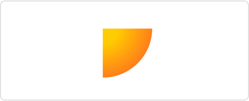
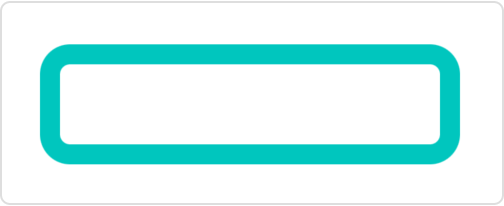
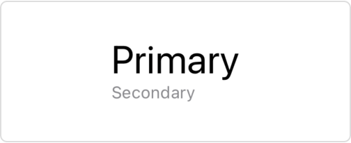

> Navigation: [Technologies](../technologies.md) · [SwiftUI](../swiftui.md)

# ShapeStyle

<sub>Protocol</sub>

A color or pattern to use when rendering a shape.

<sub>iOS, iPadOS, Mac Catalyst, macOS, tvOS, visionOS, watchOS</sub>

```swift
protocol ShapeStyle : Sendable
```

## Overview

You create custom shape styles by declaring a type that conforms to the `ShapeStyle` protocol and implementing the required `resolve` function to return a shape style that represents the desired appearance based on the current environment.

For example this shape style reads the current color scheme from the environment to choose the blend mode its color will be composited with:

```swift
struct MyShapeStyle: ShapeStyle {
    func resolve(in environment: EnvironmentValues) -> some ShapeStyle {
        if environment.colorScheme == .light {
            return Color.red.blendMode(.lighten)
        } else {
            return Color.red.blendMode(.darken)
        }
    }
}
```

In addition to creating a custom shape style, you can also use one of the concrete styles that SwiftUI defines. To indicate a specific color or pattern, you can use [Color](color.md) or the style returned by [image(_:sourceRect:scale:)](<shapestyle/image(__sourcerect_scale_).md>), or one of the gradient types, like the one returned by [radialGradient(_:center:startRadius:endRadius:)](<shapestyle/radialgradient(__center_startradius_endradius_).md>). To set a color that’s appropriate for a given context on a given platform, use one of the semantic styles, like [background](shapestyle/background.md) or [primary](shapestyle/primary.md).

You can use a shape style by:

- Filling a shape with a style with the [fill(_:style:)](<shape/fill(__style_).md>) modifier:

  ```swift
  Path { path in
      path.move(to: .zero)
      path.addLine(to: CGPoint(x: 50, y: 0))
      path.addArc(
          center: .zero,
          radius: 50,
          startAngle: .zero,
          endAngle: .degrees(90),
          clockwise: false)
  }
  .fill(.radialGradient(
      Gradient(colors: [.yellow, .red]),
      center: .topLeading,
      startRadius: 15,
      endRadius: 80))
  ```

  
- Tracing the outline of a shape with a style with either the [stroke(_:lineWidth:)](<shape/stroke(__linewidth_).md>) or the [stroke(_:style:)](<shape/stroke(__style_).md>) modifier:

  ```swift
  RoundedRectangle(cornerRadius: 10)
      .stroke(.mint, lineWidth: 10)
      .frame(width: 200, height: 50)
  ```

  
- Styling the foreground elements in a view with the [foregroundStyle(_:)](<view/foregroundstyle(__).md>) modifier:

  ```swift
  VStack(alignment: .leading) {
      Text("Primary")
          .font(.title)
      Text("Secondary")
          .font(.caption)
          .foregroundStyle(.secondary)
  }
  ```

  

## Relationships

- **Inherits From**: [Sendable](../swift/sendable.md), [SendableMetatype](../swift/sendablemetatype.md)

- **Conforming Types**: [AngularGradient](angulargradient.md), [AnyGradient](anygradient.md), [AnyShapeStyle](anyshapestyle.md), [BackgroundStyle](backgroundstyle.md), [Color](color.md), [Resolved](color/resolved.md), [ResolvedHDR](color/resolvedhdr.md), [EllipticalGradient](ellipticalgradient.md), [FillShapeStyle](fillshapestyle.md), [ForegroundStyle](foregroundstyle.md), [Gradient](gradient.md), [HierarchicalShapeStyle](hierarchicalshapestyle.md), [HierarchicalShapeStyleModifier](hierarchicalshapestylemodifier.md), [ImagePaint](imagepaint.md), [LinearGradient](lineargradient.md), [LinkShapeStyle](linkshapestyle.md), [Material](material.md), [MeshGradient](meshgradient.md), [PlaceholderTextShapeStyle](placeholdertextshapestyle.md), [RadialGradient](radialgradient.md), [SelectionShapeStyle](selectionshapestyle.md), [SeparatorShapeStyle](separatorshapestyle.md), [Shader](shader.md), [TintShapeStyle](tintshapestyle.md), [WindowBackgroundShapeStyle](windowbackgroundshapestyle.md)

## Topics

### System colors

- [black](shapestyle/black.md) — A black color suitable for use in UI elements.
- [blue](shapestyle/blue.md) — A context-dependent blue color suitable for use in UI elements.
- [brown](shapestyle/brown.md) — A context-dependent brown color suitable for use in UI elements.
- [clear](shapestyle/clear.md) — A clear color suitable for use in UI elements.
- [cyan](shapestyle/cyan.md) — A context-dependent cyan color suitable for use in UI elements.
- [gray](shapestyle/gray.md) — A context-dependent gray color suitable for use in UI elements.
- [green](shapestyle/green.md) — A context-dependent green color suitable for use in UI elements.
- [indigo](shapestyle/indigo.md) — A context-dependent indigo color suitable for use in UI elements.
- [mint](shapestyle/mint.md) — A context-dependent mint color suitable for use in UI elements.
- [orange](shapestyle/orange.md) — A context-dependent orange color suitable for use in UI elements.
- [pink](shapestyle/pink.md) — A context-dependent pink color suitable for use in UI elements.
- [purple](shapestyle/purple.md) — A context-dependent purple color suitable for use in UI elements.
- [red](shapestyle/red.md) — A context-dependent red color suitable for use in UI elements.
- [teal](shapestyle/teal.md) — A context-dependent teal color suitable for use in UI elements.
- [white](shapestyle/white.md) — A white color suitable for use in UI elements.
- [yellow](shapestyle/yellow.md) — A context-dependent yellow color suitable for use in UI elements.

### Angular gradients

- [angularGradient(_:center:startAngle:endAngle:)](<shapestyle/angulargradient(__center_startangle_endangle_).md>) — An angular gradient, which applies the color function as the angle changes between the start and end angles, and anchored to a relative center point within the filled shape.
- [angularGradient(colors:center:startAngle:endAngle:)](<shapestyle/angulargradient(colors_center_startangle_endangle_).md>) — An angular gradient defined by a collection of colors.
- [angularGradient(stops:center:startAngle:endAngle:)](<shapestyle/angulargradient(stops_center_startangle_endangle_).md>) — An angular gradient defined by a collection of color stops.

### Conic gradients

- [conicGradient(_:center:angle:)](<shapestyle/conicgradient(__center_angle_).md>) — A conic gradient that completes a full turn, optionally starting from a given angle and anchored to a relative center point within the filled shape.
- [conicGradient(colors:center:angle:)](<shapestyle/conicgradient(colors_center_angle_).md>) — A conic gradient defined by a collection of colors that completes a full turn.
- [conicGradient(stops:center:angle:)](<shapestyle/conicgradient(stops_center_angle_).md>) — A conic gradient defined by a collection of color stops that completes a full turn.

### Elliptical gradients

- [ellipticalGradient(_:center:startRadiusFraction:endRadiusFraction:)](<shapestyle/ellipticalgradient(__center_startradiusfraction_endradiusfraction_).md>) — A radial gradient that draws an ellipse.
- [ellipticalGradient(colors:center:startRadiusFraction:endRadiusFraction:)](<shapestyle/ellipticalgradient(colors_center_startradiusfraction_endradiusfraction_).md>) — A radial gradient that draws an ellipse defined by a collection of colors.
- [ellipticalGradient(stops:center:startRadiusFraction:endRadiusFraction:)](<shapestyle/ellipticalgradient(stops_center_startradiusfraction_endradiusfraction_).md>) — A radial gradient that draws an ellipse defined by a collection of color stops.

### Linear gradients

- [linearGradient(_:startPoint:endPoint:)](<shapestyle/lineargradient(__startpoint_endpoint_).md>) — A linear gradient.
- [linearGradient(colors:startPoint:endPoint:)](<shapestyle/lineargradient(colors_startpoint_endpoint_).md>) — A linear gradient defined by a collection of colors.
- [linearGradient(stops:startPoint:endPoint:)](<shapestyle/lineargradient(stops_startpoint_endpoint_).md>) — A linear gradient defined by a collection of color stops.

### Radial gradients

- [radialGradient(_:center:startRadius:endRadius:)](<shapestyle/radialgradient(__center_startradius_endradius_).md>) — A radial gradient.
- [radialGradient(colors:center:startRadius:endRadius:)](<shapestyle/radialgradient(colors_center_startradius_endradius_).md>) — A radial gradient defined by a collection of colors.
- [radialGradient(stops:center:startRadius:endRadius:)](<shapestyle/radialgradient(stops_center_startradius_endradius_).md>) — A radial gradient defined by a collection of color stops.

### Materials

- [ultraThinMaterial](shapestyle/ultrathinmaterial.md) — A mostly translucent material.
- [thinMaterial](shapestyle/thinmaterial.md) — A material that’s more translucent than opaque.
- [regularMaterial](shapestyle/regularmaterial.md) — A material that’s somewhat translucent.
- [thickMaterial](shapestyle/thickmaterial.md) — A material that’s more opaque than translucent.
- [ultraThickMaterial](shapestyle/ultrathickmaterial.md) — A mostly opaque material.
- [bar](shapestyle/bar.md) — A material matching the style of system toolbars.

### Image paint styles

- [image(_:sourceRect:scale:)](<shapestyle/image(__sourcerect_scale_).md>) — A shape style that fills a shape by repeating a region of an image.

### Hierarchical styles

- [secondary](shapestyle/secondary-swift.property.md) — Returns the second level of this shape style.
- [tertiary](shapestyle/tertiary-swift.property.md) — Returns the third level of this shape style.
- [quaternary](shapestyle/quaternary-swift.property.md) — Returns the fourth level of this shape style.
- [quinary](shapestyle/quinary-swift.property.md) — Returns the fifth level of this shape style.
- [primary](shapestyle/primary.md) — A shape style that maps to the first level of the current content style.
- [secondary](shapestyle/secondary-swift.type.property.md) — A shape style that maps to the second level of the current content style.
- [tertiary](shapestyle/tertiary-swift.type.property.md) — A shape style that maps to the third level of the current content style.
- [quaternary](shapestyle/quaternary-swift.type.property.md) — A shape style that maps to the fourth level of the current content style.
- [quinary](shapestyle/quinary-swift.type.property.md) — A shape style that maps to the fifth level of the current content style.

### Semantic styles

- [foreground](shapestyle/foreground.md) — The foreground style in the current context.
- [background](shapestyle/background.md) — The background style in the current context.
- [selection](shapestyle/selection.md) — A style used to visually indicate selection following platform conventional colors and behaviors.
- [separator](shapestyle/separator.md) — A style appropriate for foreground separator or border lines.
- [tint](shapestyle/tint.md) — A style that reflects the current tint color.
- [placeholder](shapestyle/placeholder.md) — A style appropriate for placeholder text.
- [link](shapestyle/link.md) — A style appropriate for links.
- [fill](shapestyle/fill.md) — An overlay fill style for filling shapes.
- [windowBackground](shapestyle/windowbackground.md) — A style appropriate for elements that should match the background of their containing window.

### Modifying a shape style

- [blendMode(_:)](<shapestyle/blendmode(__)-swift.method.md>) — Returns a new style based on `self` that applies the specified blend mode when drawing.
- [opacity(_:)](<shapestyle/opacity(__)-swift.method.md>) — Returns a new style based on `self` that multiplies by the specified opacity when drawing.
- [shadow(_:)](<shapestyle/shadow(__)-swift.method.md>) — Applies the specified shadow effect to the shape style.

### Configuring the default shape style

- [blendMode(_:)](<shapestyle/blendmode(__)-swift.type.method.md>) — Returns a new style based on the current style that uses `mode` as its blend mode when drawing.
- [opacity(_:)](<shapestyle/opacity(__)-swift.type.method.md>) — Returns a new style based on the current style that multiplies by `opacity` when drawing.
- [shadow(_:)](<shapestyle/shadow(__)-swift.type.method.md>) — Returns a shape style that applies the specified shadow style to the current style.

### Mapping to absolute coordinates

- [in(_:)](<shapestyle/in(__).md>) — Maps a shape style’s unit-space coordinates to the absolute coordinates of a given rectangle.

### Resolving a shape style in an environment

- [resolve(in:)](<shapestyle/resolve(in_).md>) — Evaluate to a resolved shape style given the current `environment`.
- [Resolved](shapestyle/resolved.md) — The type of shape style this will resolve to.

### Using a shape style as a view

- [body](shapestyle/body.md) — A rectangular view that’s filled with the shape style.

### Supporting types

- [AngularGradient](angulargradient.md) — An angular gradient.
- [EllipticalGradient](ellipticalgradient.md) — A radial gradient that draws an ellipse.
- [LinearGradient](lineargradient.md) — A linear gradient.
- [RadialGradient](radialgradient.md) — A radial gradient.
- [Material](material.md) — A background material type.
- [ImagePaint](imagepaint.md) — A shape style that fills a shape by repeating a region of an image.
- [HierarchicalShapeStyle](hierarchicalshapestyle.md) — A shape style that maps to one of the numbered content styles.
- [HierarchicalShapeStyleModifier](hierarchicalshapestylemodifier.md) — Styles that you can apply to hierarchical shapes.
- [ForegroundStyle](foregroundstyle.md) — The foreground style in the current context.
- [BackgroundStyle](backgroundstyle.md) — The background style in the current context.
- [SelectionShapeStyle](selectionshapestyle.md) — A style used to visually indicate selection following platform conventional colors and behaviors.
- [SeparatorShapeStyle](separatorshapestyle.md) — A style appropriate for foreground separator or border lines.
- [TintShapeStyle](tintshapestyle.md) — A style that reflects the current tint color.
- [FillShapeStyle](fillshapestyle.md) — A shape style that displays one of the overlay fills.
- [LinkShapeStyle](linkshapestyle.md) — A style appropriate for links.
- [PlaceholderTextShapeStyle](placeholdertextshapestyle.md) — A style appropriate for placeholder text.
- [WindowBackgroundShapeStyle](windowbackgroundshapestyle.md) — A style appropriate for elements that should match the background of their containing window.

### Instance Methods

- [materialActiveAppearance(_:)](<shapestyle/materialactiveappearance(__).md>) — Sets an explicit active appearance for materials created by this style.

## See Also

### Styling content

- [border(_:width:)](<view/border(__width_).md>) — Adds a border to this view with the specified style and width.
- [foregroundStyle(_:)](<view/foregroundstyle(__).md>) — Sets a view’s foreground elements to use a given style.
- [foregroundStyle(_:_:)](<view/foregroundstyle(____).md>) — Sets the primary and secondary levels of the foreground style in the child view.
- [foregroundStyle(_:_:_:)](<view/foregroundstyle(______).md>) — Sets the primary, secondary, and tertiary levels of the foreground style.
- [backgroundStyle(_:)](<view/backgroundstyle(__).md>) — Sets the specified style to render backgrounds within the view.
- [backgroundStyle](environmentvalues/backgroundstyle.md) — An optional style that overrides the default system background style when set.
- [AnyShapeStyle](anyshapestyle.md) — A type-erased ShapeStyle value.
- [Gradient](gradient.md) — A color gradient represented as an array of color stops, each having a parametric location value.
- [MeshGradient](meshgradient.md) — A two-dimensional gradient defined by a 2D grid of positioned colors.
- [AnyGradient](anygradient.md) — A color gradient.
- [ShadowStyle](shadowstyle.md) — A style to use when rendering shadows.
- [Glass](glass.md) — A structure that defines the configuration of the Liquid Glass material.
