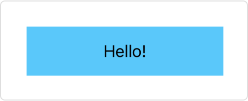

> Navigation: [Technologies](../../technologies.md) · [SwiftUI](../../swiftui.md) · [ShapeStyle](../shapestyle.md)

# body

<sub>Instance Property</sub>

A rectangular view that’s filled with the shape style.

<sub>iOS, iPadOS, Mac Catalyst, macOS, tvOS, visionOS, watchOS</sub>

```swift
var body: _ShapeView<Rectangle, Self> { get }
```

## Discussion

For a [ShapeStyle](../shapestyle.md) that also conforms to the [View](../view.md) protocol, like [Color](../color.md) or [LinearGradient](../lineargradient.md), this default implementation of the [body](../view/body-8kl5o.md) property provides a visual representation for the shape style. As a result, you can use the shape style in a view hierarchy like any other view:

```swift
ZStack {
    Color.cyan
    Text("Hello!")
}
.frame(width: 200, height: 50)
```


