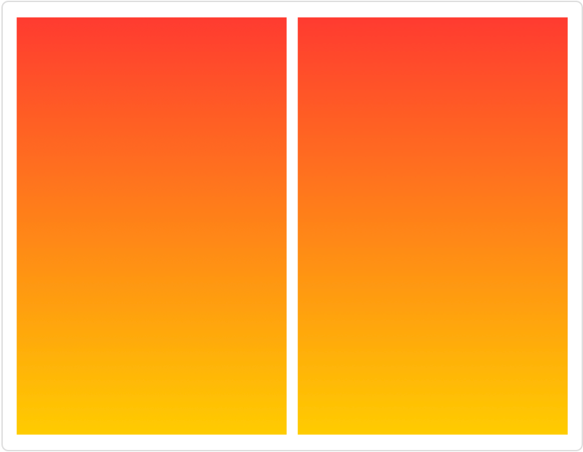
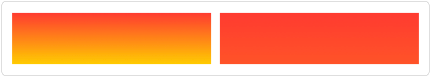

> Navigation: [Technologies](../../technologies.md) · [SwiftUI](../../swiftui.md) · [ShapeStyle](../shapestyle.md)

# in(_:)

<sub>Instance Method</sub>

Maps a shape style’s unit-space coordinates to the absolute coordinates of a given rectangle.

<sub>iOS, iPadOS, Mac Catalyst, macOS, tvOS, visionOS, watchOS</sub>

```swift
func `in`(_ rect: CGRect) -> some ShapeStyle

```

## Parameters

- `rect` — A rectangle that gives the absolute coordinates over which to map the shape style.

## Return Value

A new shape style mapped to the coordinates given by `rect`.

## Discussion

Some shape styles have colors or patterns that vary with position based on [UnitPoint](../unitpoint.md) coordinates. For example, you can create a [LinearGradient](../lineargradient.md) using [top](../unitpoint/top.md) and [bottom](../unitpoint/bottom.md) as the start and end points:

```swift
let gradient = LinearGradient(
    colors: [.red, .yellow],
    startPoint: .top,
    endPoint: .bottom)
```

When rendering such styles, SwiftUI maps the unit space coordinates to the absolute coordinates of the filled shape. However, you can tell SwiftUI to use a different set of coordinates by supplying a rectangle to the `in(_:)` method. Consider two resizable rectangles using the gradient defined above:

```swift
HStack {
    Rectangle()
        .fill(gradient)
    Rectangle()
        .fill(gradient.in(CGRect(x: 0, y: 0, width: 0, height: 300)))
}
.onTapGesture { isBig.toggle() }
.frame(height: isBig ? 300 : 50)
.animation(.easeInOut)
```

When `isBig` is true — defined elsewhere as a private [State](../state.md) variable — the rectangles look the same, because their heights match that of the modified gradient:



When the user toggles `isBig` by tapping the [HStack](../hstack.md), the rectangles shrink, but the gradients each react in a different way:



SwiftUI remaps the gradient of the first rectangle to the new frame height, so that you continue to see the full range of colors in a smaller area. For the second rectangle, the modified gradient retains a mapping to the full height, so you instead see only a small part of the overall gradient. Animation helps to visualize the difference.
