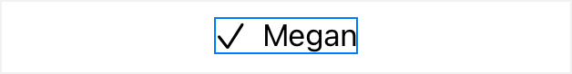
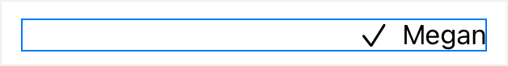
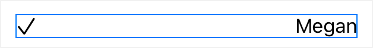
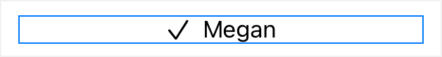

> Navigation: [Technologies](../technologies.md) · [SwiftUI](../swiftui.md)

# Spacer

<sub>Structure</sub>

A flexible space that expands along the major axis of its containing stack layout, or on both axes if not contained in a stack.

<sub>iOS, iPadOS, Mac Catalyst, macOS, tvOS, visionOS, watchOS</sub>

```swift
@frozen struct Spacer
```

## Overview

A spacer creates an adaptive view with no content that expands as much as it can. For example, when placed within an [HStack](hstack.md), a spacer expands horizontally as much as the stack allows, moving sibling views out of the way, within the limits of the stack’s size. SwiftUI sizes a stack that doesn’t contain a spacer up to the combined ideal widths of the content of the stack’s child views.

The following example provides a simple checklist row to illustrate how you can use a spacer:

```swift
struct ChecklistRow: View {
    let name: String

    var body: some View {
        HStack {
            Image(systemName: "checkmark")
            Text(name)
        }
        .border(Color.blue)
    }
}
```



Adding a spacer before the image creates an adaptive view with no content that expands to push the image and text to the right side of the stack. The stack also now expands to take as much space as the parent view allows, shown by the blue border that indicates the boundary of the stack:

```swift
struct ChecklistRow: View {
    let name: String

    var body: some View {
        HStack {
            Spacer()
            Image(systemName: "checkmark")
            Text(name)
        }
        .border(Color.blue)
    }
}
```



Moving the spacer between the image and the name pushes those elements to the left and right sides of the [HStack](hstack.md), respectively. Because the stack contains the spacer, it expands to take as much horizontal space as the parent view allows; the blue border indicates its size:

```swift
struct ChecklistRow: View {
    let name: String

    var body: some View {
        HStack {
            Image(systemName: "checkmark")
            Spacer()
            Text(name)
        }
        .border(Color.blue)
    }
}
```



Adding two spacer views on the outside of the stack leaves the image and text together, while the stack expands to take as much horizontal space as the parent view allows:

```swift
struct ChecklistRow: View {
    let name: String

    var body: some View {
        HStack {
            Spacer()
            Image(systemName: "checkmark")
            Text(name)
            Spacer()
        }
        .border(Color.blue)
    }
}
```



## Relationships

- **Conforms To**: [BitwiseCopyable](../swift/bitwisecopyable.md), [Copyable](../swift/copyable.md), [Escapable](../swift/escapable.md), [Sendable](../swift/sendable.md), [SendableMetatype](../swift/sendablemetatype.md), [View](view.md)

## Topics

### Creating a spacer

- [init(minLength:)](<spacer/init(minlength_).md>)
- [minLength](spacer/minlength.md) — The minimum length this spacer can be shrunk to, along the axis or axes of expansion.

## See Also

### Separators

- [Divider](divider.md) — A visual element that can be used to separate other content.
