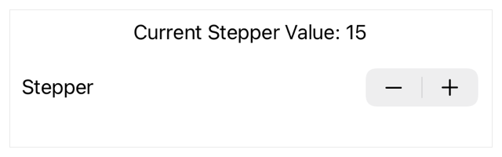

> Navigation: [Technologies](../technologies.md) · [SwiftUI](../swiftui.md)

# Stepper

<sub>Structure</sub>

A control that performs increment and decrement actions.

<sub>iOS, iPadOS, Mac Catalyst, macOS, visionOS, watchOS</sub>

```swift
nonisolated struct Stepper<Label> where Label : View
```

## Overview

Use a stepper control when you want the user to have granular control while incrementing or decrementing a value. For example, you can use a stepper to:

- Change a value up or down by `1`.
- Operate strictly over a prescribed range.
- Step by specific amounts over a stepper’s range of possible values.

The example below uses an array that holds a number of [Color](color.md) values, a local state variable, `value`, to set the control’s background color, and title label. When the user clicks or taps the stepper’s increment or decrement buttons, SwiftUI executes the relevant closure that updates `value`, wrapping the `value` to prevent overflow. SwiftUI then re-renders the view, updating the text and background color to match the current index:

```swift
struct StepperView: View {
    @State private var value = 0
    let colors: [Color] = [.orange, .red, .gray, .blue,
                           .green, .purple, .pink]

    func incrementStep() {
        value += 1
        if value >= colors.count { value = 0 }
    }

    func decrementStep() {
        value -= 1
        if value < 0 { value = colors.count - 1 }
    }

    var body: some View {
        Stepper {
            Text("Value: \(value) Color: \(colors[value].description)")
        } onIncrement: {
            incrementStep()
        } onDecrement: {
            decrementStep()
        }
        .padding(5)
        .background(colors[value])
    }
}
```


<sub>A view displaying a stepper that uses a text view for stepper’s title and that changes the background color of its view when incremented or decremented. The view selects the new background color from a predefined array of colors using the stepper’s value as the index.</sub>

The following example shows a stepper that displays the effect of incrementing or decrementing a value with the step size of `step` with the bounds defined by `range`:

```swift
struct StepperView: View {
    @State private var value = 0
    let step = 5
    let range = 1...50

    var body: some View {
        Stepper(
            value: $value,
            in: range,
            step: step
        ) {
            Text("Current: \(value) in \(range.description) " +
                 "stepping by \(step)")
        }
        .padding(10)
    }
}
```



## Relationships

- **Conforms To**: [View](view.md)

## Topics

### Creating a stepper

- [init(value:step:label:onEditingChanged:)](<stepper/init(value_step_label_oneditingchanged_).md>) — Creates a stepper configured to increment or decrement a binding to a value using a step value you provide.
- [init(value:step:format:label:onEditingChanged:)](<stepper/init(value_step_format_label_oneditingchanged_).md>) — Creates a stepper configured to increment or decrement a binding to a value using a step value you provide, displaying its value with an applied format style.
- [init(_:value:step:onEditingChanged:)](<stepper/init(__value_step_oneditingchanged_).md>) — Creates a stepper with a title key and configured to increment and decrement a binding to a value and step amount you provide.
- [init(_:value:step:format:onEditingChanged:)](<stepper/init(__value_step_format_oneditingchanged_).md>) — Creates a stepper with a title key and configured to increment and decrement a binding to a value and step amount you provide, displaying its value with an applied format style.

### Creating a stepper over a range

- [init(value:in:step:label:onEditingChanged:)](<stepper/init(value_in_step_label_oneditingchanged_).md>) — Creates a stepper configured to increment or decrement a binding to a value using a step value and within a range of values you provide.
- [init(value:in:step:format:label:onEditingChanged:)](<stepper/init(value_in_step_format_label_oneditingchanged_).md>) — Creates a stepper configured to increment or decrement a binding to a value using a step value and within a range of values you provide, displaying its value with an applied format style.
- [init(_:value:in:step:onEditingChanged:)](<stepper/init(__value_in_step_oneditingchanged_).md>) — Creates a stepper instance that increments and decrements a binding to a value, by a step size and within a closed range that you provide.
- [init(_:value:in:step:format:onEditingChanged:)](<stepper/init(__value_in_step_format_oneditingchanged_).md>) — Creates a stepper instance that increments and decrements a binding to a value, by a step size and within a closed range that you provide, displaying its value with an applied format style.

### Creating a stepper with change behavior

- [init(label:onIncrement:onDecrement:onEditingChanged:)](<stepper/init(label_onincrement_ondecrement_oneditingchanged_).md>) — Creates a stepper instance that performs the closures you provide when the user increments or decrements the stepper.
- [init(_:onIncrement:onDecrement:onEditingChanged:)](<stepper/init(__onincrement_ondecrement_oneditingchanged_).md>) — Creates a stepper that uses a title key and executes the closures you provide when the user clicks or taps the stepper’s increment and decrement buttons.

### Deprecated initializers

- [init(value:step:onEditingChanged:label:)](<stepper/init(value_step_oneditingchanged_label_).md>) — Creates a stepper configured to increment or decrement a binding to a value using a step value you provide. _(deprecated)_
- [init(value:in:step:onEditingChanged:label:)](<stepper/init(value_in_step_oneditingchanged_label_).md>) — Creates a stepper configured to increment or decrement a binding to a value using a step value and within a range of values you provide. _(deprecated)_
- [init(onIncrement:onDecrement:onEditingChanged:label:)](<stepper/init(onincrement_ondecrement_oneditingchanged_label_).md>) — Creates a stepper instance that performs the closures you provide when the user increments or decrements the stepper. _(deprecated)_

## See Also

### Getting numeric inputs

- [Slider](slider.md) — A control for selecting a value from a bounded linear range of values.
- [Toggle](toggle.md) — A control that toggles between on and off states.
- [toggleStyle(_:)](<view/togglestyle(__).md>) — Sets the style for toggles in a view hierarchy.
