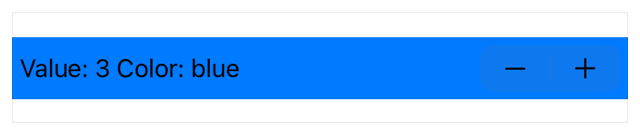

> Navigation: [Technologies](../../technologies.md) · [SwiftUI](../../swiftui.md) · [Stepper](../stepper.md)

# init(onIncrement:onDecrement:onEditingChanged:label:)

<sub>Initializer</sub>

Creates a stepper instance that performs the closures you provide when the user increments or decrements the stepper.

> [!warning] Deprecated
> Use [init(label:onIncrement:onDecrement:onEditingChanged:)](<init(label_onincrement_ondecrement_oneditingchanged_).md>) instead.

<sub>iOS, iPadOS, Mac Catalyst, macOS, visionOS, watchOS</sub>

```swift
nonisolated init(onIncrement: (() -> Void)?, onDecrement: (() -> Void)?, onEditingChanged: @escaping (Bool) -> Void = { _ in }, @ContentBuilder label: () -> Label)
```

## Parameters

- `onIncrement` — The closure to execute when the user clicks or taps the control’s plus button.

- `onDecrement` — The closure to execute when the user clicks or taps the control’s minus button.

- `onEditingChanged` — A closure called when editing begins and ends. For example, on iOS, the user may touch and hold the increment or decrement buttons on a `Stepper` which causes the execution of the `onEditingChanged` closure at the start and end of the gesture.

- `label` — A view describing the purpose of this stepper.

## Discussion

Use this initializer to create a control with a custom title that executes closures you provide when the user clicks or taps the stepper’s increment or decrement buttons.

The example below uses an array that holds a number of [Color](../color.md) values, a local state variable, `value`, to set the control’s background color, and title label. When the user clicks or taps on the stepper’s increment or decrement buttons SwiftUI executes the relevant closure that updates `value`, wrapping the `value` to prevent overflow. SwiftUI then re-renders the view, updating the text and background color to match the current index:

```swift
struct StepperView: View {
    @State private var value = 0
    let colors: [Color] = [.orange, .red, .gray, .blue, .green,
                           .purple, .pink]

    func incrementStep() {
        value += 1
        if value >= colors.count { value = 0 }
    }

    func decrementStep() {
        value -= 1
        if value < 0 { value = colors.count - 1 }
    }

    var body: some View {
        Stepper(onIncrement: incrementStep,
            onDecrement: decrementStep) {
            Text("Value: \(value) Color: \(colors[value].description)")
        }
        .padding(5)
        .background(colors[value])
    }
```

}



<sub>A view displaying a stepper that uses a text view for stepper’s title and that changes the background color of its view when incremented or decremented. The view selects the new background color from a predefined array of colors using the stepper’s value as the index.</sub>

## See Also

### Deprecated initializers

- [init(value:step:onEditingChanged:label:)](<init(value_step_oneditingchanged_label_).md>) — Creates a stepper configured to increment or decrement a binding to a value using a step value you provide. _(deprecated)_
- [init(value:in:step:onEditingChanged:label:)](<init(value_in_step_oneditingchanged_label_).md>) — Creates a stepper configured to increment or decrement a binding to a value using a step value and within a range of values you provide. _(deprecated)_
