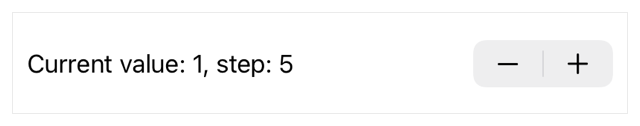

> Navigation: [Technologies](../../technologies.md) · [SwiftUI](../../swiftui.md) · [Stepper](../stepper.md)

# init(value:step:onEditingChanged:label:)

<sub>Initializer</sub>

Creates a stepper configured to increment or decrement a binding to a value using a step value you provide.

> [!warning] Deprecated
> Use [init(value:step:label:onEditingChanged:)](<init(value_step_label_oneditingchanged_).md>) instead.

<sub>iOS, iPadOS, Mac Catalyst, macOS, visionOS, watchOS</sub>

```swift
nonisolated init<V>(value: Binding<V>, step: V.Stride = 1, onEditingChanged: @escaping (Bool) -> Void = { _ in }, @ContentBuilder label: () -> Label) where V : Strideable
```

## Parameters

- `value` — The [Binding](../binding.md) to a value that you provide.

- `step` — The amount to increment or decrement `value` each time the user clicks or taps the stepper’s increment or decrement buttons. Defaults to `1`.

- `onEditingChanged` — A closure that’s called when editing begins and ends. For example, on iOS, the user may touch and hold the increment or decrement buttons on a stepper which causes the execution of the `onEditingChanged` closure at the start and end of the gesture.

- `label` — A view describing the purpose of this stepper.

## Discussion

Use this initializer to create a stepper that increments or decrements a bound value by a specific amount each time the user clicks or taps the stepper’s increment or decrement buttons.

In the example below, a stepper increments or decrements `value` by the `step` value of 5 at each click or tap of the control’s increment or decrement button:

```swift
struct StepperView: View {
    @State private var value = 1
    let step = 5
    var body: some View {
        Stepper(value: $value,
                step: step) {
            Text("Current value: \(value), step: \(step)")
        }
            .padding(10)
    }
}
```



<sub>A view displaying a stepper that increments or decrements a value by a specified amount each time the user clicks or taps the stepper’s increment or decrement buttons.</sub>

## See Also

### Deprecated initializers

- [init(value:in:step:onEditingChanged:label:)](<init(value_in_step_oneditingchanged_label_).md>) — Creates a stepper configured to increment or decrement a binding to a value using a step value and within a range of values you provide. _(deprecated)_
- [init(onIncrement:onDecrement:onEditingChanged:label:)](<init(onincrement_ondecrement_oneditingchanged_label_).md>) — Creates a stepper instance that performs the closures you provide when the user increments or decrements the stepper. _(deprecated)_
