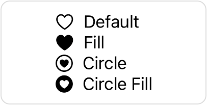

> Navigation: [Technologies](../technologies.md) · [SwiftUI](../swiftui.md)

# SymbolVariants

<sub>Structure</sub>

A variant of a symbol.

<sub>iOS, iPadOS, Mac Catalyst, macOS, tvOS, visionOS, watchOS</sub>

```swift
struct SymbolVariants
```

## Overview

Many of the [SF Symbols](../design/human-interface-guidelines/sf-symbols.md) that you can add to your app using an [Image](image.md) or a [Label](label.md) instance have common variants, like a filled version or a version that’s contained within a circle. The symbol’s name indicates the variant:

```swift
VStack(alignment: .leading) {
    Label("Default", systemImage: "heart")
    Label("Fill", systemImage: "heart.fill")
    Label("Circle", systemImage: "heart.circle")
    Label("Circle Fill", systemImage: "heart.circle.fill")
}
```



You can configure a part of your view hierarchy to use a particular variant for all symbols in that view and its child views using `SymbolVariants`. Add the [symbolVariant(_:)](<view/symbolvariant(__).md>) modifier to a view to set a variant for that view’s environment. For example, you can use the modifier to create the same set of labels as in the example above, using only the base name of the symbol in the label declarations:

```swift
VStack(alignment: .leading) {
    Label("Default", systemImage: "heart")
    Label("Fill", systemImage: "heart")
        .symbolVariant(.fill)
    Label("Circle", systemImage: "heart")
        .symbolVariant(.circle)
    Label("Circle Fill", systemImage: "heart")
        .symbolVariant(.circle.fill)
}
```

Alternatively, you can set the variant in the environment directly by passing the [symbolVariants](environmentvalues/symbolvariants.md) environment value to the [environment(_:_:)](<view/environment(____).md>) modifier:

```swift
Label("Fill", systemImage: "heart")
    .environment(\.symbolVariants, .fill)
```

SwiftUI sets a variant for you in some environments. For example, SwiftUI automatically applies the [fill](symbolvariants/fill-swift.type.property.md) symbol variant for items that appear in the `content` closure of the [swipeActions(edge:allowsFullSwipe:content:)](<view/swipeactions(edge_allowsfullswipe_content_).md>) method, or as the tab bar items of a [TabView](tabview.md).

## Relationships

- **Conforms To**: [Equatable](../swift/equatable.md), [Hashable](../swift/hashable.md), [Sendable](../swift/sendable.md), [SendableMetatype](../swift/sendablemetatype.md)

## Topics

### Getting symbol variants

- [none](symbolvariants/none.md) — No variant for a symbol.
- [circle](symbolvariants/circle-swift.type.property.md) — A variant that encapsulates the symbol in a circle.
- [square](symbolvariants/square-swift.type.property.md) — A variant that encapsulates the symbol in a square.
- [rectangle](symbolvariants/rectangle-swift.type.property.md) — A variant that encapsulates the symbol in a rectangle.
- [fill](symbolvariants/fill-swift.type.property.md) — A variant that fills the symbol.
- [slash](symbolvariants/slash-swift.type.property.md) — A variant that draws a slash through the symbol.

### Modifying a variant

- [circle](symbolvariants/circle-swift.property.md) — A version of the variant that’s encapsulated in a circle.
- [square](symbolvariants/square-swift.property.md) — A version of the variant that’s encapsulated in a square.
- [rectangle](symbolvariants/rectangle-swift.property.md) — A version of the variant that’s encapsulated in a rectangle.
- [fill](symbolvariants/fill-swift.property.md) — A filled version of the variant.
- [slash](symbolvariants/slash-swift.property.md) — A slashed version of the variant.

### Comparing variants

- [contains(_:)](<symbolvariants/contains(__).md>) — Returns a Boolean value that indicates whether the current variant contains the specified variant.

## See Also

### Setting a symbol variant

- [symbolVariant(_:)](<view/symbolvariant(__).md>) — Makes symbols within the view show a particular variant.
- [symbolVariants](environmentvalues/symbolvariants.md) — The symbol variant to use in this environment.
