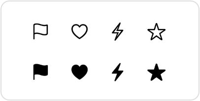

> Navigation: [Technologies](../../technologies.md) · [SwiftUI](../../swiftui.md) · [SymbolVariants](../symbolvariants.md)

# fill

<sub>Type Property</sub>

A variant that fills the symbol.

<sub>iOS, iPadOS, Mac Catalyst, macOS, tvOS, visionOS, watchOS</sub>

```swift
static let fill: SymbolVariants
```

## Discussion

Use this variant with a call to the [symbolVariant(_:)](<../view/symbolvariant(__).md>) modifier to draw filled symbols, for those symbols that have a filled variant:

```swift
VStack(spacing: 20) {
    HStack(spacing: 20) {
        Image(systemName: "flag")
        Image(systemName: "heart")
        Image(systemName: "bolt")
        Image(systemName: "star")
    }
    HStack(spacing: 20) {
        Image(systemName: "flag")
        Image(systemName: "heart")
        Image(systemName: "bolt")
        Image(systemName: "star")
    }
    .symbolVariant(.fill)
}
```



## See Also

### Getting symbol variants

- [none](none.md) — No variant for a symbol.
- [circle](circle-swift.type.property.md) — A variant that encapsulates the symbol in a circle.
- [square](square-swift.type.property.md) — A variant that encapsulates the symbol in a square.
- [rectangle](rectangle-swift.type.property.md) — A variant that encapsulates the symbol in a rectangle.
- [slash](slash-swift.type.property.md) — A variant that draws a slash through the symbol.
