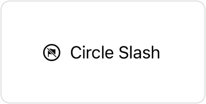

> Navigation: [Technologies](../../technologies.md) · [SwiftUI](../../swiftui.md) · [SymbolVariants](../symbolvariants.md)

# slash

<sub>Instance Property</sub>

A slashed version of the variant.

<sub>iOS, iPadOS, Mac Catalyst, macOS, tvOS, visionOS, watchOS</sub>

```swift
var slash: SymbolVariants { get }
```

## Discussion

Use this property to modify a shape variant like [circle](circle-swift.type.property.md) so that it’s also covered by a slash:

```swift
Label("Circle Slash", systemImage: "flag")
    .symbolVariant(.circle.slash)
```



## See Also

### Modifying a variant

- [circle](circle-swift.property.md) — A version of the variant that’s encapsulated in a circle.
- [square](square-swift.property.md) — A version of the variant that’s encapsulated in a square.
- [rectangle](rectangle-swift.property.md) — A version of the variant that’s encapsulated in a rectangle.
- [fill](fill-swift.property.md) — A filled version of the variant.
