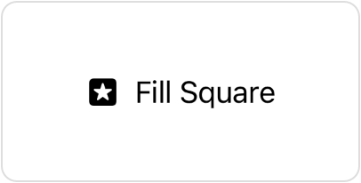

> Navigation: [Technologies](../../technologies.md) · [SwiftUI](../../swiftui.md) · [SymbolVariants](../symbolvariants.md)

# square

<sub>Instance Property</sub>

A version of the variant that’s encapsulated in a square.

<sub>iOS, iPadOS, Mac Catalyst, macOS, tvOS, visionOS, watchOS</sub>

```swift
var square: SymbolVariants { get }
```

## Discussion

Use this property to modify a variant like [fill](fill-swift.property.md) so that it’s also contained in a square:

```swift
Label("Fill Square", systemImage: "star")
    .symbolVariant(.fill.square)
```



## See Also

### Modifying a variant

- [circle](circle-swift.property.md) — A version of the variant that’s encapsulated in a circle.
- [rectangle](rectangle-swift.property.md) — A version of the variant that’s encapsulated in a rectangle.
- [fill](fill-swift.property.md) — A filled version of the variant.
- [slash](slash-swift.property.md) — A slashed version of the variant.
