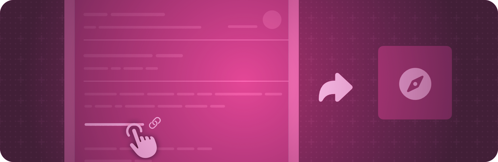

> Navigation: [Technologies](../technologies.md) · [SwiftUI](../swiftui.md)

# System events

API Collection

React to system events, like opening a URL.

## Overview

Specify view and scene modifiers to indicate how your app responds to certain system events. For example, you can use the [onOpenURL(perform:)](<view/onopenurl(perform_).md>) view modifier to define an action to take when your app receives a universal link, or use the [backgroundTask(_:action:)](<scene/backgroundtask(__action_).md>) scene modifier to specify an asynchronous task to carry out in response to a background task event, like the completion of a background URL session.

## Topics

### Sending and receiving user activities

- [Restoring your app’s state with SwiftUI](restoring-your-app-s-state-with-swiftui.md) — Provide app continuity for users by preserving their current activities.
- [userActivity(_:element:_:)](<view/useractivity(__element___).md>) — Advertises a user activity type.
- [userActivity(_:isActive:_:)](<view/useractivity(__isactive___).md>) — Advertises a user activity type.
- [onContinueUserActivity(_:perform:)](<view/oncontinueuseractivity(__perform_).md>) — Registers a handler to invoke in response to a user activity that your app receives.

### Sending and receiving URLs

- [openURL](environmentvalues/openurl.md) — An action that opens a URL.
- [OpenURLAction](openurlaction.md) — An action that opens a URL.
- [onOpenURL(perform:)](<view/onopenurl(perform_).md>) — Registers a handler to invoke in response to a URL that your app receives.

### Handling external events

- [handlesExternalEvents(matching:)](<scene/handlesexternalevents(matching_).md>) — Specifies the external events for which SwiftUI opens a new instance of the modified scene.
- [handlesExternalEvents(preferring:allowing:)](<view/handlesexternalevents(preferring_allowing_).md>) — Specifies the external events that the view’s scene handles if the scene is already open.

### Handling background tasks

- [backgroundTask(_:action:)](<scene/backgroundtask(__action_).md>) — Runs the specified action when the system provides a background task.
- [BackgroundTask](backgroundtask.md) — The kinds of background tasks that your app or extension can handle.
- [SnapshotData](snapshotdata.md) — The associated data of a snapshot background task.
- [SnapshotResponse](snapshotresponse.md) — Your application’s response to a snapshot background task.

### Importing and exporting transferable items

- [importableFromServices(for:action:)](<view/importablefromservices(for_action_).md>) — Enables importing items from services, such as Continuity Camera on macOS.
- [exportableToServices(_:)](<view/exportabletoservices(__).md>) — Exports items for consumption by shortcuts, quick actions, and services.
- [exportableToServices(_:onEdit:)](<view/exportabletoservices(__onedit_).md>) — Exports read-write items for consumption by shortcuts, quick actions, and services.

### Importing and exporting using item providers

- [importsItemProviders(_:onImport:)](<view/importsitemproviders(__onimport_).md>) — Enables importing item providers from services, such as Continuity Camera on macOS.
- [exportsItemProviders(_:onExport:)](<view/exportsitemproviders(__onexport_).md>) — Exports a read-only item provider for consumption by shortcuts, quick actions, and services.
- [exportsItemProviders(_:onExport:onEdit:)](<view/exportsitemproviders(__onexport_onedit_).md>) — Exports a read-write item provider for consumption by shortcuts, quick actions, and services.

## See Also

### Event handling

- [Gestures](gestures.md) — Define interactions from taps, clicks, and swipes to fine-grained gestures.
- [Input events](input-events.md) — Respond to input from a hardware device, like a keyboard or a Touch Bar.
- [Clipboard](clipboard.md) — Enable people to move or duplicate items by issuing Copy and Paste commands.
- [Drag and drop](drag-and-drop.md) — Enable people to move or duplicate items by dragging them from one location to another.
- [Focus](focus.md) — Identify and control which visible object responds to user interaction.
