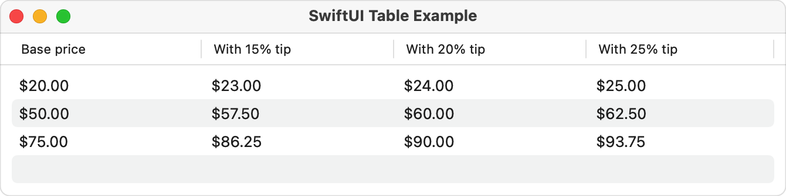

> Navigation: [Technologies](../technologies.md) · [SwiftUI](../swiftui.md)

# Table

<sub>Structure</sub>

A container that presents rows of data arranged in one or more columns, optionally providing the ability to select one or more members.

<sub>iOS, iPadOS, Mac Catalyst, macOS, visionOS</sub>

```swift
nonisolated struct Table<Value, Rows, Columns> where Value == Rows.TableRowValue, Rows : TableRowContent, Columns : TableColumnContent, Rows.TableRowValue == Columns.TableRowValue
```

## Overview

You commonly create tables from collections of data. The following example shows how to create a simple, three-column table from an array of `Person` instances that conform to the [Identifiable](../swift/identifiable.md) protocol:

```swift
struct Person: Identifiable {
    let givenName: String
    let familyName: String
    let emailAddress: String
    let id = UUID()

    var fullName: String { givenName + " " + familyName }
}

@State private var people = [
    Person(givenName: "Juan", familyName: "Chavez", emailAddress: "juanchavez@icloud.com"),
    Person(givenName: "Mei", familyName: "Chen", emailAddress: "meichen@icloud.com"),
    Person(givenName: "Tom", familyName: "Clark", emailAddress: "tomclark@icloud.com"),
    Person(givenName: "Gita", familyName: "Kumar", emailAddress: "gitakumar@icloud.com")
]

struct PeopleTable: View {
    var body: some View {
        Table(people) {
            TableColumn("Given Name", value: \.givenName)
            TableColumn("Family Name", value: \.familyName)
            TableColumn("E-Mail Address", value: \.emailAddress)
        }
    }
}
```


If there are more rows than can fit in the available space, `Table` provides vertical scrolling automatically. On macOS, the table also provides horizontal scrolling if there are more columns than can fit in the width of the view. Scroll bars appear as needed on iOS; on macOS, the `Table` shows or hides scroll bars based on the “Show scroll bars” system preference.

### Supporting selection in tables

To make rows of a table selectable, provide a binding to a selection variable. Binding to a single instance of the table data’s [id](../swift/identifiable/id-8t2ws.md) type creates a single-selection table. Binding to a [Set](../swift/set.md) creates a table that supports multiple selections. The following example shows how to add multi-select to the previous example. A [Text](text.md) view below the table shows the number of items currently selected.

```swift
struct SelectableTable: View {
    @State private var selectedPeople = Set<Person.ID>()

    var body: some View {
        Table(people, selection: $selectedPeople) {
            TableColumn("Given Name", value: \.givenName)
            TableColumn("Family Name", value: \.familyName)
            TableColumn("E-Mail Address", value: \.emailAddress)
        }
        Text("\(selectedPeople.count) people selected")
    }
}
```

### Supporting sorting in tables

To make the columns of a table sortable, provide a binding to an array of [SortComparator](../foundation/sortcomparator.md) instances. The table reflects the sorted state through its column headers, allowing sorting for any columns with key paths.

When the table sort descriptors update, re-sort the data collection that underlies the table; the table itself doesn’t perform a sort operation. You can watch for changes in the sort descriptors by using a [onChange(of:perform:)](<view/onchange(of_perform_).md>) modifier, and then sort the data in the modifier’s `perform` closure.

The following example shows how to add sorting capability to the previous example:

```swift
struct SortableTable: View {
    @State private var sortOrder = [KeyPathComparator(\Person.givenName)]

    var body: some View {
        Table(people, sortOrder: $sortOrder) {
            TableColumn("Given Name", value: \.givenName)
            TableColumn("Family Name", value: \.familyName)
            TableColumn("E-Mail address", value: \.emailAddress)
        }
        .onChange(of: sortOrder) { _, sortOrder in
            people.sort(using: sortOrder)
        }
    }
}
```

### Building tables with static rows

To create a table from static rows, rather than the contents of a collection of data, you provide both the columns and the rows.

The following example shows a table that calculates prices from applying varying gratuities (“tips”) to a fixed set of prices. It creates the table with the [init(of:columns:rows:)](<table/init(of_columns_rows_).md>) initializer, with the `rows` parameter providing the base price that each row uses for its calculations. Each column receives each price and performs its calculation, producing a [Text](text.md) to display the formatted result.

```swift
struct Purchase: Identifiable {
    let price: Decimal
    let id = UUID()
}

struct TipTable: View {
    let currencyStyle = Decimal.FormatStyle.Currency(code: "USD")

    var body: some View {
        Table(of: Purchase.self) {
            TableColumn("Base price") { purchase in
                Text(purchase.price, format: currencyStyle)
            }
            TableColumn("With 15% tip") { purchase in
                Text(purchase.price * 1.15, format: currencyStyle)
            }
            TableColumn("With 20% tip") { purchase in
                Text(purchase.price * 1.2, format: currencyStyle)
            }
            TableColumn("With 25% tip") { purchase in
                Text(purchase.price * 1.25, format: currencyStyle)
            }
        } rows: {
            TableRow(Purchase(price: 20))
            TableRow(Purchase(price: 50))
            TableRow(Purchase(price: 75))
        }
    }
}
```



### Styling tables

Use the [tableStyle(_:)](<view/tablestyle(__).md>) modifier to set a [TableStyle](tablestyle.md) for all tables within a view. SwiftUI provides several table styles, such as [InsetTableStyle](insettablestyle.md) and, on macOS, [BorderedTableStyle](borderedtablestyle.md). The default style is [AutomaticTableStyle](automatictablestyle.md), which is available on all platforms that support `Table`.

### Using tables on different platforms

You can define a single table for use on macOS, iOS, and iPadOS. However, on iPhone or in a compact horizontal size class environment — typical on iPad in certain modes, like Slide Over — the table has limited space to display its columns. To conserve space, the table automatically hides headers and all columns after the first when it detects this condition.

To provide a good user experience in a space-constrained environment, you can customize the first column to show more information when you detect that the [horizontalSizeClass](environmentvalues/horizontalsizeclass.md) environment value becomes [UserInterfaceSizeClass.compact](userinterfacesizeclass/compact.md). For example, you can modify the sortable table from above to conditionally show all the information in the first column:

```swift
struct CompactableTable: View {
    #if os(iOS)
    @Environment(\.horizontalSizeClass) private var horizontalSizeClass
    private var isCompact: Bool { horizontalSizeClass == .compact }
    #else
    private let isCompact = false
    #endif

    @State private var sortOrder = [KeyPathComparator(\Person.givenName)]

    var body: some View {
        Table(people, sortOrder: $sortOrder) {
            TableColumn("Given Name", value: \.givenName) { person in
                VStack(alignment: .leading) {
                    Text(isCompact ? person.fullName : person.givenName)
                    if isCompact {
                        Text(person.emailAddress)
                            .foregroundStyle(.secondary)
                    }
                }
            }
            TableColumn("Family Name", value: \.familyName)
            TableColumn("E-Mail Address", value: \.emailAddress)
        }
        .onChange(of: sortOrder) { _, sortOrder in
            people.sort(using: sortOrder)
        }
    }
}
```

By making this change, you provide a list-like appearance for narrower displays, while displaying the full table on wider ones. Because you use the same table instance in both cases, you get a seamless transition when the size class changes, like when someone moves your app into or out of Slide Over.

## Relationships

- **Conforms To**: [View](view.md)

## Topics

### Creating a table from columns

- [init(_:columns:)](<table/init(__columns_).md>) — Creates a table that computes its rows based on a collection of identifiable data.
- [init(_:selection:columns:)](<table/init(__selection_columns_).md>) — Creates a table that computes its rows based on a collection of identifiable data, and that supports selecting multiple rows.

### Creating a sortable table from columns

- [init(_:sortOrder:columns:)](<table/init(__sortorder_columns_).md>) — Creates a sortable table that computes its rows based on a collection of identifiable data.
- [init(_:selection:sortOrder:columns:)](<table/init(__selection_sortorder_columns_).md>) — Creates a sortable table that computes its rows based on a collection of identifiable data, and supports selecting multiple rows.

### Creating a table from columns and rows

- [init(of:columns:rows:)](<table/init(of_columns_rows_).md>) — Creates a table with the given columns and rows that generates its contents using values of the given type.
- [init(of:selection:columns:rows:)](<table/init(of_selection_columns_rows_).md>) — Creates a table with the given columns and rows that supports selecting multiple rows that generates its data using values of the given type.

### Creating a sortable table from columns and rows

- [init(of:sortOrder:columns:rows:)](<table/init(of_sortorder_columns_rows_).md>) — Creates a sortable table with the given columns and rows.
- [init(of:selection:sortOrder:columns:rows:)](<table/init(of_selection_sortorder_columns_rows_).md>) — Creates a sortable table with the given columns and rows that supports selecting multiple rows.
- [init(sortOrder:columns:rows:)](<table/init(sortorder_columns_rows_).md>) — Creates a sortable table with the given columns and rows.
- [init(selection:sortOrder:columns:rows:)](<table/init(selection_sortorder_columns_rows_).md>) — Creates a sortable table with the given columns and rows that supports selecting multiple rows.

### Creating a table with customizable columns

- [init(_:columnCustomization:columns:)](<table/init(__columncustomization_columns_).md>) — Creates a table that computes its rows based on a collection of identifiable data and has dynamically customizable columns.
- [init(_:selection:columnCustomization:columns:)](<table/init(__selection_columncustomization_columns_).md>) — Creates a table that computes its rows based on a collection of identifiable data, that supports selecting multiple rows, and that has dynamically customizable columns.
- [init(_:selection:sortOrder:columnCustomization:columns:)](<table/init(__selection_sortorder_columncustomization_columns_).md>) — Creates a sortable table that computes its rows based on a collection of identifiable data, supports selecting multiple rows, and has dynamically customizable columns.
- [init(_:sortOrder:columnCustomization:columns:)](<table/init(__sortorder_columncustomization_columns_).md>) — Creates a sortable table that computes its rows based on a collection of identifiable data and has dynamically customizable columns.

### Creating a table with dynamically customizable columns

- [init(of:columnCustomization:columns:rows:)](<table/init(of_columncustomization_columns_rows_).md>) — Creates a table with the given columns and rows that generates its contents using values of the given type and has dynamically customizable columns.
- [init(of:selection:columnCustomization:columns:rows:)](<table/init(of_selection_columncustomization_columns_rows_).md>) — Creates a table with the given columns and rows that supports selecting multiple rows that generates its data using values of the given type and has dynamically customizable columns.
- [init(of:selection:sortOrder:columnCustomization:columns:rows:)](<table/init(of_selection_sortorder_columncustomization_columns_rows_).md>) — Creates a sortable table with the given columns and rows that supports selecting multiple rows and dynamically customizable columns.
- [init(of:sortOrder:columnCustomization:columns:rows:)](<table/init(of_sortorder_columncustomization_columns_rows_).md>) — Creates a sortable table with the given columns and rows and has dynamically customizable columns.

### Creating a hierarchical table

- [init(_:children:columnCustomization:columns:)](<table/init(__children_columncustomization_columns_).md>) — Creates a hierarchical table that computes its rows based on a collection of identifiable data and key path to the children of that data.
- [init(_:children:selection:columnCustomization:columns:)](<table/init(__children_selection_columncustomization_columns_).md>) — Creates a hierarchical table that computes its rows based on a collection of identifiable data and key path to the children of that data, and supports selecting multiple rows.
- [init(_:children:selection:sortOrder:columnCustomization:columns:)](<table/init(__children_selection_sortorder_columncustomization_columns_).md>) — Creates a sortable, hierarchical table that computes its rows based on a collection of identifiable data and key path to the children of that data, and supports selecting multiple rows.
- [init(_:children:sortOrder:columnCustomization:columns:)](<table/init(__children_sortorder_columncustomization_columns_).md>) — Creates a sortable, hierarchical table that computes its rows based on a collection of identifiable data and key path to the children of that data.

## See Also

### Creating a table

- [Building a great Mac app with SwiftUI](building-a-great-mac-app-with-swiftui.md) — Create engaging SwiftUI Mac apps by incorporating side bars, tables, toolbars, and several other popular user interface elements.
- [tableStyle(_:)](<view/tablestyle(__).md>) — Sets the style for tables within this view.
