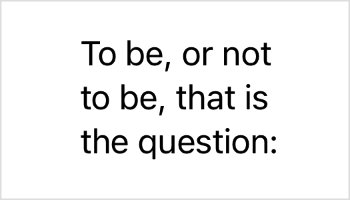

> Navigation: [Technologies](../technologies.md) · [SwiftUI](../swiftui.md)

# Text

<sub>Structure</sub>

A view that displays one or more lines of read-only text.

<sub>iOS, iPadOS, Mac Catalyst, macOS, tvOS, visionOS, watchOS</sub>

```swift
@frozen struct Text
```

## Overview

A text view draws a string in your app’s user interface using a [body](font/body.md) font that’s appropriate for the current platform. You can choose a different standard font, like [title](font/title.md) or [caption](font/caption.md), using the [font(_:)](<view/font(__).md>) view modifier.

```swift
Text("Hamlet")
    .font(.title)
```


If you need finer control over the styling of the text, you can use the same modifier to configure a system font or choose a custom font. You can also apply view modifiers like [bold()](<text/bold().md>) or [italic()](<text/italic().md>) to further adjust the formatting.

```swift
Text("by William Shakespeare")
    .font(.system(size: 12, weight: .light, design: .serif))
    .italic()
```


To apply styling within specific portions of the text, you can create the text view from an [AttributedString](../foundation/attributedstring.md), which in turn allows you to use Markdown to style runs of text. You can mix string attributes and SwiftUI modifiers, with the string attributes taking priority.

```swift
let attributedString = try! AttributedString(
    markdown: "_Hamlet_ by William Shakespeare")

var body: some View {
    Text(attributedString)
        .font(.system(size: 12, weight: .light, design: .serif))
}
```


A text view always uses exactly the amount of space it needs to display its rendered contents, but you can affect the view’s layout. For example, you can use the [frame(width:height:alignment:)](<view/frame(width_height_alignment_).md>) modifier to propose specific dimensions to the view. If the view accepts the proposal but the text doesn’t fit into the available space, the view uses a combination of wrapping, tightening, scaling, and truncation to make it fit. With a width of `100` points but no constraint on the height, a text view might wrap a long string:

```swift
Text("To be, or not to be, that is the question:")
    .frame(width: 100)
```



Use modifiers like [lineLimit(_:)](<view/linelimit(__).md>), [allowsTightening(_:)](<view/allowstightening(__).md>), [minimumScaleFactor(_:)](<view/minimumscalefactor(__).md>), and [truncationMode(_:)](<view/truncationmode(__).md>) to configure how the view handles space constraints. For example, combining a fixed width and a line limit of `1` results in truncation for text that doesn’t fit in that space:

```swift
Text("Brevity is the soul of wit.")
    .frame(width: 100)
    .lineLimit(1)
```


### Localizing strings

If you initialize a text view with a string literal, the view uses the [init(_:tableName:bundle:comment:)](<text/init(__tablename_bundle_comment_).md>) initializer, which interprets the string as a localization key and searches for the key in the table you specify, or in the default table if you don’t specify one.

```swift
Text("pencil") // Searches the default table in the main bundle.
```

For an app localized in both English and Spanish, the above view displays “pencil” and “lápiz” for English and Spanish users, respectively. If the view can’t perform localization, it displays the key instead. For example, if the same app lacks Danish localization, the view displays “pencil” for users in that locale. Similarly, an app that lacks any localization information displays “pencil” in any locale.

To explicitly bypass localization for a string literal, use the [init(verbatim:)](<text/init(verbatim_).md>) initializer.

```swift
Text(verbatim: "pencil") // Displays the string "pencil" in any locale.
```

If you initialize a text view with a variable value, the view uses the [init(_:)](<text/init(__)-9d1g4.md>) initializer, which doesn’t localize the string. However, you can request localization by creating a [LocalizedStringKey](localizedstringkey.md) instance first, which triggers the [init(_:tableName:bundle:comment:)](<text/init(__tablename_bundle_comment_).md>) initializer instead:

```swift
// Don't localize a string variable...
Text(writingImplement)

// ...unless you explicitly convert it to a localized string key.
Text(LocalizedStringKey(writingImplement))
```

When localizing a string variable, you can use the default table by omitting the optional initialization parameters — as in the above example — just like you might for a string literal.

When composing a complex string, where there is a need to assemble multiple pieces of text, use string interpolation:

```swift
let name: String = //…
Text("Hello, \(name)")
```

This would look up the `"Hello, %@"` localization key in the localized string file and replace the format specifier `%@` with the value of `name` before rendering the text on screen.

Using string interpolation ensures that the text in your app can be localized correctly in all locales, especially in right-to-left languages.

If you desire to style only parts of interpolated text while ensuring that the content can still be localized correctly, interpolate `Text` or [AttributedString](../foundation/attributedstring.md):

```swift
let name = Text(person.name).bold()
Text("Hello, \(name)")
```

The example above uses [appendInterpolation(_:)](<localizedstringkey/stringinterpolation/appendinterpolation(__)-4qyfo.md>) and will look up the `"Hello, %@"` in the localized string file and interpolate a bold text rendering the value of  `name`.

Using [appendInterpolation(_:)](<localizedstringkey/stringinterpolation/appendinterpolation(__)-5m52e.md>) you can interpolate [Image](image.md) in text.

## Relationships

- **Conforms To**: [Copyable](../swift/copyable.md), [Equatable](../swift/equatable.md), [Escapable](../swift/escapable.md), [Sendable](../swift/sendable.md), [SendableMetatype](../swift/sendablemetatype.md), [View](view.md)

## Topics

### Creating a text view

- [init(_:tableName:bundle:comment:)](<text/init(__tablename_bundle_comment_).md>) — Creates a text view that displays localized content identified by a key.
- [init(_:)](<text/init(__).md>) — Creates a text view that displays styled attributed content.
- [init(verbatim:)](<text/init(verbatim_).md>) — Creates a text view that displays a string literal without localization.
- [init(_:style:)](<text/init(__style_).md>) — Creates an instance that displays localized dates and times using a specific style.
- [init(_:format:)](<text/init(__format_).md>) — Creates a text view that displays the formatted representation of a nonstring type supported by a corresponding format style.
- [init(_:formatter:)](<text/init(__formatter_).md>) — Creates a text view that displays the formatted representation of a Foundation object.
- [init(timerInterval:pauseTime:countsDown:showsHours:)](<text/init(timerinterval_pausetime_countsdown_showshours_).md>) — Creates an instance that displays a timer counting within the provided interval.

### Choosing a font

- [font(_:)](<text/font(__).md>) — Sets the default font for text in the view.
- [fontWeight(_:)](<text/fontweight(__).md>) — Sets the font weight of the text.
- [fontDesign(_:)](<text/fontdesign(__).md>) — Sets the font design of the text.
- [fontWidth(_:)](<text/fontwidth(__).md>) — Sets the font width of the text.

### Styling the view’s text

- [foregroundStyle(_:)](<text/foregroundstyle(__).md>) — Sets the style of the text displayed by this view.
- [bold()](<text/bold().md>) — Applies a bold or emphasized treatment to the fonts of the text.
- [bold(_:)](<text/bold(__).md>) — Applies a bold font weight to the text.
- [italic()](<text/italic().md>) — Applies italics to the text.
- [italic(_:)](<text/italic(__).md>) — Applies italics to the text.
- [strikethrough(_:color:)](<text/strikethrough(__color_).md>) — Applies a strikethrough to the text.
- [strikethrough(_:pattern:color:)](<text/strikethrough(__pattern_color_).md>) — Applies a strikethrough to the text.
- [underline(_:color:)](<text/underline(__color_).md>) — Applies an underline to the text.
- [underline(_:pattern:color:)](<text/underline(__pattern_color_).md>) — Applies an underline to the text.
- [monospaced(_:)](<text/monospaced(__).md>) — Modifies the font of the text to use the fixed-width variant of the current font, if possible.
- [monospacedDigit()](<text/monospaceddigit().md>) — Modifies the text view’s font to use fixed-width digits, while leaving other characters proportionally spaced.
- [kerning(_:)](<text/kerning(__).md>) — Sets the spacing, or kerning, between characters.
- [tracking(_:)](<text/tracking(__).md>) — Sets the tracking for the text.
- [baselineOffset(_:)](<text/baselineoffset(__).md>) — Sets the vertical offset for the text relative to its baseline.
- [Case](text/case.md) — A scheme for transforming the capitalization of characters within text.
- [DateStyle](text/datestyle.md) — A predefined style used to display a `Date`.
- [LineStyle](text/linestyle.md) — Description of the style used to draw the line for `StrikethroughStyleAttribute` and `UnderlineStyleAttribute`.

### Fitting text into available space

- [textScale(_:isEnabled:)](<text/textscale(__isenabled_).md>) — Applies a text scale to the text.
- [Scale](text/scale.md) — Defines text scales
- [TruncationMode](text/truncationmode.md) — The type of truncation to apply to a line of text when it’s too long to fit in the available space.

### Localizing text

- [typesettingLanguage(_:isEnabled:)](<text/typesettinglanguage(__isenabled_).md>) — Specifies the language for typesetting.

### Configuring voiceover

- [speechAdjustedPitch(_:)](<text/speechadjustedpitch(__).md>) — Raises or lowers the pitch of spoken text.
- [speechAlwaysIncludesPunctuation(_:)](<text/speechalwaysincludespunctuation(__).md>) — Sets whether VoiceOver should always speak all punctuation in the text view.
- [speechAnnouncementsQueued(_:)](<text/speechannouncementsqueued(__).md>) — Controls whether to queue pending announcements behind existing speech rather than interrupting speech in progress.
- [speechSpellsOutCharacters(_:)](<text/speechspellsoutcharacters(__).md>) — Sets whether VoiceOver should speak the contents of the text view character by character.

### Providing accessibility information

- [accessibilityHeading(_:)](<text/accessibilityheading(__).md>) — Sets the accessibility level of this heading.
- [accessibilityLabel(_:)](<text/accessibilitylabel(__).md>) — Adds a label to the view that describes its contents.
- [accessibilityTextContentType(_:)](<text/accessibilitytextcontenttype(__).md>) — Sets an accessibility text content type.

### Combining text views

- [+(_:_:)](<text/+(____).md>) — Concatenates the text in two text views in a new text view. _(deprecated)_

### Deprecated symbols

- [foregroundColor(_:)](<text/foregroundcolor(__).md>) — Sets the color of the text displayed by this view. _(deprecated)_

### Structures

- [AlignmentStrategy](text/alignmentstrategy.md) — The way SwiftUI infers the appropriate text alignment if no value is explicitly provided.
- [Layout](text/layout.md) — A value describing the layout and custom attributes of a tree of `Text` views.
- [LayoutKey](text/layoutkey.md) — A preference key that provides the `Text.Layout` values for all text views in the queried subtree.
- [WritingDirectionStrategy](text/writingdirectionstrategy.md) — The way SwiftUI infers the appropriate writing direction if no value is explicitly provided.

### Instance Methods

- [customAttribute(_:)](<text/customattribute(__).md>) — Adds a custom attribute to the text view.
- [textVariant(_:)](<text/textvariant(__).md>) — Controls the way text size variants are chosen.

## See Also

### Displaying text

- [Label](label.md) — A standard label for user interface items, consisting of an icon with a title.
- [labelStyle(_:)](<view/labelstyle(__).md>) — Sets the style for labels within this view.
