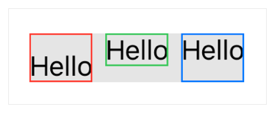

> Navigation: [Technologies](../../technologies.md) · [SwiftUI](../../swiftui.md) · [Text](../text.md)

# baselineOffset(_:)

<sub>Instance Method</sub>

Sets the vertical offset for the text relative to its baseline.

<sub>iOS, iPadOS, Mac Catalyst, macOS, tvOS, visionOS, watchOS</sub>

```swift
nonisolated func baselineOffset(_ baselineOffset: CGFloat) -> Text
```

## Parameters

- `baselineOffset` — The amount to shift the text vertically (up or down) relative to its baseline.

## Return Value

Text that’s above or below its baseline.

## Discussion

Change the baseline offset to move the text in the view (in points) up or down relative to its baseline. The bounds of the view expand to contain the moved text.

```swift
HStack(alignment: .top) {
    Text("Hello")
        .baselineOffset(-10)
        .border(Color.red)
    Text("Hello")
        .border(Color.green)
    Text("Hello")
        .baselineOffset(10)
        .border(Color.blue)
}
.background(Color(white: 0.9))
```

By drawing a border around each text view, you can see how the text moves, and how that affects the view.



The first view, with a negative offset, grows downward to handle the lowered text. The last view, with a positive offset, grows upward. The enclosing [HStack](../hstack.md) instance, shown in gray, ensures all the text views remain aligned at their top edge, regardless of the offset.

## See Also

### Styling the view’s text

- [foregroundStyle(_:)](<foregroundstyle(__).md>) — Sets the style of the text displayed by this view.
- [bold()](<bold().md>) — Applies a bold or emphasized treatment to the fonts of the text.
- [bold(_:)](<bold(__).md>) — Applies a bold font weight to the text.
- [italic()](<italic().md>) — Applies italics to the text.
- [italic(_:)](<italic(__).md>) — Applies italics to the text.
- [strikethrough(_:color:)](<strikethrough(__color_).md>) — Applies a strikethrough to the text.
- [strikethrough(_:pattern:color:)](<strikethrough(__pattern_color_).md>) — Applies a strikethrough to the text.
- [underline(_:color:)](<underline(__color_).md>) — Applies an underline to the text.
- [underline(_:pattern:color:)](<underline(__pattern_color_).md>) — Applies an underline to the text.
- [monospaced(_:)](<monospaced(__).md>) — Modifies the font of the text to use the fixed-width variant of the current font, if possible.
- [monospacedDigit()](<monospaceddigit().md>) — Modifies the text view’s font to use fixed-width digits, while leaving other characters proportionally spaced.
- [kerning(_:)](<kerning(__).md>) — Sets the spacing, or kerning, between characters.
- [tracking(_:)](<tracking(__).md>) — Sets the tracking for the text.
- [Case](case.md) — A scheme for transforming the capitalization of characters within text.
- [DateStyle](datestyle.md) — A predefined style used to display a `Date`.
