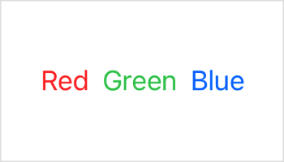

> Navigation: [Technologies](../../technologies.md) · [SwiftUI](../../swiftui.md) · [Text](../text.md)

# foregroundColor(_:)

<sub>Instance Method</sub>

Sets the color of the text displayed by this view.

> [!warning] Deprecated
> Use [foregroundStyle(_:)](<foregroundstyle(__).md>) instead.

<sub>iOS, iPadOS, Mac Catalyst, macOS, tvOS, visionOS, watchOS</sub>

```swift
nonisolated func foregroundColor(_ color: Color?) -> Text
```

## Parameters

- `color` — The color to use when displaying this text.

## Return Value

A text view that uses the color value you supply.

## Discussion

Use this method to change the color of the text rendered by a text view.

For example, you can display the names of the colors red, green, and blue in their respective colors:

```swift
HStack {
    Text("Red").foregroundColor(.red)
    Text("Green").foregroundColor(.green)
    Text("Blue").foregroundColor(.blue)
}
```


