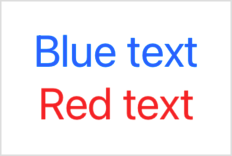

> Navigation: [Technologies](../../technologies.md) · [SwiftUI](../../swiftui.md) · [Text](../text.md)

# init(_:)

<sub>Initializer</sub>

Creates a text view that displays styled attributed content.

<sub>iOS, iPadOS, Mac Catalyst, macOS, tvOS, visionOS, watchOS</sub>

```swift
init(_ attributedContent: AttributedString)
```

## Parameters

- `attributedContent` — An attributed string to style and display, in accordance with its attributes.

### Format text by combining attributes and view modifiers

Use this initializer to style text according to attributes found in the specified [AttributedString](../../foundation/attributedstring.md). Attributes in the attributed string take precedence over styles added by view modifiers. For example, the attributed text in the following example appears in blue, despite the use of the [foregroundColor(_:)](<../view/foregroundcolor(__).md>) modifier to use red throughout the enclosing [VStack](../vstack.md):

```swift
var content: AttributedString {
    var attributedString = AttributedString("Blue text")
    attributedString.foregroundColor = .blue
    return attributedString
}

var body: some View {
    VStack {
        Text(content)
        Text("Red text")
    }
    .foregroundColor(.red)
}
```



SwiftUI combines text attributes with SwiftUI modifiers whenever possible. For example, the following listing creates text that is both bold and red:

```swift
var content: AttributedString {
    var content = AttributedString("Some text")
    content.inlinePresentationIntent = .stronglyEmphasized
    return content
}

var body: some View {
    Text(content).foregroundColor(Color.red)
}
```

### Supported Foundation attributes

A SwiftUI [Text](../text.md) view renders most of the styles defined by the Foundation attribute [inlinePresentationIntent](../../foundation/attributescopes/foundationattributes/inlinepresentationintent.md), like the [stronglyEmphasized](../../foundation/inlinepresentationintent/stronglyemphasized.md) value, which SwiftUI presents as bold text.

> [!important] Important
> [Text](../text.md) uses only a subset of the attributes defined in [AttributeScopes.FoundationAttributes](../../foundation/attributescopes/foundationattributes.md). `Text` renders all [InlinePresentationIntent](../../foundation/inlinepresentationintent.md) attributes except for [lineBreak](../../foundation/inlinepresentationintent/linebreak.md) and [softBreak](../../foundation/inlinepresentationintent/softbreak.md). It also respects [writingDirection](../../foundation/attributescopes/foundationattributes/writingdirection.md) and renders the [link](../../foundation/attributescopes/foundationattributes/link.md) attribute as a clickable link. `Text` ignores any other Foundation-defined attributes in an attributed string.

### SwiftUI attributes

SwiftUI also defines additional attributes in the attribute scope [AttributeScopes.SwiftUIAttributes](../../foundation/attributescopes/swiftuiattributes.md) which you can access from an attributed string’s [swiftUI](../../foundation/attributescopes/swiftui.md) property. SwiftUI attributes take precedence over equivalent attributes from other frameworks, such as [AttributeScopes.UIKitAttributes](../../foundation/attributescopes/uikitattributes.md) and [AttributeScopes.AppKitAttributes](../../foundation/attributescopes/appkitattributes.md).

### Markdown support

You can create an `AttributedString` with Markdown syntax, which allows you to style distinct runs within a `Text` view:

```swift
let content = try! AttributedString(
    markdown: "**Thank You!** Please visit our [website](http://example.com).")

var body: some View {
    Text(content)
}
```

The `**` syntax around “Thank You!” applies an [inlinePresentationIntent](../../foundation/attributescopes/foundationattributes/inlinepresentationintent.md) attribute with the value [stronglyEmphasized](../../foundation/inlinepresentationintent/stronglyemphasized.md). SwiftUI renders this as bold text, as described earlier. The link syntax around “website” creates a [link](../../foundation/attributescopes/foundationattributes/link.md) attribute, which `Text` styles to indicate it’s a link; by default, clicking or tapping the link opens the linked URL in the user’s default browser. Alternatively, you can perform custom link handling by putting an [OpenURLAction](../openurlaction.md) in the text view’s environment.


You can also use Markdown syntax in localized string keys, which means you can write the above example without needing to explicitly create an `AttributedString`:

```swift
var body: some View {
    Text("**Thank You!** Please visit our [website](https://example.com).")
}
```

In your app’s strings files, use Markdown syntax to apply styling to the app’s localized strings. You also use this approach when you want to perform automatic grammar agreement on localized strings, with the `^[text](inflect:true)` syntax.

For details about Markdown syntax support in SwiftUI, see [init(_:tableName:bundle:comment:)](<init(__tablename_bundle_comment_).md>).

### Applying a custom text formatting definition

Use the [attributedTextFormattingDefinition(_:)](<../view/attributedtextformattingdefinition(__)-81jn6.md>) modifier to apply a custom [AttributedTextFormattingDefinition](../attributedtextformattingdefinition.md) to text created using this initializer. This will result in the text only applying attributes in the definition’s attribute scope and constraining attributes according to the definition’s value constraints prior to display.

Custom attributes listed in the definition’s [Scope](../attributedtextformattingdefinition/scope.md), where the [Value](../../foundation/attributedstringkey/value.md) conforms to the [TextAttribute](../textattribute.md) protocol, can be read when observing the text’s layout using `Text/Layout/Run/subscript(key:)->T?`, just as text attributes applied using the [customAttribute(_:)](<customattribute(__).md>) modifier.

## See Also

### Creating a text view

- [init(_:tableName:bundle:comment:)](<init(__tablename_bundle_comment_).md>) — Creates a text view that displays localized content identified by a key.
- [init(verbatim:)](<init(verbatim_).md>) — Creates a text view that displays a string literal without localization.
- [init(_:style:)](<init(__style_).md>) — Creates an instance that displays localized dates and times using a specific style.
- [init(_:format:)](<init(__format_).md>) — Creates a text view that displays the formatted representation of a nonstring type supported by a corresponding format style.
- [init(_:formatter:)](<init(__formatter_).md>) — Creates a text view that displays the formatted representation of a Foundation object.
- [init(timerInterval:pauseTime:countsDown:showsHours:)](<init(timerinterval_pausetime_countsdown_showshours_).md>) — Creates an instance that displays a timer counting within the provided interval.
