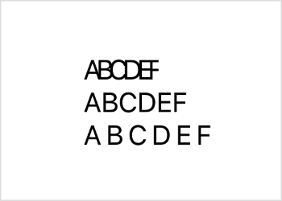
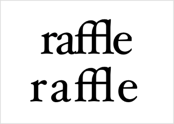
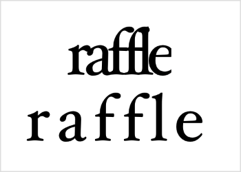

> Navigation: [Technologies](../../technologies.md) · [SwiftUI](../../swiftui.md) · [Text](../text.md)

# kerning(_:)

<sub>Instance Method</sub>

Sets the spacing, or kerning, between characters.

<sub>iOS, iPadOS, Mac Catalyst, macOS, tvOS, visionOS, watchOS</sub>

```swift
nonisolated func kerning(_ kerning: CGFloat) -> Text
```

## Parameters

- `kerning` — The spacing to use between individual characters in this text. Value of `0` sets the kerning to the system default value.

## Return Value

Text with the specified amount of kerning.

## Discussion

Kerning defines the offset, in points, that a text view should shift characters from the default spacing. Use positive kerning to widen the spacing between characters. Use negative kerning to tighten the spacing between characters.

```swift
VStack(alignment: .leading) {
    Text("ABCDEF").kerning(-3)
    Text("ABCDEF")
    Text("ABCDEF").kerning(3)
}
```

The last character in the first case, which uses negative kerning, experiences cropping because the kerning affects the trailing edge of the text view as well.



Kerning attempts to maintain ligatures. For example, the Hoefler Text font uses a ligature for the letter combination _ffl_, as in the word _raffle_, shown here with a small negative and a small positive kerning:



The _ffl_ letter combination keeps a constant shape as the other letters move together or apart. Beyond a certain point in either direction, however, kerning does disable nonessential ligatures.



> [!important] Important
> If you add both the [tracking(_:)](<tracking(__).md>) and [kerning(_:)](<kerning(__).md>) modifiers to a view, the view applies the tracking and ignores the kerning.

## See Also

### Styling the view’s text

- [foregroundStyle(_:)](<foregroundstyle(__).md>) — Sets the style of the text displayed by this view.
- [bold()](<bold().md>) — Applies a bold or emphasized treatment to the fonts of the text.
- [bold(_:)](<bold(__).md>) — Applies a bold font weight to the text.
- [italic()](<italic().md>) — Applies italics to the text.
- [italic(_:)](<italic(__).md>) — Applies italics to the text.
- [strikethrough(_:color:)](<strikethrough(__color_).md>) — Applies a strikethrough to the text.
- [strikethrough(_:pattern:color:)](<strikethrough(__pattern_color_).md>) — Applies a strikethrough to the text.
- [underline(_:color:)](<underline(__color_).md>) — Applies an underline to the text.
- [underline(_:pattern:color:)](<underline(__pattern_color_).md>) — Applies an underline to the text.
- [monospaced(_:)](<monospaced(__).md>) — Modifies the font of the text to use the fixed-width variant of the current font, if possible.
- [monospacedDigit()](<monospaceddigit().md>) — Modifies the text view’s font to use fixed-width digits, while leaving other characters proportionally spaced.
- [tracking(_:)](<tracking(__).md>) — Sets the tracking for the text.
- [baselineOffset(_:)](<baselineoffset(__).md>) — Sets the vertical offset for the text relative to its baseline.
- [Case](case.md) — A scheme for transforming the capitalization of characters within text.
- [DateStyle](datestyle.md) — A predefined style used to display a `Date`.
