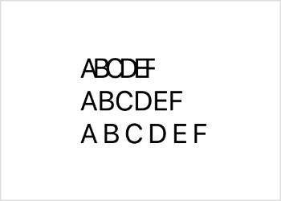

> Navigation: [Technologies](../../technologies.md) · [SwiftUI](../../swiftui.md) · [Text](../text.md)

# tracking(_:)

<sub>Instance Method</sub>

Sets the tracking for the text.

<sub>iOS, iPadOS, Mac Catalyst, macOS, tvOS, visionOS, watchOS</sub>

```swift
nonisolated func tracking(_ tracking: CGFloat) -> Text
```

## Parameters

- `tracking` — The amount of additional space, in points, that the view should add to each character cluster after layout. Value of `0` sets the tracking to the system default value.

## Return Value

Text with the specified amount of tracking.

## Discussion

Tracking adds space, measured in points, between the characters in the text view. A positive value increases the spacing between characters, while a negative value brings the characters closer together.

```swift
VStack(alignment: .leading) {
    Text("ABCDEF").tracking(-3)
    Text("ABCDEF")
    Text("ABCDEF").tracking(3)
}
```

The code above uses an unusually large amount of tracking to make it easy to see the effect.



The effect of tracking resembles that of the [kerning(_:)](<kerning(__).md>) modifier, but adds or removes trailing whitespace, rather than changing character offsets. Also, using any nonzero amount of tracking disables nonessential ligatures, whereas kerning attempts to maintain ligatures.

> [!important] Important
> If you add both the [tracking(_:)](<tracking(__).md>) and [kerning(_:)](<kerning(__).md>) modifiers to a view, the view applies the tracking and ignores the kerning.

## See Also

### Styling the view’s text

- [foregroundStyle(_:)](<foregroundstyle(__).md>) — Sets the style of the text displayed by this view.
- [bold()](<bold().md>) — Applies a bold or emphasized treatment to the fonts of the text.
- [bold(_:)](<bold(__).md>) — Applies a bold font weight to the text.
- [italic()](<italic().md>) — Applies italics to the text.
- [italic(_:)](<italic(__).md>) — Applies italics to the text.
- [strikethrough(_:color:)](<strikethrough(__color_).md>) — Applies a strikethrough to the text.
- [strikethrough(_:pattern:color:)](<strikethrough(__pattern_color_).md>) — Applies a strikethrough to the text.
- [underline(_:color:)](<underline(__color_).md>) — Applies an underline to the text.
- [underline(_:pattern:color:)](<underline(__pattern_color_).md>) — Applies an underline to the text.
- [monospaced(_:)](<monospaced(__).md>) — Modifies the font of the text to use the fixed-width variant of the current font, if possible.
- [monospacedDigit()](<monospaceddigit().md>) — Modifies the text view’s font to use fixed-width digits, while leaving other characters proportionally spaced.
- [kerning(_:)](<kerning(__).md>) — Sets the spacing, or kerning, between characters.
- [baselineOffset(_:)](<baselineoffset(__).md>) — Sets the vertical offset for the text relative to its baseline.
- [Case](case.md) — A scheme for transforming the capitalization of characters within text.
- [DateStyle](datestyle.md) — A predefined style used to display a `Date`.
