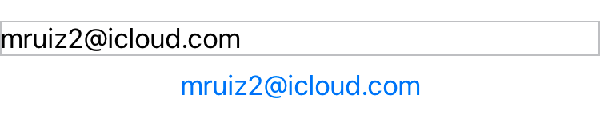
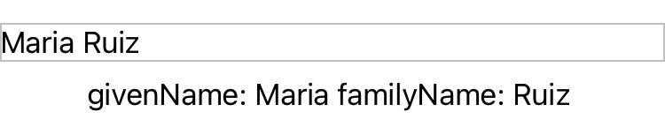
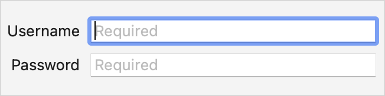
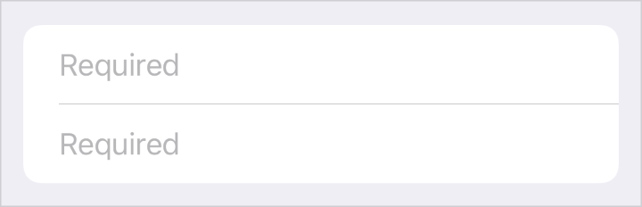
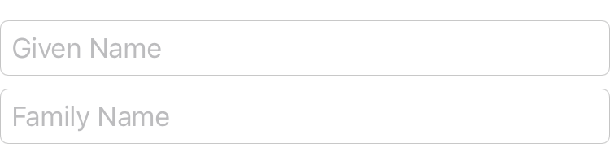

> Navigation: [Technologies](../technologies.md) · [SwiftUI](../swiftui.md)

# TextField

<sub>Structure</sub>

A control that displays an editable text interface.

<sub>iOS, iPadOS, Mac Catalyst, macOS, tvOS, visionOS, watchOS</sub>

```swift
nonisolated struct TextField<Label> where Label : View
```

## Overview

You create a text field with a label and a binding to a value. If the value is a string, the text field updates this value continuously as the user types or otherwise edits the text in the field. For non-string types, it updates the value when the user commits their edits, such as by pressing the Return key.

The following example shows a text field to accept a username, and a [Text](text.md) view below it that shadows the continuously updated value of `username`. The [Text](text.md) view changes color as the user begins and ends editing. When the user submits their completed entry to the text field, the [onSubmit(of:_:)](<view/onsubmit(of___).md>) modifier calls an internal `validate(name:)` method.

```swift
@State private var username: String = ""
@FocusState private var emailFieldIsFocused: Bool = false

var body: some View {
    TextField(
        "User name (email address)",
        text: $username
    )
    .focused($emailFieldIsFocused)
    .onSubmit {
        validate(name: username)
    }
    .textInputAutocapitalization(.never)
    .disableAutocorrection(true)
    .border(.secondary)

    Text(username)
        .foregroundColor(emailFieldIsFocused ? .red : .blue)
}
```



The bound value doesn’t have to be a string. By using a [FormatStyle](../foundation/formatstyle.md), you can bind the text field to a nonstring type, using the format style to convert the typed text into an instance of the bound type. The following example uses a [PersonNameComponents.FormatStyle](../foundation/personnamecomponents/formatstyle.md) to convert the name typed in the text field to a [PersonNameComponents](../foundation/personnamecomponents.md) instance. A [Text](text.md) view below the text field shows the debug description string of this instance.

```swift
@State private var nameComponents = PersonNameComponents()

var body: some View {
    TextField(
        "Proper name",
        value: $nameComponents,
        format: .name(style: .medium)
    )
    .onSubmit {
        validate(components: nameComponents)
    }
    .disableAutocorrection(true)
    .border(.secondary)
    Text(nameComponents.debugDescription)
}
```



### Text field prompts

You can set an explicit prompt on the text field to guide users on what text they should provide. Each text field style determines where and when the text field uses a prompt and label. For example, a form on macOS always places the label at the leading edge of the field and uses a prompt, when available, as placeholder text within the field itself. In the same context on iOS, the text field uses either the prompt or label as placeholder text, depending on whether the initializer provided a prompt.

The following example shows a [Form](form.md) with two text fields, each of which provides a prompt to indicate that the field is required, and a content builder to provide a label:

```swift
Form {
    TextField(text: $username, prompt: Text("Required")) {
        Text("Username")
    }
    SecureField(text: $password, prompt: Text("Required")) {
        Text("Password")
    }
}
```





### Styling text fields

SwiftUI provides a default text field style that reflects an appearance and behavior appropriate to the platform. The default style also takes the current context into consideration, like whether the text field is in a container that presents text fields with a special style. Beyond this, you can customize the appearance and interaction of text fields using the [textFieldStyle(_:)](<view/textfieldstyle(__).md>) modifier, passing in an instance of [TextFieldStyle](textfieldstyle.md). The following example applies the [roundedBorder](textfieldstyle/roundedborder.md) style to both text fields within a [VStack](vstack.md).

```swift
@State private var givenName: String = ""
@State private var familyName: String = ""

var body: some View {
    VStack {
        TextField(
            "Given Name",
            text: $givenName
        )
        .disableAutocorrection(true)
        TextField(
            "Family Name",
            text: $familyName
        )
        .disableAutocorrection(true)
    }
    .textFieldStyle(.roundedBorder)
}
```



## Relationships

- **Conforms To**: [View](view.md)

## Topics

### Creating a text field with a string

- [init(_:text:)](<textfield/init(__text_).md>) — Creates a text field with a text label generated from a localized title string.
- [init(_:text:prompt:)](<textfield/init(__text_prompt_).md>) — Creates a text field with a text label generated from a localized title string resource.
- [init(text:prompt:label:)](<textfield/init(text_prompt_label_).md>) — Creates a text field with a prompt generated from a `Text`.

### Creating a scrollable text field

- [init(_:text:axis:)](<textfield/init(__text_axis_).md>) — Creates a text field with a preferred axis and a text label generated from a localized title string resource.
- [init(_:text:prompt:axis:)](<textfield/init(__text_prompt_axis_).md>) — Creates a text field with a preferred axis and a text label generated from a localized title string resource.
- [init(text:prompt:axis:label:)](<textfield/init(text_prompt_axis_label_).md>) — Creates a text field with a preferred axis and a prompt generated from a `Text`.

### Creating a text field with a value

- [init(_:value:format:prompt:)](<textfield/init(__value_format_prompt_).md>) — Creates a text field that applies a format style to a bound value, with a label generated from a localized title string resource.
- [init(value:format:prompt:label:)](<textfield/init(value_format_prompt_label_).md>) — Creates a text field that applies a format style to a bound value, with a label generated from a content builder.
- [init(_:value:formatter:)](<textfield/init(__value_formatter_).md>) — Create an instance which binds over an arbitrary type, `V`.
- [init(_:value:formatter:prompt:)](<textfield/init(__value_formatter_prompt_).md>) — Creates a text field that applies a formatter to a bound value, with a label generated from a localized title string resource.
- [init(value:formatter:prompt:label:)](<textfield/init(value_formatter_prompt_label_).md>) — Creates a text field that applies a formatter to a bound optional value, with a label generated from a content builder.

### Deprecated initializers

- [Deprecated initializers](textfield-deprecated.md) — Review deprecated text field initializers.

### Initializers

- [init(_:text:selection:prompt:axis:)](<textfield/init(__text_selection_prompt_axis_).md>) — Creates a text field with a binding to the current selection and a text label generated from a localized title string resource.
- [init(text:selection:prompt:axis:label:)](<textfield/init(text_selection_prompt_axis_label_).md>) — Creates a text field with a binding to the current selection and a prompt generated from a `Text`.

## See Also

### Getting text input

- [Building rich SwiftUI text experiences](building-rich-swiftui-text-experiences.md) — Build an editor for formatted text using SwiftUI text editor views and attributed strings.
- [textFieldStyle(_:)](<view/textfieldstyle(__).md>) — Sets the style for text fields within this view.
- [SecureField](securefield.md) — A control into which people securely enter private text.
- [TextEditor](texteditor.md) — A view that can display and edit long-form text.
