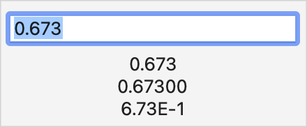

> Navigation: [Technologies](../../technologies.md) · [SwiftUI](../../swiftui.md) · [TextField](../textfield.md)

# init(_:value:format:prompt:)

<sub>Initializer</sub>

Creates a text field that applies a format style to a bound value, with a label generated from a localized title string resource.

<sub>iOS, iPadOS, Mac Catalyst, macOS, tvOS, visionOS, watchOS</sub>

```swift
@export(implementation) nonisolated init<F>(_ titleResource: LocalizedStringResource, value: Binding<F.FormatInput>, format: F, prompt: Text? = nil) where F : ParseableFormatStyle, F.FormatOutput == String
```

## Parameters

- `titleResource` — The title of the text field, describing its purpose.

- `value` — The underlying value to edit.

- `format` — A format style of type `F` to use when converting between the string the user edits and the underlying value of type `F.FormatInput`. If `format` can’t perform the conversion, the text field leaves `binding.value` unchanged. If the user stops editing the text in an invalid state, the text field updates the field’s text to the last known valid value.

- `prompt` — A `Text` which provides users with guidance on what to type into the text field.

## Discussion

Use this initializer to create a text field that binds to a bound value, using a [ParseableFormatStyle](../../foundation/parseableformatstyle.md) to convert to and from this type. Changes to the bound value update the string displayed by the text field. Editing the text field updates the bound value, as long as the format style can parse the text. If the format style can’t parse the input, the bound value remains unchanged.

Use the [onSubmit(of:_:)](<../view/onsubmit(of___).md>) modifier to invoke an action whenever the user submits this text field.

The following example uses a [Double](../../swift/double.md) as the bound value, and a [FloatingPointFormatStyle](../../foundation/floatingpointformatstyle.md) instance to convert to and from a string representation. As the user types, the bound value updates, which in turn updates three [Text](../text.md) views that use different format styles. If the user enters text that doesn’t represent a valid `Double`, the bound value doesn’t update.

```swift
@State private var myDouble: Double = 0.673
var body: some View {
    VStack {
        TextField(
            "Double",
            value: $myDouble,
            format: .number
        )
        Text(myDouble, format: .number)
        Text(myDouble, format: .number.precision(.significantDigits(5)))
        Text(myDouble, format: .number.notation(.scientific))
    }
}
```



## See Also

### Creating a text field with a value

- [init(value:format:prompt:label:)](<init(value_format_prompt_label_).md>) — Creates a text field that applies a format style to a bound value, with a label generated from a content builder.
- [init(_:value:formatter:)](<init(__value_formatter_).md>) — Create an instance which binds over an arbitrary type, `V`.
- [init(_:value:formatter:prompt:)](<init(__value_formatter_prompt_).md>) — Creates a text field that applies a formatter to a bound value, with a label generated from a localized title string resource.
- [init(value:formatter:prompt:label:)](<init(value_formatter_prompt_label_).md>) — Creates a text field that applies a formatter to a bound optional value, with a label generated from a content builder.
