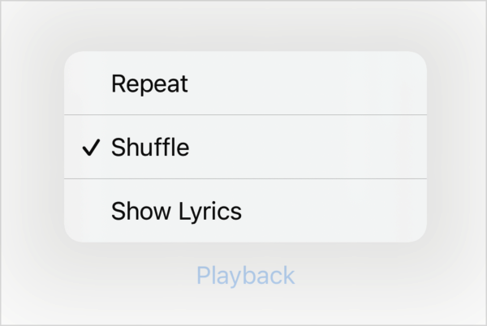
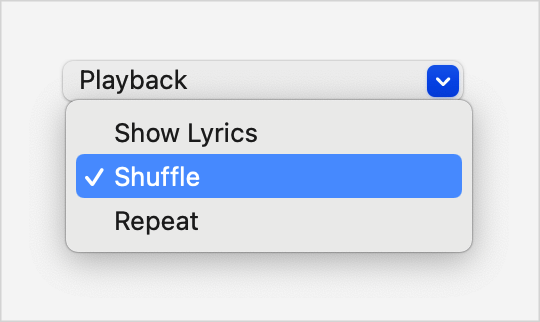

> Navigation: [Technologies](../../technologies.md) · [SwiftUI](../../swiftui.md) · [ToggleStyle](../togglestyle.md)

# automatic

<sub>Type Property</sub>

The default toggle style.

<sub>iOS, iPadOS, Mac Catalyst, macOS, tvOS, visionOS, watchOS</sub>

```swift
@MainActor @export(implementation) @preconcurrency static var automatic: DefaultToggleStyle { get }
```

## Discussion

Use this [ToggleStyle](../togglestyle.md) to let SwiftUI pick a suitable style for the current platform and context. Toggles use the `automatic` style by default, but you might need to set it explicitly using the [toggleStyle(_:)](<../view/togglestyle(__).md>) modifier to override another style in the environment. For example, you can request automatic styling for a toggle in an [HStack](../hstack.md) that’s otherwise configured to use the [button](button.md) style:

```swift
HStack {
    Toggle(isOn: $isShuffling) {
        Label("Shuffle", systemImage: "shuffle")
    }
    Toggle(isOn: $isRepeating) {
        Label("Repeat", systemImage: "repeat")
    }

    Divider()

    Toggle("Enhance Sound", isOn: $isEnhanced)
        .toggleStyle(.automatic) // Set the style automatically here.
}
.toggleStyle(.button) // Use button style for toggles in the stack.
```

### Platform defaults

The `automatic` style produces an appearance that varies by platform, using the following styles in most contexts:

| Platform | Default style |
|---|---|
| iOS, iPadOS | [switch](switch.md) |
| macOS | [checkbox](checkbox.md) |
| tvOS | [switch](switch.md) |
| watchOS | [switch](switch.md) |

The default style for tvOS behaves like a button. However, unlike the [switch](switch.md) style that’s on other platforms, the tvOS toggle takes as much horizontal space as its parent offers, and displays both the toggle’s label and a text field that indicates the toggle’s state. You typically collect tvOS toggles into a [List](../list.md):

```swift
List {
    Toggle("Show Lyrics", isOn: $isShowingLyrics)
    Toggle("Shuffle", isOn: $isShuffling)
    Toggle("Repeat", isOn: $isRepeating)
}
```


### Contextual defaults

A toggle’s automatic appearance varies in certain contexts:

- A toggle that appears as part of the content that you provide to one of the toolbar modifiers, like [toolbar(content:)](<../view/toolbar(content_).md>), uses the [button](button.md) style by default.
- A toggle in a [Menu](../menu.md) uses a style that you can’t create explicitly:

  ```swift
  Menu("Playback") {
      Toggle("Show Lyrics", isOn: $isShowingLyrics)
      Toggle("Shuffle", isOn: $isShuffling)
      Toggle("Repeat", isOn: $isRepeating)
  }
  ```

  SwiftUI shows the toggle’s label with a checkmark that appears only in the `on` state:

  | Platform | Appearance |
  |---|---|
  | iOS, iPadOS |   <sub>A screenshot of a Playback menu in iOS showing three menu items with the labels Repeat, Shuffle, and Show Lyrics. The shuffle item has a checkmark to its left, while the other two items have a blank space to their left.</sub> |
  | macOS |   <sub>A screenshot of a Playback menu in macOS showing three menu items with the labels Repeat, Shuffle, and Show Lyrics. The shuffle item has a checkmark to its left, while the other two items have a blank space to their left.</sub> |

## See Also

### Getting built-in toggle styles

- [button](button.md) — A toggle style that displays as a button with its label as the title.
- [checkbox](checkbox.md) — A toggle style that displays a checkbox followed by its label.
- [switch](switch.md) — A toggle style that displays a leading label and a trailing switch.
