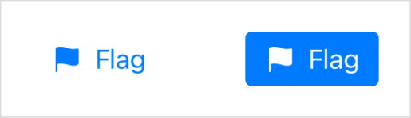
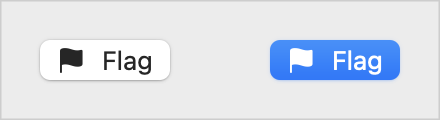

> Navigation: [Technologies](../../technologies.md) · [SwiftUI](../../swiftui.md) · [ToggleStyle](../togglestyle.md)

# button

<sub>Type Property</sub>

A toggle style that displays as a button with its label as the title.

<sub>iOS, iPadOS, Mac Catalyst, macOS, visionOS, watchOS</sub>

```swift
@export(implementation) nonisolated static var button: ButtonToggleStyle { get }
```

## Discussion

Apply this style to a [Toggle](../toggle.md) or to a view hierarchy that contains toggles using the [toggleStyle(_:)](<../view/togglestyle(__).md>) modifier:

```swift
Toggle(isOn: $isFlagged) {
    Label("Flag", systemImage: "flag.fill")
}
.toggleStyle(.button)
```

The style produces a button with a label that describes the purpose of the toggle. The user taps or clicks the button to change the toggle’s state. The button indicates the `on` state by filling in the background with its tint color. You can change the tint color using the [tint(_:)](<../view/tint(__).md>) modifier. SwiftUI uses this style as the default for toggles that appear in a toolbar.

The following table shows the toggle in both the `off` and `on` states, respectively:

| Platform | Appearance |
|---|---|
| iOS, iPadOS |   <sub>A screenshot of two buttons with a flag icon and the word flag inside. The first button isn’t highlighted; the second one is.</sub> |
| macOS |   <sub>A screenshot of two buttons with a flag icon and the word flag inside. The first button isn’t highlighted; the second one is.</sub> |

A [Label](../label.md) instance is a good choice for a button toggle’s label. Based on the context, SwiftUI decides whether to display both the title and icon, as in the example above, or just the icon, like when the toggle appears in a toolbar. You can also control the label’s style by adding a [labelStyle(_:)](<../view/labelstyle(__).md>) modifier. In any case, SwiftUI always uses the title to identify the control using VoiceOver.

## See Also

### Getting built-in toggle styles

- [automatic](automatic.md) — The default toggle style.
- [checkbox](checkbox.md) — A toggle style that displays a checkbox followed by its label.
- [switch](switch.md) — A toggle style that displays a leading label and a trailing switch.
